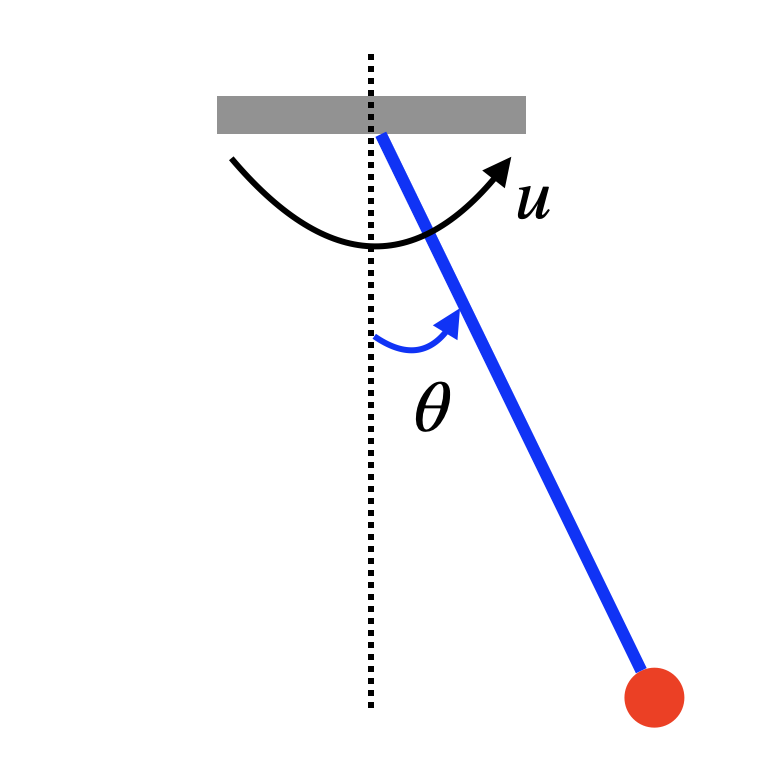
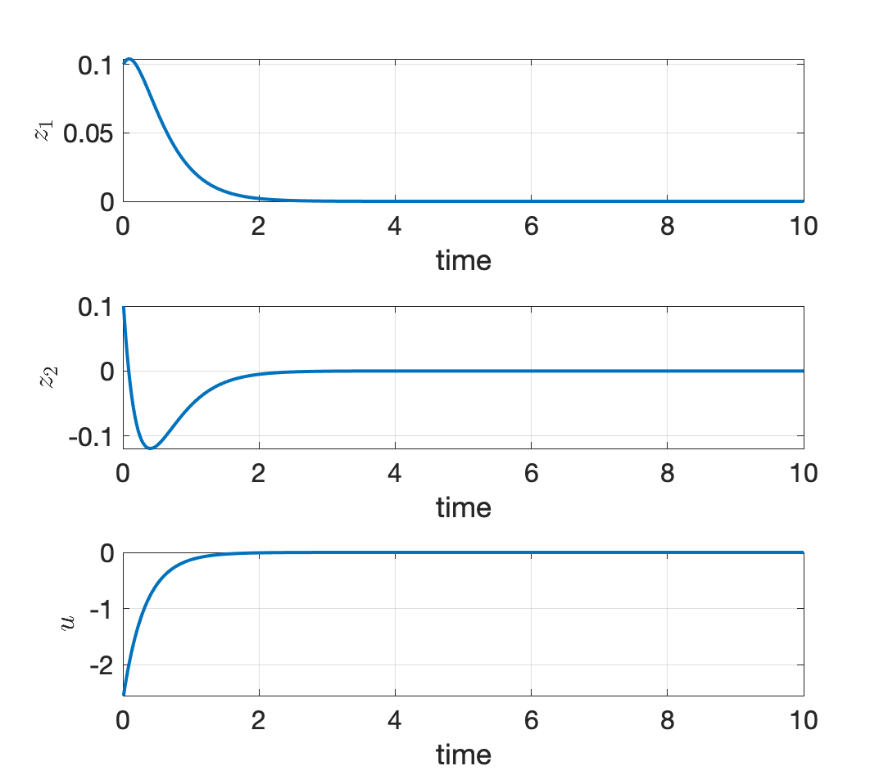

# Exact Dynamic Programming {#exactdp}

In Chapter \@ref(formulation), we introduced the basic formulation of the finite-horizon and discrete-time optimal control problem, presented the Bellman principle of optimality, and derived the dynamic programming (DP) algorithm. We mentioned that, despite being a general-purpose algorithm, it can be difficult to implement DP exactly in practical applications.

In this Chapter, we will introduce two problem setups where DP can in fact be implemented exactly. 

## Linear Quadratic Regulator {#lqr}

Consider a linear discrete-time dynamical system 
\begin{equation}
x_{k+1} = A_k x_k + B_k u_k + w_k, \quad k=0,1,\dots,N-1,
(\#eq:lqr-linear-system)
\end{equation}
where $x_k \in \mathbb{R}^n$ the state, $u_k \in \mathbb{R}^m$ the control, $w_k \in \mathbb{R}^n$ the independent, zero-mean disturbance with given probability distribution that does not depend on $x_k,u_k$, and $A_k \in \mathbb{R}^{n \times n}, B_k \in \mathbb{R}^{n \times m}$ are known matrices determining the transition dynamics.

We want to solve the following optimal control problem 
\begin{equation}
\min_{\mu_0,\dots,\mu_{N-1}} \mathbb{E} \left\{ x_N^T Q_N x_N + \sum_{k=0}^{N-1} \left( x_k^T Q_k x_k + u_k^T R_k u_k \right) \right\},
(\#eq:lqr-formulation)
\end{equation}
where the expectation is taken over the randomness in $w_0,\dots,w_{N-1}$. In \@ref(eq:lqr-formulation), $\{Q_k \}_{k=0}^N$ are positive semidefinite matrices, and $\{ R_k \}_{k=0}^{N-1}$ are positive definite matrices. The formulation \@ref(eq:lqr-formulation) is typically known as the linear quadratic regulator (LQR) problem because the dynamics is linear, the cost is quadratic, and the formulation can be considered to "regulate" the system around the origin $x=0$. 

We will now show that the DP algorithm in Theorem \@ref(thm:dynamicprogramming) can be exactly implemented for LQR.

The DP algorithm computes the optimal cost-to-go backwards in time. 
The terminal cost is 
$$
J_N(x_N) = x_N^T Q_N x_N
$$
by definition.

The optimal cost-to-go at time $N-1$ is equal to
\begin{equation}
\begin{split}
J_{N-1}(x_{N-1}) = \min_{u_{N-1}} \mathbb{E}_{w_{N-1}} \{ x_{N-1}^T Q_{N-1} x_{N-1} + u_{N-1}^T R_{N-1} u_{N-1} + \\ \Vert \underbrace{A_{N-1} x_{N-1} + B_{N-1} u_{N-1} + w_{N-1} }_{x_N} \Vert^2_{Q_N} \}
\end{split}
(\#eq:lqr-cost-N-1)
\end{equation}
where $\Vert v \Vert_Q^2 = v^T Q v$ for $Q \succeq 0$. Now observe that the objective in \@ref(eq:lqr-cost-N-1) is 
\begin{equation}
\begin{split}
x_{N-1}^T Q_{N-1} x_{N-1} + u_{N-1}^T R_{N-1} u_{N-1} + \Vert A_{N-1} x_{N-1} + B_{N-1} u_{N-1} \Vert_{Q_N}^2 + \\
\mathbb{E}_{w_{N-1}} \left[ 2(A_{N-1} x_{N-1} + B_{N-1} u_{N-1} )^T Q_{N-1} w_{N-1} \right] + \\
\mathbb{E}_{w_{N-1}} \left[ w_{N-1}^T Q_N w_{N-1} \right]
\end{split}
\end{equation}
where the second line is zero due to $\mathbb{E}(w_{N-1}) = 0$ and the third line is a constant with respect to $u_{N-1}$. Consequently, the optimal control $u_{N-1}^\star$ can be computed by setting the derivative of the objective with respect to $u_{N-1}$ equal to zero 
\begin{equation}
u_{N-1}^\star = - \left[ \left( R_{N-1} + B_{N-1}^T Q_N B_{N-1} \right)^{-1} B_{N-1}^T Q_N A_{N-1} \right] x_{N-1}.
(\#eq:optimal-u-N-1)
\end{equation}
Plugging the optimal controller $u^\star_{N-1}$ back to the objective of \@ref(eq:lqr-cost-N-1) leads to
\begin{equation}
J_{N-1}(x_{N-1}) = x_{N-1}^T S_{N-1} x_{N-1} + \mathbb{E} \left[ w_{N-1}^T Q_N w_{N-1} \right],
(\#eq:optimal-cost-N-1)
\end{equation}
with 
$$
S_{N-1} = Q_{N-1} + A_{N-1}^T \left[ Q_N - Q_N B_{N-1} \left( R_{N-1} + B_{N-1}^T Q_N B_{N-1} \right)^{-1} B_{N-1}^T Q_N \right] A_{N-1}.
$$
We note that $S_{N-1}$ is positive semidefinite (this is an exercise for you to convince yourself). 

Now we realize that something surprising and nice has happened.

1. The optimal controller $u^{\star}_{N-1}$ in \@ref(eq:optimal-u-N-1) is a linear feedback policy of the state $x_{N-1}$, and 

2. The optimal cost-to-go $J_{N-1}(x_{N-1})$ in \@ref(eq:optimal-cost-N-1) is quadratic in $x_{N-1}$, just the same as $J_{N}(x_N)$.

This implies that, if we continue to compute the optimal cost-to-go at time $N-2$, we will again compute a linear optimal controller and a quadratic optimal cost-to-go. This is the rare nice property for the LQR problem, that is, 

> The (representation) complexity of the optimal controller and cost-to-go does not grow as we run the DP recursion backwards in time. 

We summarize the solution for the LQR problem \@ref(eq:lqr-formulation) as follows.

::: {.theorembox}
::: {.proposition #discretetimefinitehorizonlqrsolution name="Solution of Discrete-Time Finite-Horizon LQR"}
The optimal controller for the LQR problem \@ref(eq:lqr-formulation) is a linear state-feedback policy
\begin{equation}
\mu_k^\star(x_k) = - K_k x_k, \quad k=0,\dots,N-1.
(\#eq:lqr-solution-control)
\end{equation}
The gain matrix $K_k$ can be computed as
$$
K_k = \left( R_k + B_k^T S_{k+1} B_k  \right)^{-1} B_k^T S_{k+1} A_k,
$$
where the matrix $S_k$ satisfies the following backwards recursion
\begin{equation}
\hspace{-6mm}
\begin{split}
S_N &= Q_N \\
S_k &= Q_k + A_k^T \left[ S_{k+1} - S_{k+1}B_k \left( R_k + B_k^T S_{k+1} B_k  \right)^{-1}  B_k^T S_{k+1}  \right] A_k, k=N-1,\dots,0.
\end{split}
(\#eq:finite-discrete-lqr-riccati)
\end{equation}
The optimal cost-to-go is given by 
$$
J_0(x_0) = x_0^T S_0 x_0 + \sum_{k=0}^{N-1} \mathbb{E} \left[ w_k^T S_{k+1} w_k\right].
$$
The recursion \@ref(eq:finite-discrete-lqr-riccati) is called the _discrete-time Riccati equation_.
:::
:::

Proposition \@ref(prp:discretetimefinitehorizonlqrsolution) states that, to evaluate the optimal policy \@ref(eq:lqr-solution-control), one can first run the backwards Riccati equation \@ref(eq:finite-discrete-lqr-riccati) to compute all the positive definite matrices $S_k$, and then compute the gain matrices $K_k$. For systems of reasonable dimensions, evalutating the matrix inversion in \@ref(eq:finite-discrete-lqr-riccati) should be fairly efficient.


### Infinite-Horizon LQR

In many robotics applications, it is often more useful to study the infinite-horizon LQR problem
\begin{align}
\min_{u_k} & \quad  \sum_{k=0}^{\infty} \left( x_k^T Q x_k + u_k^T R u_k \right) (\#eq:infinite-horizon-lqr-cost) \\
\text{subject to} & \quad x_{k+1} = A x_k + B u_k, \quad k=0,\dots,\infty, (\#eq:infinite-horizon-lqr-system)
\end{align}
where $Q \succeq 0$, $R \succ 0$, and $A,B$ are constant matrices. The reason for studying the formulation \@ref(eq:infinite-horizon-lqr-cost) is twofold. First, for nonlinear systems, we often linearize the nonlinear dynamics around an (equilibrium) point we care about, leading to constant $A$ and $B$ matrices. Second, we care more about the _asymptotic_ effect of our controller than its behavior in a fixed number of steps. We will soon see an example of this formulation for balancing a simple pendulum.

The infinite-horizon formulation is essentially the finite-horizon formulation \@ref(eq:lqr-formulation) with $N \rightarrow \infty$. Based on our intuition in deriving the finite-horizon LQR solution, we may want to hypothesize that the optimal cost-to-go is a quadratic function
\begin{equation}
J_{k}(x_{k}) = x_{k}^T S x_{k}, k=0,\dots,\infty
(\#eq:infinite-horizon-lqr-optimal-cost)
\end{equation}
for some positive definite matrix $S$, and proceed to invoke the DP algorithm. Notice that we hypothesize the matrix $S$ is in fact _stationary_, i.e., it does not change with respect to time. This hypothesis makes sense because the $A,B,Q,R$ matrices are stationary in the formulation \@ref(eq:infinite-horizon-lqr-cost). Invoking the DP algorithm we have
\begin{equation}
x_k^T S x_k = J_k(x_k) = \min_{u_k} \left\{ x_k^T Q x_k + u_k^T R u_k + \Vert \underbrace{A x_k + B u_k}_{x_{k+1}} \Vert_S^2  \right\}.
(\#eq:infinite-horizon-lqr-invoke-dp)
\end{equation}
The minimization over $u_k$ in \@ref(eq:infinite-horizon-lqr-invoke-dp) can again be solved in closed-form by setting the gradient of the objective with respect to $u_k$ to be zero
\begin{equation}
u_k^\star = - \underbrace{\left[ \left( R + B^T S B \right)^{-1} B^T S A \right]}_{K} x_k.
(\#eq:infinite-horizon-lqr-control)
\end{equation}
Plugging the optimal $u_k^\star$ back into \@ref(eq:infinite-horizon-lqr-invoke-dp), we see that the matrix $S$ has to satisfy the following equation
\begin{equation}
S = Q + A^T \left[  S - SB \left( R + B^T S B  \right)^{-1} B^T S \right] A.
(\#eq:algebraic-riccati)
\end{equation}
Equation \@ref(eq:algebraic-riccati) is the famous _algebraic Riccati equation_. 

Let's zoom out to see what we have done. We started with a hypothetical optimal cost-to-go \@ref(eq:infinite-horizon-lqr-optimal-cost) that is stationary, and invoked the DP algorithm in \@ref(eq:infinite-horizon-lqr-invoke-dp), which led us to the algebraic Riccati equation \@ref(eq:algebraic-riccati). Therefore, if there actually exists a solution to the algebraic Riccati equation \@ref(eq:algebraic-riccati), then the linear controller \@ref(eq:infinite-horizon-lqr-control) is indeed optimal (by the optimality of DP)!

So the question boils down to if the algebraic Riccati equation has a solution $S$ that is positive definite? The following proposition gives an answer.

::: {.theorembox}
::: {.proposition #infinitehorizonlqrsolution name="Solution of Discrete-Time Infinite-Horizon LQR"} 
Consider a linear system 
$$
x_{k+1} = A x_k + B u_k,
$$
with $(A,B)$ controllable (see Appendix \@ref(app-lti-controllable-observable)). Let $Q \succeq 0$ in \@ref(eq:infinite-horizon-lqr-cost) be such that $Q$ can be written as $Q = C^T C$ with $(A,C)$ observable. 

Then the optimal controller for the infinite-horizon LQR problem \@ref(eq:infinite-horizon-lqr-cost) is a stationary linear policy
$$
\mu^\star (x) = - K x,
$$
with 
$$
K = \left( R + B^T S B \right)^{-1} B^T S A.
$$
The matrix $S$ is the unique positive definite matrix that satisfies the algebraic Riccati equation 
$$
S = Q + A^T \left[  S - SB \left( R + B^T S B  \right)^{-1} B^T S \right] A.
$$

Moreover, the closed-loop system 
$$
x_{k+1} = A x_k + B (-K x_k) = (A - BK) x_k
$$
is stable, i.e., the eigenvalues of the matrix $A - BK$ are strictly within the unit circle (see Appendix \@ref(app-lti-stability-dt)).
:::
:::

A rigorous proof of Proposition \@ref(prp:infinitehorizonlqrsolution) is available in Proposition 3.1.1 of [@bertsekas12book-dpocI]. The proof basically studies the limit of the discrete-time Riccati equation \@ref(eq:finite-discrete-lqr-riccati) when $N \rightarrow \infty$. Indeed, the algebraic Riccati equation \@ref(eq:algebraic-riccati) is the limit of the discrete-time Riccati equation \@ref(eq:finite-discrete-lqr-riccati) when $N \rightarrow \infty$. The assumptions of $(A,B)$ being controllable and $(A,C)$ being observable can be relaxted to $(A,B)$ being stabilizable and $(A,C)$ being detectable (for definitions of stabilizability and detectability, see Appendix \@ref(app-lti-system-theory)).

We have not discussed how to solve the algebraic Riccati equation \@ref(eq:finite-discrete-lqr-riccati). It is clear that \@ref(eq:finite-discrete-lqr-riccati) is not a linear system of equations in $S$. In fact, the numerical algorithms for solving the algebraic Riccati equation can be highly nontrivial, for example see [@arnold84ieee-generalized]. Fortunately, such algorithms are often readily available, and as practitioners we do not need to worry about solving the algebraic Riccati equation by ourselves. For example, the Matlab [`dlqr`](https://www.mathworks.com/help/control/ref/dlqr.html) function computes the $K$ and $S$ matrices from $A,B,Q,R$. 

Let us now apply the infinite-horizon LQR solution to stabilizing a simple pendulum.


::: {.examplebox}
::: {.example #lqr-pendulum-stabilization name="Pendulum Stabilization by LQR"}
Consider the simple pendulum in Fig. \@ref(fig:pendulum-drawing) with dynamics
\begin{equation}
x = \begin{bmatrix} \theta \\ \dot{\theta} \end{bmatrix}, \quad 
\dot{x} = f(x,u) = \begin{bmatrix}
\dot{\theta} \\
-\frac{1}{ml^2}(b \dot{\theta} + mgl \sin \theta) + \frac{1}{ml^2} u
\end{bmatrix}
(\#eq:lqr-pendulum-dynamics)
\end{equation}
where $m$ is the mass of the pendulum, $l$ is the length of the pole, $g$ is the gravitational constant, $b$ is the damping ratio, and $u$ is the torque applied to the pendulum. 

We are interested in applying the LQR controller to balance the pendulum in the upright position $x_d = [\pi,0]^T$ with a zero velocity.

```{r pendulum-drawing, out.width='40%', fig.show='hold', fig.cap='A Simple Pendulum.', fig.align='center', echo=FALSE}

```

Let us first shift the dynamics so that "$0$" is the upright position. This can be done by defining a new variable $z = x - x_d = [\theta - \pi, \dot{\theta}]^T$, which leads to 
$$
\dot{z} = \dot{x} = f(x,u) = f(z + x_d,u) = \begin{bmatrix}
z_2 \\
\frac{1}{ml^2} \left( u - b z_2 + mgl \sin z_1  \right)
\end{bmatrix} = f'(z,u).
$$
We then linearize the nonlinear dynamics $\dot{z} = f'(z,u)$ at the point $z^\star = 0, u^\star = 0$:
\begin{align}
\dot{z} & \approx f'(z^\star,u^\star) + \left( \frac{\partial f'}{\partial z} \right)_{z^\star,u^\star} (z - z^\star) + \left( \frac{\partial f'}{\partial u} \right)_{z^\star,u^\star} (u - u^\star) \\
& = \begin{bmatrix}
0 & 1 \\
\frac{g}{l} \cos z_1 & - \frac{b}{ml^2}
\end{bmatrix}_{z^\star, u^\star} z + 
\begin{bmatrix}
0 \\
\frac{1}{ml^2}
\end{bmatrix} u \\
& = \underbrace{\begin{bmatrix}
0 & 1 \\
\frac{g}{l} & - \frac{b}{ml^2}
\end{bmatrix}}_{A_c} z  + 
\underbrace{\begin{bmatrix}
0 \\
\frac{1}{ml^2}
\end{bmatrix}}_{B_c} u.
\end{align} 
Finally, we convert the continuous-time dynamics to discrete time with a fixed discretization $h$
$$
z_{k+1} = \dot{z}_k \cdot h + z_k = \underbrace{(h \cdot A_c + I )}_{A} z_k + \underbrace{(h \cdot B_c)}_{B} u_k.
$$

We are now ready to implement the LQR controller. In the formulation \@ref(eq:infinite-horizon-lqr-cost), we choose $Q = I$, $R = I$, and solve the gain matrix $K$ using the Matlab `dlqr` function.

Fig. \@ref(fig:pendulum-stabilization-sim) shows the simulation result for $m=1,l=1,b=0.1$, $g = 9.8$, and $h = 0.01$, with an initial condition $z^0 = [0.1,0.1]^T$. We can see that the LQR controller successfully stabilizes the pendulum at $z^\star$, the upright position.

You can play with the Matlab code [here](https://github.com/ComputationalRobotics/OptimalControlEstimation-Examples/blob/main/pendulum_stabilization_lqr.m).

```{r pendulum-stabilization-sim, out.width='60%', fig.show='hold', fig.cap='LQR stabilization of a simple pendulum.', fig.align='center', echo=FALSE}

```

:::
:::