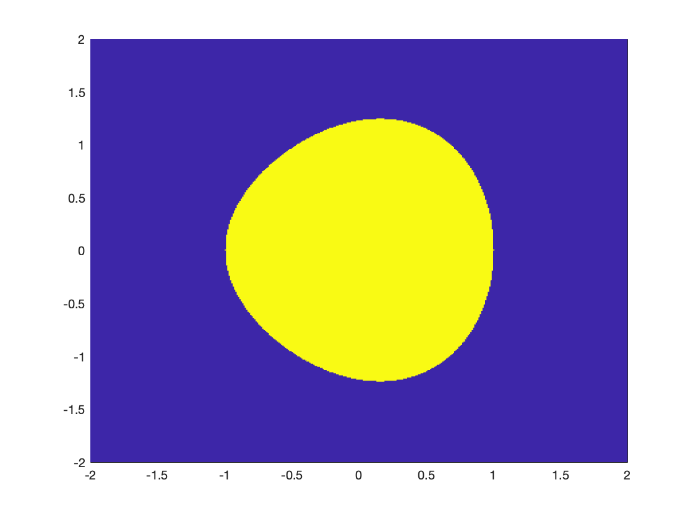

# Semidefinite Optimization {#sdp}

## Positive Semidefinite Matrices 

A real matrix $A = (A_{ij}) \in \Real{n \times n}$ is symmetric if $A = A\tran$, i.e., $A_{ij} = A_{ji}$ for all $i,j$. Let $\sym{n}$ be the space of all real symmetric matrices.

Any symmetric matrix $A$ defines a **quadratic form** $x\tran A x$. A matrix $A$ is said to be **positive semidefinite** (PSD) if and only if its associated quadratic form is nonnegative, i.e., 
$$
x\tran A x \geq 0, \quad \forall x \in \Real{n}.
$$
We use $\psd{n}$ to denote the set of $n\times n$ PSD matrices. We also write $A \succeq 0$ to denote positive semidefiniteness when the dimension is clear.

There are several equivalent characterizations of positive semidefiniteness.

::: {.theorembox}
::: {.lemma #PositiveSemidefinite name="Positive Semidefinite Matrices"}
Let $A \in \sym{n}$ be a symmetric matrix, the following statements are equivalent:

1. A is positive semidefinite.

2. $x\tran A x \geq 0, \forall x \in \Real{n}$.

3. All eigenvalues of $A$ are nonnegative.

4. All $2^n-1$ principal minors of $A$ are nonnegative.

5. The coefficients of $p_A(\lambda)$ weakly alternate in sign, i.e., $(-1)^{n-k} p_k \geq 0$ for $k=0,\dots,n-1$, where $p_A(\lambda) = \det (A - \lambda \eye_n)$ is the characteristics polynomial of $A$.

6. There exists a factorization $A = BB\tran$, where $B \in \Real{n \times r}$ with $r$ the rank of $A$.
:::
:::

Among the equivalent characterizations of PSD matrices, (5) is less well-known, but it can be very useful when we want to convert a PSD constraint into multiple scalar constraints. For example, consider the following subset of $\Real{3}$:
$$
\lcbrace{z \in \Real{3} \lmid X(z) = \begin{bmatrix} 1 & z_1 & z_2 \\ z_1 & z_2 & z_3 \\ z_2 & z_3 & 5 z_2 - 4  \end{bmatrix} \succeq 0 }.
$$
We can first form the characteristic polynomial of $X(z)$ --whose coefficients will be functions of $z$-- and then invoking (5) to obtain a finite number scalar inequality constraints. We can then pass these scalar constraints to Mathematica and plot the set as in the following figure [@yang22mp-inexact].

```{r SpectrahedronStride, out.width='50%', fig.show='hold', fig.cap='An example spectrahedron.', fig.align='center', echo=FALSE}
knitr::include_graphics("images/spectrahedron-stride.png")
```

Similarly, we say a matrix $A \in \sym{n}$ is **positive definite** (PD) is its associated quadratic form is always positive, i.e., 
$$
x\tran A x > 0, \quad \forall x \in \Real{n}.
$$
We use $\pd{n}$ to denote the set of $n \times n$ PD matrices, and also write $A \succ 0$ when the dimension is clear.

Below is set of equivalent characterizations of positive definite matrices.

::: {.theorembox}
::: {.lemma #PositiveDefinite name="Positive Definite Matrices"}
Let $A \in \sym{n}$ be a symmetric matrix, the following statements are equivalent:

1. A is positive definite. 

2. $x\tran A x > 0, \forall x \in \Real{n}$.

3. All eigenvalues of $A$ are strictly positive.

4. All $n$ leading principal minors of $A$ are strictly positive.

5. The coefficients of $p_A(\lambda)$ strictly alternate in sign, i.e., $(-1)^{n-k} p_k > 0$ for $k=0,\dots,n-1$, where $p_A(\lambda) = \det (A - \lambda \eye_n)$ is the characteristics polynomial of $A$.

6. There exists a factorization $A = BB\tran$ with $B$ square and nonsingular (full-rank).
:::
:::

**Schur Complements**. A useful technique to check whether a matrix is positive (semi-)definite is to use the Schur Complements. Consider a block-partitioned matrix 
\begin{equation}
M = \begin{bmatrix} A & B \\ B\tran & C \end{bmatrix},
(\#eq:block-mat-M)
\end{equation}
where $A$ and $C$ are symmetric matrices.
If $A$ is invertible, then the Schur complement of $A$ is
$$
M / A = C - B\tran A\inv B.
$$
Similarly, if $C$ is invertible, then the Schur complement of $C$ is 
$$
M / C = A - B C\inv B\tran.
$$

We have the following result relating the Schur Complements to positive (semi-)definiteness.

::: {.theorembox}
::: {.proposition #SchurPSD name="Schur Complements and PSD"}
Consider the block-partitioned matrix $M$ in \@ref(eq:block-mat-M),

- $M$ is positive definite if and only if both $A$ and $M/A$ are positive definite:
$$
M \succ 0 \Leftrightarrow A \succ 0, M/A = C - B\tran A\inv B \succ 0.
$$

- $M$ is positive definite if and only if both $C$ and $M/C$ are positive definite:
$$
M \succ 0 \Leftrightarrow C \succ 0, M/C = A - B C\inv B\tran \succ 0.
$$

- If $A$ is positive definite, then $M$ is positive semidefinite if and only if $M/A$ is positive semidefinite:
$$
\text{If } A \succ 0, \text{ then } M \succeq 0 \Leftrightarrow M / A \succeq 0.
$$

- If $C$ is positive definite, then $M$ is positive semidefinite if and only if $M/C$ is positive semidefinite:
$$
\text{If } C \succ 0, \text{ then } M \succeq 0 \Leftrightarrow M / C \succeq 0.
$$
:::
:::

### Geometric Properties 

The set $\psd{n}$ is a proper cone (cf. Definition \@ref(def:ProperCone)). Its interior is $\pd{n}$. Under the inner product 
$$
\inprod{A}{B} = \trace(AB\tran), \quad A,B \in \Real{n \times n},
$$
the PSD cone $\psd{n}$ is self-dual.

Next we want to characterize the face of the PSD cone. We first present the following lemma which will turn out to be useful afterwards.

::: {.theorembox}
::: {.lemma #PSDRange name="Range of PSD Matrices"}
Let $A,B \in \psd{n}$, then we have
\begin{equation}
\Range(A) \subseteq \Range(A + B),
(\#eq:Range-PSD)
\end{equation}
where $\Range(A)$ denotes the span of the column vectors of $A$.
:::
:::
::: {.proofbox}
::: {.proof}
For any symmetric matrix $S$, we know
$$
\Range(S) = \ker(S)^{\perp}.
$$
Therefore, to prove \@ref(eq:Range-PSD), it is equivalent to prove 
$$
\ker(A) \supseteq \ker(A + B).
$$
Pick any $u \in \ker(A + B)$, we have 
$$
(A + B) u = 0 \Rightarrow u \tran (A + B) u = 0 \Rightarrow u\tran A u + u\tran B u = 0 \Rightarrow u\tran A u = u\tran B u = 0,
$$
where the last derivation is due to $A, B \succeq 0$. Now that we have $u\tran A u = 0$, we claim that $Au = 0$ must hold, i.e., $u \in \ker(A)$. To see this, write 
$$
u = \sum_{i=1}^n a_i v_i,
$$
where $a_i = \inprod{u}{v_i}$ and $v_i,i=1,\dots,n$ are the eigenvectors of $A$ corresponding to eigenvalues $\lambda_i,i=1,\dots,n$. Then we have 
$$
Au = \sum_{i=1}^n a_i A v_i = \sum_{i=1}^n a_i \lambda_i v_i,
$$
and 
$$
u\tran A u = \sum_{i=1}^n \lambda_i a_i^2 = 0.
$$
Since $\lambda_i \geq 0, a_i^2 \geq 0$, we have 
$$
\lambda_i a_i^2 = 0, \forall i = 1,\dots,n.
$$
This indicates that if $\lambda_i > 0$, then $a_i = 0$. Therefore, $a_i$ can only be nonzero for $\lambda_i = 0$, which leads to 
$$
Au = \sum_{i=1}^n a_i \lambda_i v_i = 0.
$$
Therefore, $u \in \ker(A)$, proving the result.
:::
:::

Lemma \@ref(lem:PSDRange) indicates that if $A \succeq B$, then $\Range(B) \subseteq \Range(A)$. What about the reverse? 

::: {.theorembox}
::: {.lemma #Extension name="Extend Line Segment"}
Let $A,B \in \psd{n}$, if $\Range(B) \subseteq \Range(A)$, then there must exist $C \in \psd{n}$ such that 
$$
A \in (B,C),
$$
i.e., the line segment from $B$ to $A$ can be extended past $A$ within $\psd{n}$.
:::
:::
::: {.proofbox}
::: {.proof}
Since $\Range(B) \subseteq \Range(A)$, we have 
$$
\ker(A) \subseteq \ker(B).
$$
Now consider extending the line segment past $A$ to 
$$
C_{\alpha} = A + \alpha(A - B) = (1+\alpha) A - \alpha B,
$$
with some $\alpha > 0$. We want to show that there exists $\alpha > 0$ such that $C_{\alpha} \succeq 0$.

Pick $u \in \Real{n}$, then either $u \in \ker(B)$ or $u \not\in \ker(B)$. If $u \in \ker(B)$, then
$$
u\tran C_{\alpha} u = (1+\alpha) u\tran A u - \alpha u\tran B u = (1+\alpha) u\tran A u \geq 0.
$$
If $u \not\in \ker(B)$, then due to $\ker(A) \subseteq \ker(B)$, we have $u \not\in \ker(A)$ as well. As a result, we have
\begin{equation}
u\tran C_{\alpha} u = (1+\alpha) u\tran A u - \alpha u\tran B u = (1+\alpha) u\tran A u \lparen{ 1- \frac{\alpha}{1+\alpha} \frac{u\tran B u}{u\tran A u} }.
(\#eq:prove-extension-1)
\end{equation}
Since 
$$
\max_{u: u \not\in \ker(A)} \frac{u\tran B u}{u\tran A u} \leq \frac{\lambda_{\max}(B)}{\lambda_{\min,>0}(A)},
$$
where $\lambda_{\min,>0}(A)$ denotes the minimum positive eigenvalue of $A$, we can always choose $\alpha$ sufficiently small to make \@ref(eq:prove-extension-1) nonnegative. Therefore, there exists $\alpha > 0$ such that $C_{\alpha} \succeq 0$.
:::
:::

In fact, from Lemma \@ref(lem:PSDRange) we can induce a corollary.

::: {.theorembox}
::: {.corollary #PSDRange name="Range of PSD Matrices"}
Let $A, B \in \psd{n}$, then we have 
$$
\Range(A + B) = \Range(A) + \Range(B),
$$
with "$+$" the Minkowski sum.
:::
:::

::: {.exercisebox}
::: {.exercise}
Let $A,B \in \psd{n}$, show that $\inprod{A}{B} = 0$ if and only if $\Range(A) \perp \Range(B)$.
:::
:::


For a subset $T \subseteq \psd{n}$, we use $\face(T,\psd{n})$ to denote the smallest face of $\psd{n}$ that contains $T$. We first characterize the smallest face that contains a given PSD matrix, i.e., $\face(A,\psd{n})$ for $A\succeq 0$. Clearly, if $A$ is PD, then $\face(A, \psd{n}) = \psd{n}$ is the entire cone. If $A$ is PSD but singular with rank $r < n$, then $A$ has the following spectral decomposition 
$$
Q\tran A Q = \begin{bmatrix} \Lambda & 0 \\ 0 & 0 \end{bmatrix},
$$
where $\Lambda \in \pd{r}$ is a diagonal matrix with the $r$ nonzero eigenvalues of $A$, and $Q \in \Ogroup(n)$ is orthogonal. If 
$$
A = \lambda B + (1-\lambda)C, \quad B,C \in \psd{n},\lambda \in (0,1),
$$
then multiplying both sides by $Q\tran$ and $Q$ we have
$$
\begin{bmatrix} \Lambda & 0 \\ 0 & 0 \end{bmatrix} = Q\tran A Q = \lambda Q\tran B Q + (1-\lambda) Q\tran C Q.
$$
Therefore, it must hold that
$$
Q\tran B Q = \begin{bmatrix} B_1 & 0 \\ 0 & 0 \end{bmatrix}, \quad Q\tran C Q = \begin{bmatrix} C_1 & 0 \\ 0 & 0 \end{bmatrix}, \quad B_1 \in \psd{r}, C_1 \in \psd{r},
$$
which is equivalent to 
$$
B = Q \begin{bmatrix} B_1 & 0 \\ 0 & 0 \end{bmatrix} Q\tran, C = Q \begin{bmatrix} C_1 & 0 \\ 0 & 0 \end{bmatrix} Q\tran, \quad B_1 \in \psd{r}, C_1 \in \psd{r}.
$$
We conclude that $\face(A,\psd{n})$ must contain the set 
\begin{equation}
G:= \lcbrace{Q \begin{bmatrix} X & 0 \\ 0 & 0 \end{bmatrix} Q\tran  \lmid  X \in \psd{r}}.
(\#eq:face-of-A-psd)
\end{equation}

::: {.exercisebox}
::: {.exercise}
Show that $G$ in \@ref(eq:face-of-A-psd) is a face of $\psd{n}$, i.e., (i) $G$ is convex; (ii) $u \in (x,y), u \in G, x,y \in \psd{n} \Rightarrow x,y \in G$. 
:::
:::

As a result, we have $\face(A,\psd{n}) = G$.

More general faces of the PSD cone $\psd{n}$ can be characterized as follows (Theorem 3.7.1 in [@wolkowicz12book-sdp]).

::: {.theorembox}
::: {.theorem #FacePSD name="Faces of the PSD Cone"}
A set $F \subseteq \psd{n}$ is a face if and only if there exists a subspace $L \subseteq \Real{n}$ such that 
$$
F = \cbrace{X \in \psd{n} \mid \Range(X) \subseteq L}.
$$
:::
:::
::: {.proofbox}
::: {.proof}
It is easy to prove the "**If**" direction using Lemma \@ref(lem:PSDRange). 

First we show $F$ is convex. Pick $A,B \in F$. We have $\Range(A) \subseteq L$ and $\Range(B) \subseteq L$. Let $v_1,\dots,v_m$ be a set of basis spanning $L$. We have that, for any $u \in \Real{n}$,
\begin{equation}
\begin{split}
A u \in L & \Rightarrow Au = \sum_{i=1}^m a_i v_i, \\
B u \in L & \Rightarrow Bu = \sum_{i=1}^m b_i v_i. 
\end{split}
\end{equation}
So for any $\lambda \in [0,1]$, we have 
$$
(\lambda A + (1-\lambda) B) u = \lambda Au + (1-\lambda) Bu = \sum_{i=1}^m (\lambda a_i + (1-\lambda) b_i ) v_i \in L,
$$
implying $\lambda A + (1-\lambda) B \in F$ for any $\lambda \in [0,1]$.

Now we show that:
$$
X \in (A,B), X \in F, A,B \in \psd{n} \Rightarrow A, B \in F.
$$
From $X = \lambda A + (1-\lambda) B$ for some $\lambda \in (0,1)$, and invoking Lemma \@ref(lem:PSDRange), we have 
\begin{equation}
\begin{split}
\Range(X) & = \Range(\lambda A + (1-\lambda) B) \supseteq \Range(\lambda A) = \Range(A) \\
\Range(X) & = \Range(\lambda A + (1-\lambda) B) \supseteq \Range((1-\lambda) B) = \Range(B).
\end{split}
\end{equation}
Since $\Range(X) \subseteq L$ due to $X \in F$, we have
$$
\Range(A) \subseteq L, \quad \Range(B) \subseteq L,
$$
leading to $A,B \in F$.

The proof for the "**Only If**" direction can be found in Theorem 3.7.1 of [@wolkowicz12book-sdp].
:::
:::

## Semidefinite Programming

### Spectrahedra 

Recall the definition of a polyhedron in \@ref(eq:polyhedron), i.e., a vector $x$ constrained by finitely many linear inequalities. The feasible set of a Linear Program is a polyhedron.

Similarly, we define a **spectrahedron** as a set defined by finitely many **linear matrix inequalities** (LMIs). Spectrahedra are the feasible sets of Semidefinite Programs (SDPs). 

A linear matrix inequality has the form
$$
A_0 + \sum_{i=1}^m A_i x_i \succeq 0,
$$
where $A_i \in \sym{n},i=0,\dots,m$ are given symmetric matrices. Correspondingly, a spectrahedron is defined by finitely many LMIs.

::: {.definitionbox}
::: {.definition #Spectrahedron name="Spectrahedron"}
A set $S \subseteq \Real{m}$ is a spectrahedron if it has the form
$$
S = \lcbrace{x \in \Real{m} \lmid A_0 + \sum_{i=1}^m x_i A_i \succeq 0},
$$
for given symmetric matrices $A_0,A_1,\dots,A_m \in \sym{n}$.
:::
:::
Note that there is no less of generality in defining a spectrahedron using a single LMI. For example, in the case of a set defined by two LMIs:
$$
S = \lcbrace{x \in \Real{m} \lmid A_0 + \sum_{i=1}^m x_i A_i \succeq 0, B_0 + \sum_{i=1}^m x_i B_i \succeq 0 }, A_i \in \sym{n}, B_i \in \sym{d},
$$
we can compress the two LMIs into a single LMI by putting $A_i$ and $B_i$ along the diagonal: 
$$
S = \lcbrace{x \in \Real{m} \lmid \begin{bmatrix} A_0 & \\ & B_0 \end{bmatrix} + \sum_{i=1}^m x_i \begin{bmatrix} A_i & \\ & B_i \end{bmatrix} \succeq 0 }.
$$

Leveraging (5) of Lemma \@ref(lem:PositiveSemidefinite), we know that a PSD constraint is equivalent to weakly alternating signs of the characteristic polynomial of the given matrix. Therefore, a spectrahedron is defined by finitely many polynomial inequalities, i.e., a spectrahedron is a (convex) **basic semialgebraic set**, as seen in the following example [@blekherman12book-semidefinite].

::: {.examplebox}
::: {.example #EllipticCurve name="Elliptic Curve"}
Consider the spectrahedron in $\Real{2}$ defined by 
$$
\lcbrace{(x,y) \in \Real{2} \lmid A(x,y) = \begin{bmatrix} x+1 & 0 & y \\ 0 & 2 & -x-1 \\ y & -x-1 & 2 \end{bmatrix} \succeq 0 }.
$$
To obtain scalar inequalities defining the set, let
$$
p_A(\lambda) = \det (\lambda I - A(x,y)) = \lambda^3 + p_2 \lambda^2 + p_1 \lambda + p_0
$$
be the characteristic polynomial of $A(x,y)$. $A(x,y) \succeq 0$ is then equivalent to the coefficients weakly alternating in sign:
\begin{equation}
\begin{split}
p_2 & = -(x+5) \leq 0, \\
p_1 & = -x^2 + 2x - y^2 + 7 \geq 0, \\
p_0 & = -(3+ x -x^3 -3x^2 - 2y^2) \leq 0.
\end{split}
\end{equation}
We can use the following Matlab script to plot the set shown in Fig. \@ref(fig:EllipticCurve). (The code is also available at [here](https://github.com/ComputationalRobotics/Semidefinite-Examples).) As we can see, the spectrahedron is convex, but it is not a polyhedron.

```matlab 
x = -2:0.01:2; 
y = -2:0.01:2; 
[X,Y] = meshgrid(x,y);

ineq = (-X - 5 <= 0) & ...
    (-X.^2 + 2*X - Y.^2 + 7 >=0) & ...
    (3 + X - X.^3 - 3*X.^2 - 2*Y.^2 >= 0);

h = pcolor(X,Y,double(ineq)) ;
h.EdgeColor = 'none' ;
```

```{r EllipticCurve, out.width='60%', fig.show='hold', fig.cap='Elliptic Curve.', fig.align='center', echo=FALSE}

```
:::
:::

We can use the same technique to visualize the elliptope, a spectrahedron that we will see again later when we study the MAXCUT problem.

::: {.examplebox}
::: {.example #Elliptope name="Elliptope"}
Consider the 3D elliptope defined by 
$$
\lcbrace{(x,y,z) \in \Real{3} \lmid A(x,y,z) = \begin{bmatrix} 1 & x & y \\ x & 1 & z \\ y & z & 1 \end{bmatrix} \succeq 0}.
$$
The characteristic polynomial of $A(x,y,z)$ is
$$
p_A(\lambda) = \lambda^3 - 3 \lambda^2 + (-x^2 - y^2 - z^2 + 3) \lambda + x^2 - 2 xyz + y^2 + z^2 -1. 
$$
The coefficients need to weakly alternative in sign, we have the inequalities
\begin{equation}
\begin{split}
-x^2 - y^2 - z^2 + 3 & \geq 0 \\
x^2 - 2 xyz + y^2 + z^2 -1 & \leq 0
\end{split}
\end{equation}

Using the Matlab script [here](https://github.com/ComputationalRobotics/Semidefinite-Examples/blob/main/elliptope.m), we generate the following plot.
 
```{r Elliptope, out.width='80%', fig.show='hold', fig.cap='Elliptope.', fig.align='center', echo=FALSE}
knitr::include_graphics("images/elliptope.png")
```

:::
:::


Another example is provided in Fig. \@ref(fig:SpectrahedronStride).


### Formulation and Duality

Semidefinite programs (SDPs) are linear optimization problems over spectrahedra. A standard SDP in **primal** form is written as
\begin{equation}
\boxed{
\begin{split}
p^\star = \min_{X \in \sym{n}} & \quad \inprod{C}{X} \\
\subject & \quad \calA(X) = b, \\
& \quad X \succeq 0
\end{split}
}
(\#eq:SDP-P)
\end{equation}
where $C \in \sym{n}$, $b \in \Real{m}$, and the linear map $\calA: \sym{n} \rightarrow \Real{m}$ is defined as 
$$
\calA(X) := \begin{bmatrix} \inprod{A_1}{X} \\
\vdots \\ \inprod{A_i}{X} \\ \inprod{A_m}{X} \end{bmatrix}.
$$
Recall that $\inprod{C}{X} = \trace(CX)$. The feasible set of \@ref(eq:SDP-P) is the intersection of the PSD cone ($\psd{n}$) and the affine subspace defined by $\calA(X) = b$. 

Closely related to the primal SDP \@ref(eq:SDP-P) is the **dual** problem
\begin{equation}
\boxed{
\begin{split}
d^\star = \max_{y \in \Real{m}} & \quad \inprod{b}{y} \\
\subject & \quad C - \calA^* (y) \succeq 0
\end{split}
}
(\#eq:SDP-D)
\end{equation}
where $\calA^{*}: \Real{m} \rightarrow \sym{n}$ is the **adjoint** map defined as
$$
\calA^*(y) := \sum_{i=1}^m y_i A_i.
$$
Observe how the primal-dual SDP pair \@ref(eq:SDP-P)-\@ref(eq:SDP-D) parallels the primal-dual LP pair \@ref(eq:primal-lp)-\@ref(eq:dual-lp).

**Weak duality**. We have a similar weak duality between the primal and dual. Pick any $X$ that is feasible for the primal \@ref(eq:SDP-P) and $y$ that is feasible for the dual \@ref(eq:SDP-D), we have 
$$
\boxed{\inprod{C}{X} - \inprod{b}{y} = \inprod{C}{X} - \inprod{\calA(X)}{y} = \inprod{C - \calA^* (y)}{X} \geq 0,}
$$
where the last inequality holds because both $C - \calA^*(y)$ and $X$ are positive semidefinite. As a result, we have the weak duality
$$
d^\star \leq p^\star.
$$

Similar to the LP case, we will denote $p^\star = +\infty$ if the primal is infeasible, $p^\star = - \infty$ if the primal is unbounded below. We will denote $d^\star = +\infty$ if the dual is unbounded above, and $d^\star = -\infty$ if the dual is infeasible. We say the primal (or the dual) is **solvable** if it admits optimizers. We denote $p^\star - d^\star$ as the **duality gap**. 

Recall Theorem \@ref(thm:LPStrongDuality) states that in LP, if at least one of the primal and dual is feasible, then strong duality holds (i.e., $p^\star = d^\star = \{\pm \infty, \text{finite} \}$). Unfortunately, this does not carry over to SDPs. Let us provide several examples.

::: {.examplebox}
::: {.example #FailureSDPDuality name="Failure of SDP Strong Duality"}

The first example, from [@ramana97mp-exact], shows that even if both primal and dual are feasible, there could exist a nonzero duality gap. Consider the following SDP pair for some $\alpha \geq 0$
$$
\begin{cases}
\min_{X \in \sym{3}} & \alpha X_{11} \\
\subject & X_{22} = 0 \\
& X_{11} + 2 X_{23} = 1 \\
& \begin{bmatrix} X_{11} & X_{12} & X_{13} \\
* & X_{22} & X_{23} \\
* & * & X_{33} \end{bmatrix} \succeq 0 
\end{cases}, 
\begin{cases}
\max_{y \in \Real{2}} & y_2 \\
\subject & \begin{bmatrix} \alpha & 0 & 0 \\ 0 & 0 & 0 \\ 0 & 0 & 0 \end{bmatrix} \succeq \begin{bmatrix} y_2 & 0 & 0 \\ 0 & y_1 & y_2 \\ 0 & y_2 & 0 \end{bmatrix}
\end{cases}
$$
To examine the primal feasible set, let us pick the bottom-right $2\times 2$ submatrix of $X$. The determinant of this submatrix needs to be nonnegative (due to (4) of Lemma \@ref(lem:PositiveSemidefinite)):
$$
X_{22} X_{33} - X_{23}^2 \geq 0.
$$
Because $X_{22} = 0$, we have $X_{23} = 0$ and hence $X_{11} = 1$. Therefore, $p^\star = \alpha$ is attained.

To examine the dual feasible set, pick the bottom-right $2 \times 2$ submatrix of 
$$
\begin{bmatrix} \alpha - y_2 & 0 & 0 \\ 0 & - y_1 & -y_2 \\ 0 & -y_2 & 0 \end{bmatrix} \succeq 0,
$$
we have $y_2 = 0$. As a result, $d^\star = 0$, and strong duality fails. 


The second example, from [@todd01an-semidefinite], shows that the duality gap can even be infinite. Consider the primal-dual SDP 
$$
\begin{cases}
\min_{X \in \sym{2}} & 0 \\
\subject & X_{11} = 0 \\
& X_{12} = 1 \\
& \begin{bmatrix} X_{11} & X_{12} \\ * & X_{22} \end{bmatrix} \succeq 0
\end{cases},
\begin{cases}
\max_{y \in \Real{2}} & 2 y_2 \\
\subject & \begin{bmatrix} - y_1 & - y_2 \\ - y_2 & 0 \end{bmatrix} \succeq 0 
\end{cases}
$$
Clearly, the primal is infeasible because
$$
\begin{bmatrix} 0 & 1 \\ 1 & X_{22} \end{bmatrix}
$$
can never be PSD. So $p^\star = + \infty$. The dual problem, however, is feasible. From the PSD constraint we have $y_2 = 0$ and $d^\star = 0$. Therefore, the duality gap is infinite.

The third example, from [@todd01an-semidefinite], shows that even when the duality gap is zero, the primal or dual problem may not admit optimizers. Consider the primal-dual SDP
$$
\begin{cases}
\min_{X \in \sym{2}} & 2 X_{12} \\
\subject & - X_{11} = -1 \\
& - X_{22} = 0 \\
& \begin{bmatrix} X_{11} & X_{12} \\ * & X_{22} \end{bmatrix} \succeq 0 
\end{cases},
\begin{cases}
\max_{y \in \Real{2}} & - y_1 \\
\subject & \begin{bmatrix} y_1 & 1 \\ 1 & y_2 \end{bmatrix} \succeq 0
\end{cases}
$$
To examine the primal feasible set, we have
$$
\begin{bmatrix} 1 & X_{12} \\ X_{12} & 0 \end{bmatrix} \succeq 0
$$
implies $X_{12} = 0$. Hence the primal feasible set only has one point and $p^\star = 0$. The dual feasible set reads
$$
y_1 y_2 \geq 1,\quad  y_1 \geq 0, \quad y_2 \geq 0,
$$
and we want to minimize $y_1$. Clearly, $d^\star = 0$ but it is not attainable. Therefore, strong duality holds but the dual problem is not solvable.

A Matlab script that passes these three examples to SDP solvers can be found [here](https://github.com/ComputationalRobotics/Semidefinite-Examples/blob/main/failure_strong_duality.m).
:::
:::

The examples above are somewhat "pathological" and they show that SDPs in general can be more complicated that LPs. It turns out, with the addition of **Slater's condition**, i.e., **strict feasibility** of the primal and dual, we can recover nice results parallel to those of LP.

::: {.theorembox}
::: {.theorem #SDPStrongDuality name="SDP Strong Duality"}
Assume both the primal SDP \@ref(eq:SDP-P) and the dual SDP \@ref(eq:SDP-D) are _strictly feasible_, i.e., there exists $X \succ 0$ such that $\calA(X)=b$ for the primal and there exists $y \in \Real{m}$ such that $C - \calA^* (y) \succ 0$ for the dual, then strong duality holds, i.e., both problems are solvable and admit optimizers, and $p^\star = d^\star$ equals to some finite number. 

Further, a pair of primal-dual feasible points $(X,y)$ is optimal if and only if 
$$
\inprod{C}{X} = \inprod{b}{y} \Leftrightarrow \inprod{C - \calA^* (y)}{X} = 0 \Leftrightarrow (C - \calA^* (y)) X = 0.
$$
:::
:::

One can relax the requirement of both primal and dual being strictly feasible to only one of them being strictly feasible, and similar results would hold. Precisely, if the primal is bounded below and strictly feasible, then $p^\star = d^\star$ and the dual is solvable. If the dual is bounded above and strictly feasible, then $p^\star = d^\star$ and the primal is solvable [@nie23book-moment]. 

::: {.examplebox}
::: {.example #SuccessSDPDuality name="SDP Strong Duality"}
Consider the following primal-dual SDP pair
$$
\begin{cases}
\min_{X \in \sym{2}} & 2 X_{11} + 2 X_{12} \\
\subject & X_{11} + X_{22} = 1 \\
& \begin{bmatrix} X_{11} & X_{12} \\ * & X_{22} \end{bmatrix} \succeq 0 
\end{cases},
\begin{cases}
\max_{y \in \Real{}} & y \\
\subject & \begin{bmatrix} 2 - y & 1 \\ 1 & - y \end{bmatrix} \succeq 0
\end{cases}
$$
Choose
$$
X = \begin{bmatrix} 0.5 & 0 \\ 0 & 0.5 \end{bmatrix} \succ 0
$$
we see the primal is strictly feasible.
Choose $y = -1$, we have 
$$
\begin{bmatrix} 3 & 1 \\ 1 & 1 \end{bmatrix} \succ 0
$$
and the dual is strictly feasible. Therefore, strong duality holds. 

In this case, pick the pair of primal-dual feasible points
$$
X^\star = \begin{bmatrix} \frac{2 - \sqrt{2}}{4} & - \frac{1}{2 \sqrt{2}} \\ - \frac{1}{2 \sqrt{2}} & \frac{2 + \sqrt{2}}{4} \end{bmatrix}, \quad y^\star = 1 - \sqrt{2},
$$
we have 
$$
\inprod{C}{X^\star} = 1-\sqrt{2} = \inprod{b}{y^\star},
$$
and both $X^\star$ and $y^\star$ are optimal. 
:::
:::

### Geometric Properties 

## Software for Conic Optimization

Linear optimization over the nonnegative orthant ($\Real{n}_{+}$), the second-order cone ($\calQ_{n}$), and the positive semidefinite cone ($\psd{n}$) forms the foundation of modern convex optimization, commonly referred to as conic optimization. These three types of cones are self-dual, and there exist efficient algorithms to solve the convex optimization problems. Popular solvers include SDPT3, SeDuMi, MOSEK, and SDPNAL+. 

In this section, we introduce how we should "talk to" the numerical solvers for conic optimization, i.e., how should we pass a mathematically written conic optimization to a numerical solver. Note that in many cases, this "transcription" can be done by programming packages such as CVX, CVXPY, YALMIP etc., but I think it is important to understand the standard interface of numerical solvers because (i) it reinforces our understanding of the mathematical basics, (ii) it gets us closer to designing custom numerical solvers for specific problems, (iii) if you are a heavy convex optimization user you will realize that many of the programming packages are not "efficient" in transcribing the original optimization problem (but they are indeed very general). I have had cases where solving the conic optimization takes a few minutes but transcribing the problem to the solver takes half an hour.

We will use the SeDuMi format as an example. Consider the following general linear convex optimization problem
\begin{equation}
\begin{split}
\max_{y \in \Real{m}} & \quad b\tran y \\
\subject & \quad Fy = g \\
& \quad f \geq Gy \\
& \quad h_i\tran y + \tau_i \geq \norm{H_i y + p_i}_2, i=1,\dots,r \\
& \quad B_{j,0} + \sum_{k=1}^m y_k B_{j,k} \succeq 0, j=1,\dots,s,
\end{split}
(\#eq:general-convex-sedumi)
\end{equation}
for given matrices and vectors 
$$
F \in \Real{\ell_1 \times m},G \in \Real{\ell_2 \times m},H_i \in \Real{l_i \times m}, B_{j,k} \in \sym{n_j}, h_i \in \Real{m}, p_i \in \Real{l_i}, \tau_i \in \Real{}, g \in \Real{\ell_1},f \in \Real{\ell_2}.
$$
Define the linear function 
$$
\phi(y):= \left(Fy, Gy, \begin{bmatrix} - h_1\tran y \\ - H_1 y \end{bmatrix}, \dots, \begin{bmatrix} - h_r\tran y \\ - H_r y \end{bmatrix}, - \sum_{k=1}^m y_k B_{1,k}, \dots,- \sum_{k=1}^m y_k B_{s,k} \right),
$$
which is a linear map from $\Real{m}$ to the vector space of Cartesian products
$$
V:= \Real{\ell_1} \times \Real{\ell_2} \times \Real{l_1+1} \times \dots \times \Real{l_r + 1} \times \sym{n_1}\times \dots \times \sym{n_s}.
$$
A vector $X \in V$ can be written as a tuple
$$
X = (x_1,x_2,\mathx_1,\dots,\mathx_r,X_1,\dots,X_s).
$$
Given another vector $Y \in V$
$$
X = (y_1,y_2,\mathy_1,\dots,\mathy_r,Y_1,\dots,Y_s),
$$
the inner product between $X$ and $Y$ is defined as 
$$
\inprod{X}{Y} = \inprod{x_1}{y_2} + \inprod{x_2}{y_2} + \sum_{i=1}^r \inprod{\mathx_i}{\mathy_i} + \sum_{j=1}^s \inprod{X_j}{Y_j}.
$$

Let $\calK$ be the Cartesian product of the free cone, the nonnegative orthant, the second-order cone, and the PSD cone 
$$
\calK := \Real{\ell_1} \times \Real{\ell_2}_{+} \times \calQ_{l_1} \times \dots \times \calQ_{l_r} \times \psd{n_1} \times \dots \times \psd{n_s}.
$$
Its dual cone is 
$$
\calK^* = \{0\}^{\ell_1} \times \times \Real{\ell_2}_{+} \times \calQ_{l_1} \times \dots \times \calQ_{l_r} \times \psd{n_1} \times \dots \times \psd{n_s}.
$$
Note that all the cones there are self-dual except the free cone whose dual is the zero point. Then denote 
$$
C := \left( g,f,\begin{bmatrix} \tau_1 \\ p_1 \end{bmatrix},\dots,\begin{bmatrix} \tau_r \\ p_r \end{bmatrix},B_{1,0},\dots,B_{s,0} \right) \in V,
$$
we have that the original optimization \@ref(eq:general-convex-sedumi) is simply the following dual conic problem
\begin{equation}
\max_{y \in \Real{m}} \cbrace{b\tran y \mid C - \phi(y) \in \calK^*}.
(\#eq:dual-conic)
\end{equation}
The linear map $\phi(y)$ can be written as
$$
\phi(y) = y_1 A_1 + \dots, y_m A_m
$$
for vectors $A_1,\dots,A_m$ in the space $V$. Therefore, the primal problem to \@ref(eq:dual-conic) is
\begin{equation}
\min_{X \in V} \cbrace{\inprod{C}{X} \mid \inprod{A_i}{X}=b_i,i=1,\dots,m,X \in \calK }.
(\#eq:primal-conic)
\end{equation}

Let us practice an example from [@nie23book-moment].

::: {.examplebox}
::: {.example #SeDuMiExample name="SeDuMi Example"}
Consider the following optimization problem as an instance of \@ref(eq:general-convex-sedumi):
\begin{equation}
\begin{split}
\max_{y \in \Real{3}} & \quad y_3 - y_1 \\
\subject & \quad y_1 + y_2 + y_3 = 3\\
& \quad -1 \geq -y_1 - y_2 \\
& \quad -1 \geq -y_2 - y_3 \\
& \quad y_1 + y_3 \geq \sqrt{(y_1-1)^2 + y_2^2 + (y_3 -1)^2} \\
& \quad \begin{bmatrix} 1 & y_1 & y_2 \\ y_1 & 2 & y_3 \\ y_2 & y_3 & 3 \end{bmatrix} \succeq 0
\end{split}
(\#eq:sedumi-example)
\end{equation}
Clearly we have $b = (-1,0,1)$. The linear map $\phi(y)$ is 
$$
\phi(y) = \left( y_1+y_2+y_3,\begin{bmatrix} -y_1 - y_2 \\ - y_2 - y_3 \end{bmatrix}, \begin{bmatrix} - y_1 - y_3 \\ -y_1 \\ -y_2 \\ -y_3 \end{bmatrix}, \begin{bmatrix} 0 & -y_1 & -y_2 \\ -y_1 & 0 & -y_3 \\ -y_2 & -y_3 & 0 \end{bmatrix} \right).
$$
The vector space $V=\Real{} \times \Real{2} \times \Real{4} \times \sym{3}$, and the cone $\calK$ is 
$$
\calK = \Real{} \times \Real{2}_{+} \times \calQ_3 \times \psd{3}.
$$
The vectors $A_1,A_2,A_3$ are
\begin{equation}
\begin{split}
A_1 &= \left( 1,\begin{bmatrix}-1\\0\end{bmatrix}, \begin{bmatrix}-1\\-1\\0\\0\end{bmatrix},\begin{bmatrix}0&-1&0\\-1&0&0\\0&0&0\end{bmatrix} \right)\\
A_2 &= \left( 1,\begin{bmatrix}-1\\-1\end{bmatrix}, \begin{bmatrix}0\\0\\-1\\0\end{bmatrix},\begin{bmatrix}0&0&-1\\0&0&0\\-1&0&0\end{bmatrix} \right)\\
A_3 &= \left( 1,\begin{bmatrix}0\\-1\end{bmatrix}, \begin{bmatrix}-1\\0\\0\\-1\end{bmatrix},\begin{bmatrix}0&0&0\\0&0&-1\\0&-1&0\end{bmatrix} \right).
\end{split}
\end{equation}
The vector $C$ is 
$$
C = \left( 3,\begin{bmatrix}-1\\-1\end{bmatrix}, \begin{bmatrix}0\\-1\\0\\-1\end{bmatrix},\begin{bmatrix}1&0&0\\0&2&0\\0&0&3\end{bmatrix} \right).
$$

To input this problem to SeDuMi, we only need to provide the data $(A,b,C)$ together with the description of the cones $\calK$.

```matlab 
% describe dimensions of the cones
K.f = 1; % free cone
K.l = 2; % nonnegative orthant
K.q = 4; % second order cone
K.s = 3; % psd cone

% provide A,b,c
c = [3,-1,-1,0,-1,0,-1,1,0,0,0,2,0,0,0,3];
b = [-1,0,1];
A = [
    1,-1,0,-1,-1,0,0,0,-1,0,-1,0,0,0,0,0;
    1,-1,-1,0,0,-1,0,0,0,-1,0,0,0,-1,0,0;
    1,0,-1,-1,0,0,-1,0,0,0,0,0,-1,0,-1,0
    ];

% solve using sedumi
[xopt,yopt,info] = sedumi(A,b,c,K);
```
Note that in providing $A$, we vectorize each $A_i$ and place it along the $i$-th row of the matrix $A$.
The above Matlab script gives us the optimal solution
$$
y^\star = (0,1,2).
$$
To run the [code](https://github.com/ComputationalRobotics/Semidefinite-Examples/blob/main/sedumi_example.m), make sure you download [SeDuMi](https://github.com/sqlp/sedumi) and add that to your Matlab path. 

:::
:::

## Interior Point Algorithm

A nice property of semidefinite optimization is that it can be solved in polynomial time. The algorithm of choice for solving SDPs is called an **interior point method** (IPM), which is also what popular SDP solvers like SeDuMI, MOSEK, and SDPT3 implement under the hood. 

Although it can be difficult to implement an SDP solver as efficient and robust as MOSEK (as it requires many engineering wisdom), it is surprisingly simple to sketch out the basic algorithmic framework, as it is based on [Newton's method for solving a system of nonlinear equations](https://en.wikipedia.org/wiki/Newton%27s_method#:~:text=14%20External%20links-,Description,the%20method%20can%20be%20iterated.). Before I introduce you the basic algorithm, let me review two useful preliminaries. 

::: {.highlightbox}
<p style="text-align: center;"><b>Newton's Method</b></p>

Given a function $f: \Real{} \rightarrow \Real{}$ that is continuously differentiable, Newton's method is designed to find a root of $f(x) = 0$. Given an initial iterate $x^{(0)}$, Newton's method works as follows 
$$
x^{(k+1)} = x^{(k)} - \frac{f(x^{(k)})}{f'(x^{(k)})},
$$
where $f'(x^{(k)})$ denotes the derivative of $f$ at the current iterate $x^{(k)}$. This simple algorithm is indeed (in my opinion) the most important foundation of modern numerical optimization [@nocedal99book-numerical]. Under mild conditions, Newton's method has at least quadratic convergence rate, that is to say, if $|x^{(k)} - x^\star| = \epsilon$, then $|x^{(k+1)} - x^\star| = O(\epsilon^2)$. Of course, there exist pathological cases where even linear convergence is not guaranteed (e.g., when $f'(x^\star) = 0$). 

Newton's method can be generalized to find a point at which multiple functions vanish simultaneously. Given a function $F: \Real{n} \rightarrow \Real{n}$ that is continuously differentiable, and an initial iterate $x^{(0)}$, Newton's method reads 
\begin{equation}
x^{(k+1)} = x^{(k)} - J_F(x^{(k)})\inv F(x^{(k)}),
(\#eq:newton-method-vector)
\end{equation}
where $J_F(\cdot)$ denotes the Jacobian of $F$. Iteration \@ref(eq:newton-method-vector) is equivalent to 
\begin{equation}
\begin{split}
J_F(x^{(k)}) \Delta x^{(k)} & = - F(x^{(k)}) \\
x^{(k+1)} & = x^{(k)} + \Delta x^{(k)}
\end{split}
(\#eq:newton-method-vector-1)
\end{equation}
i.e., one first solves a linear system of equations to find an update direction $\Delta x^{(k)}$, and then take a step along the direction.

As we will see, IPMs for solving SDPs can be interpreted as applying Newton's method to the perturbed KKT optimality conditions.
:::

We introduce another useful preliminary about the symmetric Kronecker product. 

::: {.highlightbox}
<p style="text-align: center;"><b>Symmetric Vectorization and Kronecker Product</b></p>
Consider a linear operator on $\Real{n \times n}$:
\begin{equation}
\begin{split}
\Real{n \times n} & \rightarrow \Real{n \times n} \\
K & \mapsto N K M\tran 
\end{split}
(\#eq:linear-opt-Rn)
\end{equation}
where $N,M \in \Real{n \times n}$ are given square matrices. This linear map is equivalent to 
\begin{equation}
\begin{split}
\Real{n^2} & \rightarrow \Real{n^2} \\
\vectorize(K) & \mapsto (M \kron N) \vectorize(K)
\end{split}
(\#eq:linear-opt-Rn-kron)
\end{equation}
where $\kron$ denotes the usual kronecker product.

Symmetric vectorization and kronecker product is to generalize the above linear map on $\Real{n \times n}$ to $\sym{n}$.

Consider a linear operator on $\sym{n}$:
\begin{equation}
\begin{split}
\sym{n} & \rightarrow \sym{n} \\
K & \mapsto \frac{1}{2} \left( N K M\tran + M K N\tran \right)
\end{split}
(\#eq:linear-opt-Sn)
\end{equation}
where $N,M\in\Real{n\times n}$ are given square matrices. This linear map is equivalent to 
\begin{equation}
\begin{split}
\Real{n^{\Delta}} & \rightarrow \Real{n^{\Delta}} \\
\svec(K) & \mapsto (M \skron N) \svec(K)
\end{split}
(\#eq:linear-opt-Sn-skron)
\end{equation}
where
$$
n^{\Delta} = \frac{n(n+1)}{2}
$$
is the $n$-th triangle number, $\svec(K)$ denotes the symmetric vectorization of $K$ defined as
$$
\svec(K) = \begin{bmatrix}
K_{11} \\
\sqrt{2} K_{12} \\
\vdots \\
\sqrt{2} K_{1n} \\
K_{22} \\
\vdots \\
\sqrt{2} K_{2n} \\
\vdots \\
K_{nn}
\end{bmatrix},
$$
and $M \skron N$ denotes the symmetric kronecker product. Note that we have
$$
\inprod{A}{B} = \inprod{\svec(A)}{\svec(B)}, \quad \forall A,B \in \sym{n},
$$
and 
$$
M \skron N = N \skron M.
$$
To compute the symmetric kronecker product, see [@schacke04mthesis-kronecker]. The $\skron$ function is readily implemented in software packages such as SDPT3.

The following property of the symmetric kronecker product is useful for us later.

::: {.theorembox}
::: {.lemma #SkronEigLemma name="Spectrum of Symmetric Kronecker Product"}
Let $M,N \in \sym{n}$ be two symmetric matrices that commute, i.e., $MN = NM$, and $\alpha_1,\dots,\alpha_n$ and $\beta_1,\dots,\beta_n$ be their eigenvalues with $v_1,\dots,v_n$ a common basis of orthonormal eigenvectors. The $n^\Delta$ eigenvalues of $M \skron N$ are given by 
$$
\frac{1}{2}(\alpha_i \beta_j + \beta_i \alpha_j), \quad 1 \leq i \leq j \leq n,
$$
with the corresponding set of orthonormal eigenvectors 
$$
\begin{cases}
\svec(v_i v_i\tran) & \text{if } i = j \\
\frac{1}{\sqrt{2}} \svec(v_i v_j\tran + v_j v_i\tran) & \text{if } i < j
\end{cases}.
$$
:::
:::
It is easy to see that, if $M,N$ are two PSD matrices that commute, then $M \skron N$ is also PSD. 

For more properties of symmetric vectorization and Kronecker product, see [@schacke04mthesis-kronecker].
:::

Now we are ready to sketch the interior-point algorithm.

### The Central Path 

Assuming strict feasibility, strong duality holds between the SDP primal \@ref(eq:SDP-P) and dual \@ref(eq:SDP-D), then $(X,y,Z)$ is primal-dual optimal if and only if they satisfy the following KKT optimality conditions
\begin{equation}
\begin{split}
\calA(X) = b, \quad X \succeq 0 \\
C - \calA^*(y) - Z = 0, \quad Z \succeq 0 \\
\inprod{X}{Z} = 0 \Leftrightarrow XZ = 0
\end{split}
(\#eq:SDP-KKT)
\end{equation}
The first idea in IPM is to relax the last condition in \@ref(eq:SDP-KKT), i.e., zero duality gap, to a small positive gap, which leads to the notion of a central path.

::: {.definitionbox}
::: {.definition #CentralPath name="Central Path"}
A point $(X^\mu,y^\mu,Z^\mu)$ is said to lie on the central path if there exists $\mu > 0$ such that 
\begin{equation}
\begin{split}
\calA(X^\mu) = b, \quad X^\mu \succeq 0 \\
C - \calA^*(y^\mu) - Z^\mu = 0, \quad Z^\mu \succeq 0 \\
X^\mu Z^\mu = \mu \eye 
\end{split},
(\#eq:SDP-central-path)
\end{equation}
that is, $(X^\mu,y^\mu,Z^\mu)$ is primal and dual feasible, but attain a nonzero duality gap:
$$
\inprod{C}{X^\mu} - \inprod{b}{y^\mu} = \inprod{C}{X^\mu} - \inprod{\calA(X^\mu)}{y^\mu} = \inprod{C - \calA^*(y^\mu)}{X^\mu} = \inprod{X^\mu}{Z^\mu} = n\mu.
$$
:::
:::

The central path exists and is unique.

::: {.theorembox}
::: {.theorem #UniqueCentralPath name="Central Path"}
Assume the SDP pair \@ref(eq:SDP-P) and \@ref(eq:SDP-D) are strictly feasible. For any $\mu > 0$, $(X^\mu,y^\mu,Z^\mu)$ satisfying \@ref(eq:SDP-central-path) exists and is unique. Moreover,
$$
(X,y,Z) = \lim_{\mu \rightarrow 0} (X^\mu, y^\mu, Z^\mu)
$$
exists and solves \@ref(eq:SDP-P) and \@ref(eq:SDP-D). 
:::
:::

Theorem \@ref(thm:UniqueCentralPath) states that the limit of the central path leads to a solution of the SDP. Therefore, the basic concept of IPM is to follow the central path and converge to the optimal solution.

### The AHO Newton Direction

We will focus on the central path equation \@ref(eq:SDP-central-path) and for simplicity of notation, we will rename $(X^\mu,y^\mu,Z^\mu)$ as $(X,y,Z)$. Discarding the positive semidefiniteness condition for now, we can view \@ref(eq:SDP-central-path) as finding a root to the following function
\begin{equation}
F(X,y,Z) = \begin{pmatrix}
\calA^*(y) + Z - C \\
\calA(X) - b \\
X Z - \mu \eye 
\end{pmatrix} = 0.
(\#eq:central-path-F-1)
\end{equation}
However, there is an issue with $F$ defined as above. The input of the function $(X,y,Z)$ lives in $\sym{n} \times \Real{m} \times \sym{n}$, but the output lives in $\sym{n} \times \Real{m} \times \Real{n \times n}$ because $XZ$ is not guaranteed to be symmetric (two symmetric matrices may not commute). Therefore, Newton's method cannot be directly applied.

An easy way to fix this issue is to treat the input and output of $F$ as both $\Real{n \times n} \times \Real{m} \times \Real{n \times n}$. This could work, however, leads to nonsymmetric Newton iterates.

[@alizadeh98siopt-primal] proposed a better idea -- to equivalently rewrite \@ref(eq:central-path-F-1) as 
\begin{equation}
F(X,y,Z) = \begin{pmatrix}
\calA^*(y) + Z - C \\
\calA(X) - b \\
\frac{1}{2}(X Z + Z X) - \mu \eye 
\end{pmatrix} = 0.
(\#eq:central-path-F-2)
\end{equation}

The next proposition states that \@ref(eq:central-path-F-2) and \@ref(eq:central-path-F-1) are indeed equivalent.

::: {.theorembox}
::: {.proposition #SymmetricCentralPath name="Symmetrized Central Path"}
If $X,Z \succeq 0$, then 
$$
XZ = \mu \eye \Leftrightarrow XZ + ZX = 2 \mu \eye.
$$
:::
:::
::: {.proofbox}
::: {.proof}
The $\Rightarrow$ direction is obvious. To show the "\Leftarrow" direction, write $X = Q \Lambda Q\tran$ with $QQ\tran = \eye$.
:::
:::

Now that the input and output domains of $F$ in \@ref(eq:central-path-F-2) are both $\sym{n} \times \Real{m} \times \sym{n}$, we can apply Newton's method to solving the system of equations. For ease of implementation, let us denote 
$$
x = \svec(X), \quad z = \svec(Z), \quad c = \svec(C), 
$$
$$
A\tran = \begin{bmatrix}
\svec(A_1) & \svec(A_2) & \cdots & \svec(A_m)
\end{bmatrix}
$$
and rewrite \@ref(eq:central-path-F-2) as 
\begin{equation}
F(x,y,z) = \begin{pmatrix}
A\tran y + z - c \\
A x - b \\
\frac{1}{2}\svec(XZ + ZX) - \svec(\mu \eye)
\end{pmatrix} = 0.
(\#eq:central-path-F-3)
\end{equation}
The Jacobian of $F$ reads
\begin{equation}
J_F = \begin{bmatrix}
0 & A\tran & \eye \\
A & 0 & 0 \\
P & 0 & Q
\end{bmatrix}
(\#eq:aho-Jacobian)
\end{equation}
where 
$$
P = Z \skron \eye, \quad Q = X \skron \eye,
$$
due to the symmetric kronecker product introduced before 
$$
\frac{1}{2}\svec(XZ + ZX) = (Z \skron \eye ) x = (X \skron \eye) z.
$$
Let 
$$
r_d = c - A\tran y - z, \quad r_p = b - Ax, \quad r_c = \svec(\mu \eye ) - \frac{1}{2}\svec(XZ + ZX),
$$
be the dual, primal, and complementarity residuals, applying Newton's method to \@ref(eq:central-path-F-3) gives us the Newton direction as the solution to the following linear system
\begin{equation}
\begin{bmatrix}
0 & A\tran & \eye \\
A & 0 & 0 \\
P & 0 & Q 
\end{bmatrix} 
\begin{bmatrix} \Delta x \\ \Delta y \\ \Delta z \end{bmatrix} = \begin{bmatrix} r_d \\ r_p \\ r_c \end{bmatrix}.
(\#eq:aho-newton-direction)
\end{equation}
One can directly form the block matrix in \@ref(eq:aho-newton-direction) and solve the linear system. However, leveraging the sparsity of the linear system, we can do better. 

We can first use the third equation to eliminate $\Delta z$:
\begin{equation}
\Delta z = Q\inv (r_c - P \Delta x).
(\#eq:aho-eliminate-z)
\end{equation}
Then we can use the first equation to eliminate $\Delta x$:
\begin{equation}
\Delta x = - P\inv Q r_d + P\inv r_c + P\inv Q A\tran \Delta y.
(\#eq:aho-eliminate-x)
\end{equation}
Then we are left with a single equation of $\Delta y$:
\begin{equation}
\underbrace{ A P\inv Q A\tran}_{M} \Delta y = r_p + A P\inv (Q r_d - r_c),
(\#eq:aho-schur-system)
\end{equation}
which is called the **Schur system**.

### Basic Algorithm

With the AHO Newton direction worked out above, we can formulate the basic primal-dual path following interior point algorithm.

1. Choose $X,Z$ strictly feasible for \@ref(eq:SDP-P) and \@ref(eq:SDP-D), $0 \leq \sigma < 1$, define 
$$
\mu = \sigma \frac{\inprod{X}{Z}}{n}
$$

2. Solve the Newton direction from \@ref(eq:aho-schur-system), \@ref(eq:aho-eliminate-x), and \@ref(eq:aho-eliminate-z)

3. Step along the Newton direction 
$$
x \leftarrow x + \alpha \Delta x, \quad y \leftarrow y + \beta \Delta y, \quad z \leftarrow z + \beta \Delta z,
$$
where the step sizes $\alpha, \beta$ are chosen as 
$$
\alpha = \min (1, \tau \hat{\alpha}), \quad \beta = \min (1, \tau \hat{\beta})
$$
with $\tau \in (0,1)$ and $\hat{\alpha}, \hat{\beta}$ computed by 
\begin{equation}
\hat{\alpha} = \sup \cbrace{\bar{\alpha} \mid x + \bar{\alpha} \Delta x \succeq 0 }, \quad \hat{\beta} = \sup \cbrace{\bar{\beta} \mid z + \bar{\beta} \Delta z \succeq 0 }.
(\#eq:ipm-step-size)
\end{equation}

To compute the maximum step sizes $\hat{\alpha}$ and $\hat{\beta}$ in \@ref(eq:ipm-step-size), let
$$
X = \smat(x), \quad \Delta X = \smat(\Delta x)
$$
be the reconstructed matrices from the corresponding symmetric vectorizations. We can first perform a Cholesky factorization of $X$
$$
X = LL\tran.
$$
Then we perform a [matrix similarity transformation](https://en.wikipedia.org/wiki/Matrix_similarity) 
$$
X + \bar{\alpha} \Delta X \mapsto L\inv (X + \bar{\alpha} \Delta X) L^{-\top} = \eye + \bar{\alpha} L\inv \Delta X L^{-\top},
$$
which does not change the eigenvalues of $X + \bar{\alpha} \Delta X$. Therefore, the maximum step size $\hat{\alpha}$ is
$$
\hat{\alpha}\inv = \lambda_{\max}(- L\inv \Delta X L^{-\top}),
$$
assuming $\Delta X$ is not PSD.

### Nondegeneracy

Since the algorithm above is an application of Newton's method to the system of equations \@ref(eq:central-path-F-3), the key to understand its asymptotic behavior is to analyze the Jacobian \@ref(eq:aho-Jacobian) at the optimal solution. If the Jacobian at the optimal solution is nonsingular, then one can show that the algorithm above has asymptotic quadratic convergence rate. 

[@alizadeh98siopt-primal] provided a sufficient condition for the Jacobian to be nonsingular, which is called nondegeneracy.

::: {.definitionbox}
::: {.definition #Nondegeneracy name="Nondegeneracy"}
Let $(X,y,Z)$ be a solution to the SDP pair \@ref(eq:SDP-P) and \@ref(eq:SDP-D) and satisfies the KKT optimality conditions \@ref(eq:SDP-KKT). In this case, $X$ and $Z$ can be simultaneously diagonalized
$$
X = Q \Diag(\lambda_1,\dots,\lambda_n) Q\tran, \quad Z = Q \Diag(\omega_1,\dots,\omega_n)Q\tran
$$
by some orthogonal matrix $Q$. We assume 
$$
\lambda_1, \geq \dots \geq \lambda_n, \quad \omega_1 \leq \dots \omega_n.
$$
Due to $XZ = 0$, we have 
$$
\lambda_i \omega_i = 0,\quad i=1,\dots,n.
$$

Let $X$ have rank $r$ with positive eigenvalues $\lambda_1,\dots,\lambda_r$, and partition $Q = [Q_1, Q_2]$ where the colums of $Q_1$ are eigenvectors corresponding to $\lambda_1,\dots,\lambda_r$. We say $(X,y,Z)$ satisfies the strict complementarity and primal and dual nondegeneracy conditions if the following hold:

1. **(Strict Complementarity)** $\rank(Z) = n - r$.

2. **(Primal Nondegeneracy)** The matrices 
\begin{equation}
\begin{bmatrix} Q_1\tran A_k Q_1 & Q_1\tran A_k Q_2 \\
Q_2\tran A_k Q_1 & 0 \end{bmatrix}, \quad k=1,\dots,m
(\#eq:primal-nondegeneracy)
\end{equation}
are linearly independent in $\sym{n}$.

3. **(Dual Nondegeneracy)** The matrices 
\begin{equation}
Q_1\tran A_k Q_1, \quad k=1,\dots,m
(\#eq:dual-nondegeneracy)
\end{equation}
span the space $\sym{r}$.
:::
:::

When strict complementarity holds, **primal nondegeneracy implies the dual optimal solution is unique**, and **dual nondegeneracy implies the primal optimal solution is unique**. 

Strict complementarity and primal-dual nondegeneracy also immediately imply, recalling $r^{\Delta} = r(r+1)/2$,
\begin{equation}
r^{\Delta} \leq m \leq r^{\Delta} + r (n - r),
(\#eq:sc-pn-dn-m)
\end{equation}
where $r^\Delta \leq m$ is due to \@ref(eq:dual-nondegeneracy) and $m \leq r^{\Delta} + r (n - r)$ is due to \@ref(eq:primal-nondegeneracy). 

From \@ref(eq:sc-pn-dn-m), we can understand that when $m$ is very large, then primal nondegeneracy must fail and the dual solution must not be unique. This is a property we will see later when we study the moment-SOS hierarchy.

### Generalization

The AHO Newton direction is obtained by symmetrizing the centrality condition $XZ = \mu \eye$ as 
$$
\frac{1}{2}(XZ + ZX) = \mu \eye.
$$

It turns out that is not the only way (and also not the most robust way) to symmetrize the centrality condition. A more popular symmetrization is due to [@monteiro97siopt-primal] and [@zhang98siopt-extending], and is typically referred to as the Monteiro-Zhang family [@monteiro98siopt-polynomial]. The basic idea is to symmetrize the centrality condition as 
\begin{equation}
\frac{1}{2}(P XZ P\inv + P\invtran XZ P\tran) = \mu \eye.
(\#eq:Monteiro-Zhang)
\end{equation}
Clearly, the AHO direction is a special case of \@ref(eq:Monteiro-Zhang) with the choice $P = \eye$.

Two other most popular Newton directions are:

- Nesterov-Todd [@todd98siopt-nesterov], where $P$ is obtained by first solving
$$
WZW = X, 
$$
and then setting 
$$
P = W^{-1/2}.
$$
This is the Newton method implemented by SeDuMi.

- HKM, which was proposed and analyzed by multiple authors [@helmberg96siopt-interior], [@kojima97siopt-interior], computes 
$$
P = Z^{1/2}.
$$
This is the Newton method implemented by SDPT3 and MOSEK.


## Applications

### Lyapunov Stability

One of the earliest and most important applications of semidefinite optimization is in the context of dynamical systems and control theory. The main reason is that it is possible to characterize the dynamical properties of a system (e.g., stability, contraction) in terms of algebraic statements such as the feasibility of specific forms of inequalities. We provide a simple example in the case of Lyapunov stability for linear dynamical systems. For a comprehensive overview, see [@boyd94book-lmi].

Consider a discrete-time linear dynamical system
\begin{equation}
x_{k+1} = A x_k,\quad k=0,\dots
(\#eq:dt-linear-system)
\end{equation}
where $x \in \Real{n}$ is called the state of the system, and $k$ indexes the time. An important property that one wants to understand about the system \@ref(eq:dt-linear-system) is whether it is **stable**, i.e., given an initial state $x_0$, does $x_k$ tend to zero as $k$ tends to infinity.

It is well-known that $x_k$ tends to zero for all initial conditions $x_0$ if and only if $|\lambda_i(A)| < 1, \forall i=1,\dots,n$, i.e., all the eigenvalues of the transition matrix $A$ lies inside the unit circle.

Equivalently, one can also **certify** the stability of the system if a **Lyapunov function** 
\begin{equation}
V(x_k) = x_k\tran P x_k
(\#eq:Lyapunov-function)
\end{equation}
is given that satisfies the following matrix inequalities.

::: {.theorembox}
::: {.lemma #LyapunovStability name="Lyapunov Stability"}
Given $A \in \Real{n \times n}$, the following statements are equivalent:

1. All eigenvalues of $A$ lie strictly inside the unit circle, i.e., $|\lambda_i(A)| < 1, i=1,\dots,n$

2. There exists a matrix $P \in \sym{n}$ such that
$$
P \succ 0, \quad A\tran P A - P \prec 0.
$$
:::
:::
::: {.proofbox}
::: {.proof}

2 $\Rightarrow$ 1: Let $\lambda \in \Comp{}$ and $v  \neq 0 \in \Comp{n}$ be a pair of eigenvalue and eigenvector of $A$ such that $A v = \lambda v$. Since $A\tran P A - P \prec 0$, we have
$$
v^* (A\tran P A - P) v < 0 \Rightarrow (\lambda v)^* P (\lambda v) - v^* P v < 0 \Rightarrow (|\lambda|^2 - 1) (v^* P v) < 0.
$$
Since $P \succ 0$, we have $v^* P v > 0$. Hence, $|\lambda|^2 - 1 < 0$ and $|\lambda| < 1$.

1 $\Rightarrow$ 2: Construct 
$$
P := \sum_{k=0}^{\infty} (A^k)\tran A^k.
$$
The sum converges by the condition that $|\lambda_i(A)| < 1,\forall i$ and $P \succ 0$. Then we have
$$
A\tran P A - P = \sum_{k=1}^{\infty} (A^k)\tran A^k - \sum_{k=0}^{\infty} (A^k)\tran A^k = - \eye \prec 0,
$$
proving the result.
:::
:::

Intuitively, the Lyapunov function \@ref(eq:Lyapunov-function) defines a positive definite energy function. The fact that $P \succ 0$ implies $V(0) = 0$ and $V(x) > 0$ for any $x$ that is nonzero. The condition $A\tran P A - P \prec 0$ guarantees that the system's energy strictly decreases along any possible system trajectory. To see this, write
$$
V(x_{k+1}) - V(x_k) = V(Ax_k) - V(x_k) = x_k\tran(A\tran P A - P) x_k < 0, \forall x_k \neq 0.
$$
Therefore, the existence of a Lyapunov function guarantees any system trajectory will converge to the origin. 

The nice property of constructing such a Lyapunov function is that it goes beyond linear systems and can be similarly generalized to nonlinear systems, where one can compute a stability certificate from semidefinite optimization. See for example [this lecture notes](https://hankyang.seas.harvard.edu/OptimalControlEstimation/stability.html#lyapunov-analysis).

**Control Design**. Consider now the case where $A$ is not stable, but we can use a linear **feedback controller** to stabilize the system, i.e., 
$$
u_k = K x_k, \quad x_{k+1} = A x_k + B u_k = (A+ BK) x_k,
$$
where the matrix $K \in \Real{m \times n}$ is the feedback law we wish to design. We wish to design $K$ using convex optimization, in particular semidefinite optimization.

Involving Lemma~\@ref(lem:LyapunovStability), we see that designing $K$ to stabilize $A + BK$ is equivalent to finding
\begin{equation}
P \succ 0, \quad (A + BK)\tran P (A + BK) - P \prec 0.
(\#eq:control-stability)
\end{equation}
Using the Schur complement technique in Proposition \@ref(prp:SchurPSD), we know \@ref(eq:control-stability) is equivalent to
$$
\begin{bmatrix}
P & (A + BK)\tran P \\
P(A+BK) & P \end{bmatrix} \succ 0.
$$
This matrix inequality is, however, not jointly convex in the unknowns $(P,A)$. To address this issue, we can pre-multiply and post-multiply the equation by $\BlkDiag(P\inv, P\inv)$, which leads to
\begin{equation}
\begin{split}
\begin{bmatrix} P\inv & \\
& P\inv \end{bmatrix}
\begin{bmatrix}
P & (A + BK)\tran P \\
P(A+BK) & P \end{bmatrix}
\begin{bmatrix} P\inv & \\
& P\inv \end{bmatrix} \succ 0  \Leftrightarrow \\
\begin{bmatrix} P\inv & P\inv (A + BK)\tran \\ (A+BK)P\inv & P\inv \end{bmatrix} \succ 0.
\end{split}
\end{equation}
Now with a change of variable $Q:= P\inv$, $Y = K P\inv$, we have
$$
\begin{bmatrix} Q & Q A\tran + Y\tran B\tran \\
A Q + BY & Q \end{bmatrix} \succ 0,
$$
which is indeed a linear matrix inequality in the unknowns $(Q,Y)$. Solving the LMI, we can recover
$$
P = Q\inv, K = Y Q\inv.
$$

### Linear Quadratic Regulator

Another (somewhat surprising) application of semidefinite optimization is that it can be used to convexify the direct optimization of the linear quadratic regulator problem (one of the cornerstones in modern optimal control). In fact, such a convex formulation is the key to prove why **policy optimization** works in reinforcement learning, as least in the linear quadratic case [@hu23review-toward] [@mohammadi21tac-convergence].

Consider a continuous-time linear dynamical system
\begin{equation}
\dot{x} = A x + B u, \quad x \in \Real{n}, u \in \Real{m}, A \in \Real{n \times n}, B \in \Real{n \times m},
(\#eq:ct-linear-dynamical)
\end{equation}
where $x$ denotes the state and $u$ denotes the control. Consider the following optimal control problem 
\begin{equation}
\begin{split}
\min_{u(t)}  & \quad \bbE\lcbrace{ \int_{t=0}^{\infty} x(t)\tran Q x(t) + u(t)\tran R u(t) dt } \\
\subject & \quad \dot{x} = A x + Bu, \quad x(0) \sim \calN(0,\Omega)
\end{split}
(\#eq:linear-quadratic-regulator)
\end{equation}
where $Q,R\succ 0$ are known cost matrices, and $x(0)$ is supposed to satisfy the zero-mean Gaussian distribution with covariance $\Omega \succ 0$. In the case where $A,B,Q,R$ are perfectly known to the control designer, and $(A,B)$ is controllable (to be defined soon), problem \@ref(eq:linear-quadratic-regulator) can be solved exactly and optimally, with the optimal controller being a linear feedback controller of the form
$$
u(t) = -Kx(t),
$$
where
$$
K = R\inv B\tran S,
$$
with $S$ the unique positive definite solution to the continuous-time **algebraic Riccati equation** (ARE)
$$
SA + A\tran S - SBR\inv B\tran S + Q = 0.
$$

**Policy Optimization**. The control and reinforcement learning community are interested in whether it is possible to directly find the optimal feedback policy $K$, i.e., directly solving
\begin{equation}
\begin{split}
\min_{K \in \calS}  & \quad \bbE\lcbrace{ \int_{t=0}^{\infty} x(t)\tran Q x(t) + u(t)\tran R u(t) dt } \\
\subject & \quad \dot{x} = A x + Bu, \quad u = -Kx, \quad x(0) \sim \calN(0,\Omega).
\end{split}
(\#eq:linear-quadratic-regulator-directK)
\end{equation}
Note that problem \@ref(eq:linear-quadratic-regulator-directK) is different from the original problem \@ref(eq:linear-quadratic-regulator) in the sense that we assume the knowledge that the optimal controller is linear and directly optimize $K$. The feasible set $\calS$ contains the set of **stabilizing controllers**, i.e., 
\begin{equation}
\calS = \cbrace{K \in \Real{m \times n} \mid A - BK \text{ is Hurwitz}},
(\#eq:stabilizing-K)
\end{equation}
where a matrix $A$ is Hurwitz means $\Re(\lambda_i(A)) < 0$ for all $i=1,\dots,n$, i.e., all the eigenvalues of $A$ have strictly negative real parts. When $A - BK$ is Hurwitz, the closed-loop system is stable and the integral in \@ref(eq:linear-quadratic-regulator-directK) will not blow up (so it is sufficient to consider the class of stabilizing controllers).

We will first observe that the direct optimization \@ref(eq:linear-quadratic-regulator-directK) is nonconvex, because the feasible set $\calS$ is nonconvex. The following example is adapted from [@fazel18icml-global].

::: {.examplebox}
::: {.example #NonconvexStabilizingController name="Nonconvex Set of Stabilizing Controllers"}
Consider the dynamical system \@ref(eq:ct-linear-dynamical) with
$$
A = 0_{3 \times 3}, \quad B = \eye_3.
$$
It is easy to show that both
$$
K_1 = \begin{bmatrix} 1 & 0 & -10 \\ -1 & 1 & 0 \\ 0 & 0 & 1 \end{bmatrix}, \quad K_2 = \begin{bmatrix} 1 & -10 & 0 \\ 0 & 1 & 0 \\ -1 & 0 & 1 \end{bmatrix}
$$
are stabilizing controllers, as
$$
\lambda(A - BK_1) = (-1,-1,-1), \quad \lambda(A - BK_2) = (-1,-1,-1).
$$
However, pick 
$$
K = \frac{K_1 + K_2}{2} = \begin{bmatrix} 1 & -5 & -5 \\ -0.5 & 1 & 0 \\ -0.5 & 0 & 1 \end{bmatrix},
$$
we have
$$
\lambda(A - BK) = (-3.2361, 1.2361, -1)
$$
and $K$ does not stabilize the closed-loop system.
:::
:::

**Convex Parameterization with Semidefinite Optimization**. We will now show that it is possible to reparameterize problem \@ref(eq:linear-quadratic-regulator-directK) as a semidefinite optimization so it becomes convex. To do so, we note
$$
x\tran Q x + u\tran R u = x\tran Q x + x\tran K\tran R K x = x\tran(Q + K\tran R K)x\tran = \trace((Q + K\tran R K)xx\tran),
$$
and therefore the objective of \@ref(eq:linear-quadratic-regulator-directK) can be written as
\begin{equation}
\bbE\lcbrace{\int_{0}^{\infty} \trace((Q + K\tran R K) xx\tran) dt } = \trace\left( (Q + K\tran R K) \bbE\lcbrace{ \int_{0}^{\infty} xx\tran dt }   \right).
\end{equation}
For any given initial condition, the solution of the closed-loop dynamics is given by the matrix exponential
$$
x(t) = e^{(A-BK)t} x(0).
$$
For the distribution of initial conditions, we have 
$$
\bbE\lcbrace{x(t)x(t)\tran} = e^{(A-BK)t} \bbE\cbrace{x(0)x(0)\tran}  e^{(A-BK)\tran t} = e^{(A-BK)t} \Omega  e^{(A-BK)\tran t}.
$$
The integral of this function, call it $X$, represents the expected energy of the closed-loop response
$$
X = \bbE\lcbrace{\int_{0}^{\infty} xx\tran dt}.
$$
For every $K \in \calS$ that is stabilizing, $X$ can be computed as the solution to the Lyapunov equation 
\begin{equation}
(A - BK) X + X(A - BK)\tran + \Omega = 0.
(\#eq:Lyapunov-equation)
\end{equation}
As a result, the objective of \@ref(eq:linear-quadratic-regulator-directK) is simplied as
$$
\trace((Q + K\tran R K) X),
$$
with $X$ solves \@ref(eq:Lyapunov-equation). We arrive at an optimization problem 
\begin{equation}
\begin{split}
\min_{X,K} & \quad \trace(QX) + \trace(K\tran R K X) \\
\subject & \quad (A-BK) X + X (A - BK)\tran + \Omega = 0 \\
& \quad X \succ 0
\end{split},
(\#eq:lqr-directK-toX)
\end{equation}
which is still nonconvex. We do a change of variable $Y = KX$, so $K = Y X \inv$ and obtain 
\begin{equation}
\begin{split}
\min_{X,Y} & \quad \trace(QX) + \trace(X\inv Y\tran R Y) \\
\subject & \quad AX - BY + XA\tran - Y\tran B\tran + \Omega = 0 \\
& \quad X \succ 0
\end{split}.
(\#eq:lqr-directK-toX-1)
\end{equation}
The second term in the objective is still nonconvex, but we can use the Schur complement technique again, and arrive at the final optimization
\begin{equation}
\begin{split}
\min_{X,Y,Z} & \quad \trace(QX) + \trace(Z) \\
\subject & \quad AX - BY + XA\tran - Y\tran B\tran + \Omega = 0 \\
& \quad X \succ 0 \\
& \quad \begin{bmatrix} Z & R^{1/2} Y & \\ Y\tran R^{1/2} & X \end{bmatrix} \succeq 0
\end{split}.
(\#eq:lqr-directK-toX-2)
\end{equation}
Note that the last two matrix inequalities of \@ref(eq:lqr-directK-toX-2) implies, by Schur complement
$$
Z - R^{1/2}Y X\inv Y\tran R^{1/2} \succeq 0 \Rightarrow \trace(Z - R^{1/2}Y X\inv Y\tran R^{1/2}) \geq 0.
$$
Since the optimization is trying to minimize $\trace(Z)$, it will push the equality to hold
$$
Z - R^{1/2}Y X\inv Y\tran R^{1/2} = 0,
$$
and thus
$$
\trace(Z) = \trace(R^{1/2}Y X\inv Y\tran R^{1/2}) = \trace(X\inv Y\tran R Y).
$$

::: {.examplebox}
::: {.example #ConvexLQR name="Convex LQR"}
For the same linear system as in Example \@ref(exm:NonconvexStabilizingController), let $Q = R = \eye_3$.

If we solve the optimal feedback controller $K$ by solving the ARE, we get the optimal controller is $K^\star = \eye_3$.

If we implement the SDP in \@ref(eq:lqr-directK-toX-2), we also get $K^\star = \eye_3$, confirming the correctness of the convex parameterization. The implementation is shown below and can be found [here](https://github.com/ComputationalRobotics/Semidefinite-Examples/blob/main/lqr_sdp.m).

```matlab 
%% Show the feasible set is nonconvex
A = zeros(3,3);
B = eye(3);
K1 = [1, 0, -10; -1, 1, 0; 0, 0, 1];
K2 = [1, -10, 0; 0, 1, 0; -1, 0, 1];
K = (K1 + K2)/2;

%% get the groundtruth LQR controller
Q = eye(3); R = eye(3);
K_lqr = lqr(A,B,Q,R,zeros(3,3));
Omega = eye(3);

%% solve SDP
addpath(genpath('../YALMIP'))
addpath(genpath('../../../mosek'))

X = sdpvar(3,3);
Y = sdpvar(3,3,'full');
Z = sdpvar(3,3);
M = [Z, R*Y; Y'*R, X];
F = [
    A*X - B*Y + X*A' - Y'*B' + Omega == 0;
    M >= 0
];
obj = trace(Q*X) + trace(Z);
optimize(F,obj);
K_sdp = value(Y)*inv(value(X));
```

:::
:::

### Domain Adaptation

[@mansour09arxiv-domain]