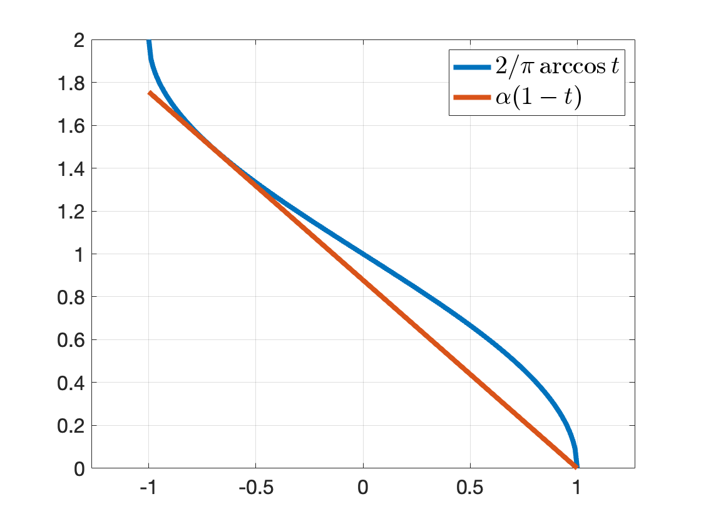

# Shor's Semidefinite Relaxation {#Shor}

In this Chapter, we introduce one of the most important and well-known applications of semidefinite optimization, namely its use in the formulation of **convex relaxations** of nonconvex optimization problems.

We will focus on the so-called Shor's semidefinite relaxation [@shor87sjcss-quadratic], which is particularly designed for quadratically constrained quadratic programs (QCQPs). Shor's semidefinite relaxation is relatively easy to formulate and understand, and as we will see later, is essentially the first-order relaxation in the moment-SOS hierarchy.

## Semidefinite Relaxation of QCQPs

Consider a quadratically constrained quadratic program (QCQP):
\begin{equation}
\begin{split}
f^\star = \min_{x \in \Real{n}} & \quad x\tran C x \\
\subject & \quad x\tran A_i x = b_i, i=1,\dots,m
\end{split}
(\#eq:qcqp)
\end{equation}
where $C,A_1,\dots,A_m \in \sym{n}$ are given symmetric matrices and $b = [b_1,\dots,b_m] \in \Real{m}$ is a given vector. We assume the problem \@ref(eq:qcqp) is feasible, solvable, and bounded from below, i.e., $-\infty < f^\star < +\infty$ and is attained. Many practical problems in optimization, engineering, and applied sciences can be formulated as \@ref(eq:qcqp). For example, problem \@ref(eq:qcqp) includes binary quadratic optimization (BQP) problems by letting
$$
A_i = e_i e_i\tran, i=1,\dots,n
$$
with $e_i \in \Real{n}$ the standard Euclidean basis vector, in which case the $i$-th constraint becomes
$$
x_i^2 = 1 \Leftrightarrow x_i \in \{+1,-1\},i=1,\dots,n.
$$
We will discuss a particular type of BQP known as the MAXCUT problem in more details later. From this simple example, since QCQP includes BQP, we know in general the problem \@ref(eq:qcqp) is nonconvex and it is NP-hard to compute $f^\star$ and find a global optimizer.

### Lagrangian Dual Problem 

Since the original QCQP is hard to solve in general, we turn to computing a **lower bound** of \@ref(eq:qcqp). The most natural way to find a lower bound, according to Section \@ref(background:convex:optimization:Lagrangian), is to derive its Lagrangian dual problem. Towards this goal, we associate a Lagrangian multipler $-y_i$ with each equality constraint and obtain the Lagrangian
$$
L(x,y) = x\tran C x - \sum_{i=1}^m y_i (x\tran A_i x - b_i), \quad x \in \Real{n},y \in \Real{m}.
$$
The Lagrangian dual, by definition, is
$$
\phi(y) = \min_x L(x,y) = \sum_{i=1}^m y_i b_i + \min_{x \in \Real{n}} x\tran \underbrace{\left( C - \sum_{i=1}^m y_i A_i \right)}_{Z} x.
$$
Clearly, if $Z$ is positive semidefinite, then $\min_x x\tran Z x = 0$ (by choosing $x=0$); otherwise, $\min_x x\tran Z x = -\infty$. Therefore, the dual function is
$$
\phi(y) = \begin{cases}
\sum_{i=1}^m y_i b_i & \text{if } C - \sum_{i=1}^m y_i A_i \succeq 0 \\
- \infty & \text{otherwise}
\end{cases}.
$$
The Lagrangian dual problem seeks to maximize $y$, and hence it will make sure $Z$ is PSD
\begin{equation}
\begin{split}
d^\star = \max_{y \in \Real{m}} & \quad b\tran y \\
\subject & \quad C - \calA^*(y) \succeq 0.
\end{split}
(\#eq:Lagrangian-dual-qcqp)
\end{equation}
By Lagrangian duality, we have
$$
d^\star \leq f^\star.
$$
Note that problem \@ref(eq:Lagrangian-dual-qcqp) is a convex SDP and can be solved by off-the-shelf solvers.

Another nice property of the dual problem is that it naturally leads to a **certifier**.

::: {.theorembox}
::: {.proposition #DualCertifier name="Dual Optimality Certifier"}
Let $x_\star$ be a feasible solution to the QCQP \@ref(eq:qcqp), if there exists $y_\star \in \Real{m}$ such that 
\begin{equation}
C - \calA^*(y_\star) \succeq 0, \quad \bracket{C - \calA^*(y_\star)} x_\star = 0,
(\#eq:dual-optimality-condition)
\end{equation}
then $x_\star$ is a global minimizer of \@ref(eq:qcqp), and $y_\star$ is a global minimizer of \@ref(eq:Lagrangian-dual-qcqp).
:::
:::
::: {.proofbox}
::: {.proof}
We have zero duality gap
\begin{equation}
\begin{split}
x_\star\tran C x_\star - b\tran y_\star = \inprod{C}{x_\star x_\star\tran} - \inprod{b}{y_\star} = \inprod{C}{x_\star x_\star\tran} - \inprod{\calA(x_\star x_\star\tran)}{y_\star} \\
= \inprod{C - \calA^*(y_\star)}{ x_\star x_\star\tran} = x_\star\tran \bracket{C - \calA^*(y_\star)} x_\star = 0.
\end{split}
\end{equation}
and $(x_\star, y_\star)$ is primal-dual feasible. Therefore, $(x_\star, y_\star)$ is primal-dual optimal.
:::
:::

The reason why Proposition \@ref(prp:DualCertifier) can be quite useful is that it gives a very efficient algorithm to certify global optimality of a candidate (potentially locally) optimal solution $x_\star$. In particular, in several practical applications in computer vision and robotics, the second equation in \@ref(eq:dual-optimality-condition) is a linear system of $n$ equations in $m$ variables with $m\leq n$, and hence it has a unique solution. Therefore, one can first solve the linear system and obtain a candidate $y_\star$, and then simply check the PSD condition $C - \calA^*(y_\star) \succeq 0$. This leads to optimality certifiers that can run in real time [@garcia21ivc-certifiable] [@holmes23ral-efficient].

### Dual of the Dual (Bidual)

The dual problem \@ref(eq:Lagrangian-dual-qcqp) should appear familiar to us at this moment -- it is simply a standard-form dual SDP \@ref(eq:SDP-D). Therefore, we can write down the SDP dual of the QCQP dual \@ref(eq:Lagrangian-dual-qcqp)
\begin{equation}
\begin{split}
p^\star = \min_{X \in \sym{n}} & \quad \inprod{C}{X} \\
\subject & \quad \calA(X) = b \\
& \quad X \succeq 0
\end{split}
(\#eq:qcqp-bidual)
\end{equation}
Under the assumption of SDP strong duality (e.g., both \@ref(eq:qcqp-bidual) and \@ref(eq:Lagrangian-dual-qcqp) are strictly feasible), we have
$$
p^\star = d^\star \leq f^\star.
$$
The weak duality $d^\star \leq f^\star$ can be interpreted using standard Lagrangian duality. How about the weak duality $p^\star \leq f^\star$?
It turns out the dual of the dual (bidual) also has a nice interpretation. 

We first observe that the original QCQP \@ref(eq:qcqp) is equivalent to a rank-constrained matrix optimization problem. 

::: {.theorembox}
::: {.proposition #RankConstrainedMatrix name="Rank-Constrained Matrix Optimization"}
The QCQP \@ref(eq:qcqp) is equivalent to the following rank-constrained matrix optimization
\begin{equation}
\begin{split}
f^\star_m = \min_{X \in \sym{n}} & \quad \inprod{C}{X} \\
\subject & \quad \calA(X) = b \\
& \quad X \succeq 0 \\
& \quad \rank(X) = 1
\end{split}
(\#eq:rank-constrained-optimization)
\end{equation}
in the sense that

1. $f^\star = f^\star_m$

2. For every optimal solution $x_\star$ of the QCQP \@ref(eq:qcqp), $X_\star = x_\star x_\star\tran$ is globally optimal for the matrix optimization \@ref(eq:rank-constrained-optimization)

3. Every optimal solution $X_\star$ of the matrix optimization can be factorized as $X_\star = x_\star x_\star\tran$ so that $x_\star$ is optimal for the QCQP \@ref(eq:qcqp).
:::
:::
::: {.proofbox}
::: {.proof}
We will show that the feasible set of the QCQP \@ref(eq:qcqp) is the same as the feasible set of \@ref(eq:rank-constrained-optimization).

Let $x$ be feasible for the QCQP \@ref(eq:qcqp), we have $X=xx\tran$ must be feasible for \@ref(eq:rank-constrained-optimization) because $X \succeq 0$ by construction, $\rank(X) = \rank(xx\tran) = \rank(x) = 1$, and
$$
x\tran A_i x = b_i \Rightarrow \trace(x\tran A_i x) = b_i \Rightarrow \trace(A_i x x\tran) = b_i \Rightarrow \inprod{A_i}{X} = b_i, \forall i.
$$

Conversely, let $X$ be feasible for the matrix optimization \@ref(eq:rank-constrained-optimization). Since $X \succeq 0$ and $\rank(X) = 1$, $X = xx\tran$ must hold for some $x \in \Real{n}$. In the meanwhile,
$$
\inprod{A_i}{X} = b_i \Rightarrow \inprod{A_i}{xx\tran} = b_i \Rightarrow x\tran A_i x = b_i, \forall i.
$$
Therefore, $x$ is feasible for the QCQP \@ref(eq:qcqp).

Finally, it is easy to observer that
$$
\inprod{C}{X} = \inprod{C}{xx\tran} = x\tran C x,
$$
and the objective is also the same. 
:::
:::

Since the QCQP is equivalent to the matrix optimization \@ref(eq:rank-constrained-optimization), one should expect the matrix optimization to be NP-hard in general as well. In fact, this is true due to the nonconvex rank constraint $\rank(X) = 1$. Comparing the nonconvex SDP \@ref(eq:rank-constrained-optimization) and the convex SDP \@ref(eq:qcqp-bidual), we see the only difference is that we have dropped the nonconvex rank constraint in \@ref(eq:qcqp-bidual) to make it convex, hence the SDP \@ref(eq:qcqp-bidual) is a convex relaxation of the QCQP \@ref(eq:qcqp) and $p^\star \leq f^\star$.

This convex relaxation perspective also provides a way to certify global optimality, by checking the rank of the optimal solution after solving the convex SDP \@ref(eq:qcqp-bidual).

::: {.theorembox}
::: {.proposition #SDPExactness name="Exactness of SDP Relaxation"}
Let $X_\star$ be an optimal solution to the SDP \@ref(eq:qcqp-bidual), if $\rank(X_\star) = 1$, then $X_\star$ can be factorized as $X_\star = x_\star x_\star\tran$ with $x_\star$ a globally optimal solution to the QCQP \@ref(eq:qcqp). If so, we say the relaxation \@ref(eq:qcqp-bidual) is exact, or tight.
:::
:::

It is worth noting that, even when the relaxation is exact, i.e., $p^\star = f^\star$, it may not be trivial to numerically certify the exactness, due to several reasons

- If the SDP \@ref(eq:qcqp-bidual) is solved using interior point methods such as MOSEK, then it is well known that they converge to the _maximum-rank solution_ [@wolkowicz12book-sdp]. This is saying that even if the SDP \@ref(eq:qcqp-bidual) has rank-one solutions, the solvers may not find them. Consider the case where $x_1$ and $x_2$ are both optimal solutions to the QCQP \@ref(eq:qcqp) and the relaxation is exact, it is easy to check that 
$$
X = \lambda_1 x_1 x_1\tran + \lambda_2 x_2 x_2\tran, \quad \lambda_1, \lambda_2 \geq 0, \lambda_1 + \lambda_2 = 1
$$
is globally optimal for the SDP. When $x_1 x_1\tran$ and $x_2 x_2\tran$ are linearly independent, $X$ can have rank equal to two. In this case, interior point methods will not converge to either $x_1x_1\tran$ or $x_2 x_2\tran$, but will instead find $X$ with some unknown coefficients of $\lambda_1$ and $\lambda_2$.

- Even if the original QCQP has a unique optimal solution and the relaxation is exact, the SDP solver will converge to a solution that is approximately rank-one (i.e., the second largest sigular value / eigenvalue will still be nonzero) and it may be difficult to draw a conclusion about exactness. Therefore, in practice one can compute a **relative suboptimality gap** by rounding a feasible point to the QCQP from the SDP (it may or may not be easy to round a feasible point), denoted as $\hat{x}$, then compute 
$$
\hat{f} = \hat{x}\tran C \hat{x},
$$
which serves as an upper bound
$$
p^\star \leq f^\star \leq \hat{f}.
$$
The relative suboptimality gap can be computed as
$$
\eta = \frac{|\hat{f} - p^\star|}{1 + |\hat{f}| + |p^\star|}.
$$
Clearly, $\eta \approx 0$ certifies exactness of the SDP relaxation.

### MAXCUT

We will now study binary quadratic optimization problems, in particular the MAXCUT problem. The original QCQP reads
\begin{equation}
\begin{split}
\min_{x \in \Real{n}} & \quad x\tran C x \\
\subject & \quad x_i^2 = 1, i=1,\dots,n.
\end{split}
(\#eq:bqp)
\end{equation}
For the MAXCUT problem, a standard formulation is
\begin{equation}
\max_{x_i^2 = 1}  \frac{1}{4} \sum_{i,j} w_{ij} (1 - x_i x_j).
(\#eq:maxcut-org)
\end{equation}
It is clear that if $x_i, x_j$ have the same sign, then $1- x_i x_j = 0$, otherwise, $1- x_i x_j = 2$. Removing the constant terms in \@ref(eq:maxcut-org), it is equivalent to the followng BQP
\begin{equation}
\min_{x_i^2 = 1}  \sum_{i,j} w_{ij} x_i x_j.
(\#eq:maxcut-bqp)
\end{equation}

**Random Rounding**. In general, solving the SDP relaxation of the MAXCUT problem will not produce a certifiably optimal solution. It is therefore interesting to ask if solving the SDP relaxation can produce provably good approximations. 

Let $X$ be the optimal solution of the SDP relaxation, and $X = V\tran  V$ be a rank-$r$ factorization with $V \in \Real{r \times n}$
$$
V = [v_1,\dots,v_n]
$$
and each vector $v_i \in \Real{r}$. We have $X_{ij} = v_i\tran v_j$. Since $X_{ii} = 1$, the vectors $v_i$'s lie on the unit sphere. Goemans and Williamson [@goemans95jacm-improved] proposed to obtain a feasible point to the orignal BQP by first choosing a random unit direction $p \in \Real{r}$ and then assign
$$
x_i = \sign (p\tran v_i), i=1,\dots,n.
$$
The expected value of this solution can be written as
$$
\bbE_p \lcbrace{x\tran C x} = \sum_{i,j} C_{ij} \bbE_p \lcbrace{x_i x_j} = \sum_{i,j} C_{ij} \bbE_p \lcbrace{\sign(p\tran x_i) \sign(p\tran x_j)}.
$$
This expectation can be computed using geometric intuition. Consider the plan spanned by $v_i$ and $v_j$ and let $\theta_{ij}$ be the angle between them. Then, it is easy to see that the desired expectation is equal to the probability that both points are on the same side of the hyperplane, minus the probability that they are on different sides. These probabilities are $1- \theta_{ij} / \pi$ and $\theta_{ij} / \pi$, respectively. Therefore, the expected value of the rounded solution is 
$$
\sum_{i,j} C_{ij} \left( 1- \frac{2\theta_{ij}}{\pi} \right) = \sum_{i,j} C_{ij} \left( 1- \frac{2}{\pi} \arccos (v_i\tran v_j)  \right) = \frac{2}{\pi} \sum_{i,j} C_{ij} \arcsin X_{ij},
$$
where we have used 
$$
\arccos t + \arcsin t = \frac{\pi}{2}.
$$

**MAXCUT Bound**. For the MAXCUT problem, there are constant terms involved in the original cost function, which leads to the expected cut of the rounded solution to be
$$
c_{\mathrm{expected}} = \frac{1}{4} \sum_{i,j} w_{ij} \left( 1- \frac{2}{\pi} \arcsin X_{ij} \right) = \frac{1}{4} \frac{2}{\pi} \sum_{ij} w_{ij} \arccos X_{ij}.
$$
On the other hand, the optimal value of the SDP relaxation produces an upper bound on the true MAXCUT 
$$
c_{\mathrm{ub}} = \frac{1}{4} \sum_{i,j} w_{ij} (1 - X_{ij}).
$$
We have
$$
c_{\mathrm{expected}} \leq c_{\mathrm{MAXCUT}} \leq c_{\mathrm{ub}}.
$$
We want to find the maximum possible $\alpha$ such that 
$$
\alpha c_{\mathrm{ub}} \leq c_{\mathrm{expected}} \leq c_{\mathrm{MAXCUT}} \leq c_{\mathrm{ub}},
$$
so that $\alpha$ acts to be the best approximation ratio. To find such $\alpha$, we need to find the maximum $\alpha$ such that 
$$
\alpha (1 - t) \leq \frac{2}{\pi} \arccos(t), \forall t \in [-1,1].
$$
The best possible $\alpha$ is $0.878$, see Fig. \@ref(fig:MAXCUTAlpha).

```{r MAXCUTAlpha, out.width='60%', fig.show='hold', fig.cap='Best approximation ratio.', fig.align='center', echo=FALSE}

```