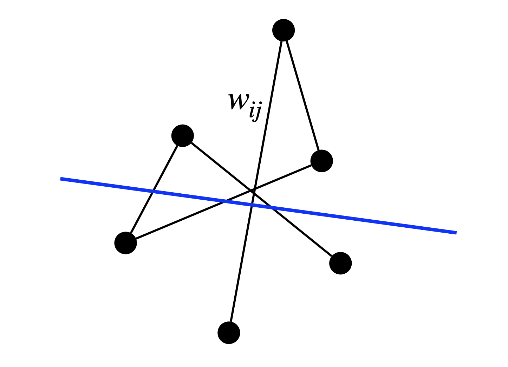
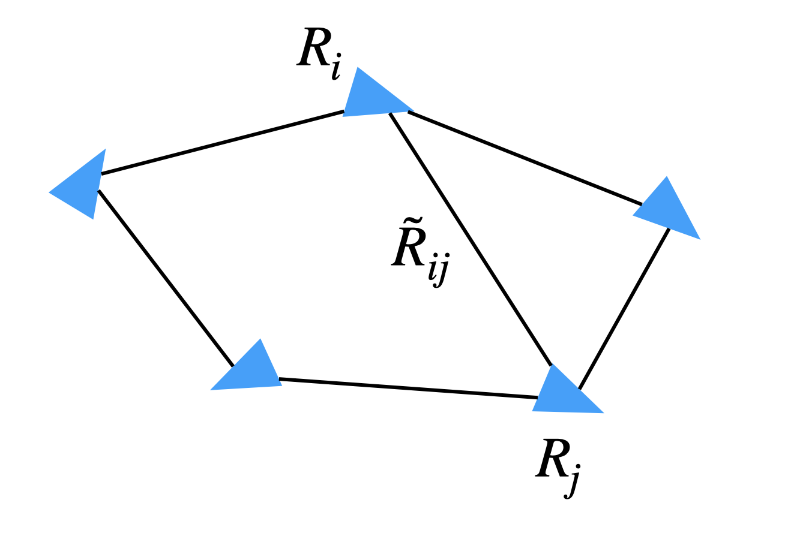
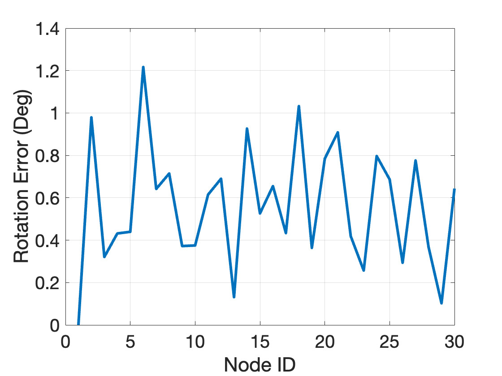
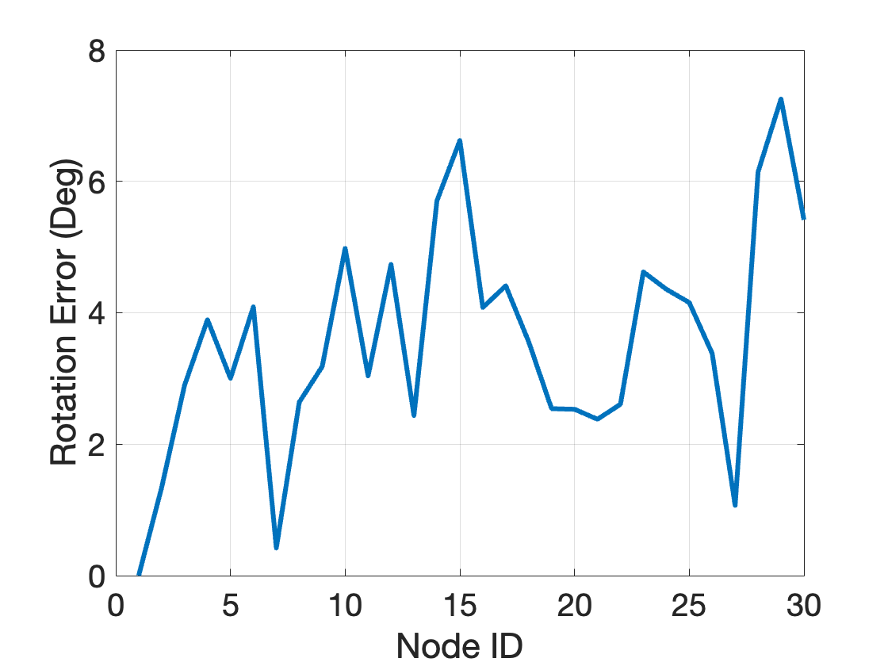
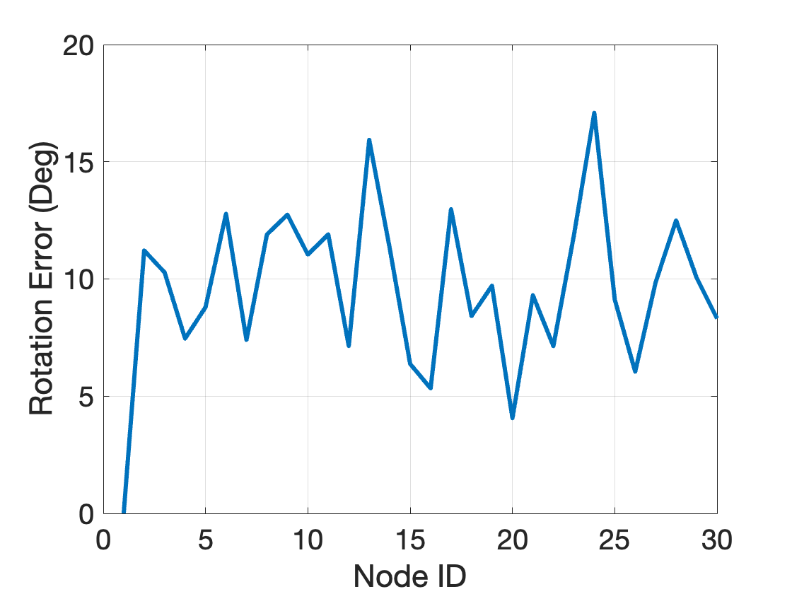
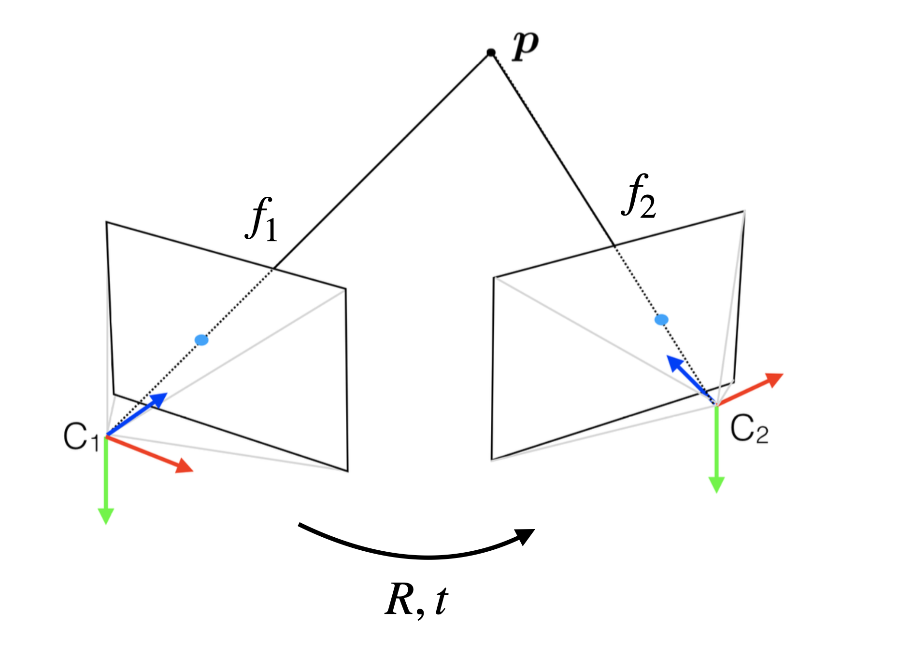
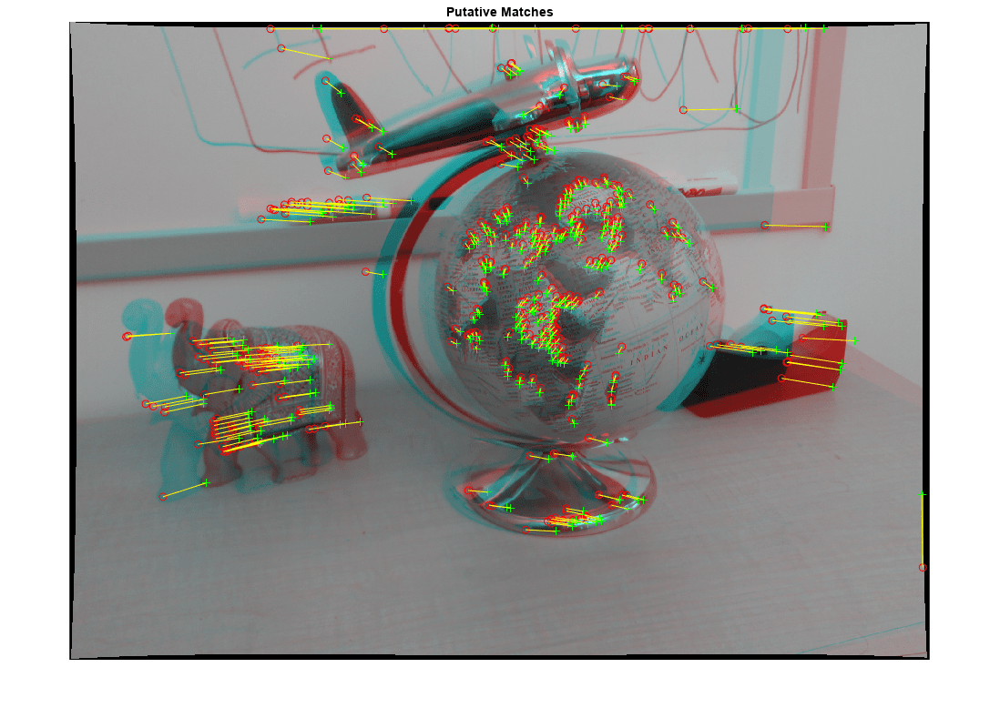

# Shor's Semidefinite Relaxation {#Shor}

In this Chapter, we introduce one of the most important and well-known applications of semidefinite optimization, namely its use in the formulation of **convex relaxations** of nonconvex optimization problems.

We will focus on the so-called Shor's semidefinite relaxation [@shor87sjcss-quadratic], which is particularly designed for quadratically constrained quadratic programs (QCQPs). Shor's semidefinite relaxation is relatively easy to formulate and understand, and as we will see later, is essentially the first-order relaxation in the moment-SOS hierarchy.

## Semidefinite Relaxation of QCQPs

Consider a quadratically constrained quadratic program (QCQP):
\begin{equation}
\begin{split}
f^\star = \min_{x \in \Real{n}} & \quad x\tran C x \\
\subject & \quad x\tran A_i x = b_i, i=1,\dots,m
\end{split}
(\#eq:qcqp)
\end{equation}
where $C,A_1,\dots,A_m \in \sym{n}$ are given symmetric matrices and $b = [b_1,\dots,b_m] \in \Real{m}$ is a given vector. We assume the problem \@ref(eq:qcqp) is feasible, solvable, and bounded from below, i.e., $-\infty < f^\star < +\infty$ and is attained. Many practical problems in optimization, engineering, and applied sciences can be formulated as \@ref(eq:qcqp). For example, problem \@ref(eq:qcqp) includes binary quadratic optimization (BQP) problems by letting
$$
A_i = e_i e_i\tran, i=1,\dots,n
$$
with $e_i \in \Real{n}$ the standard Euclidean basis vector, in which case the $i$-th constraint becomes
$$
x_i^2 = 1 \Leftrightarrow x_i \in \{+1,-1\},i=1,\dots,n.
$$
We will discuss a particular type of BQP known as the MAXCUT problem in more details later. From this simple example, since QCQP includes BQP, we know in general the problem \@ref(eq:qcqp) is nonconvex and it is NP-hard to compute $f^\star$ and find a global optimizer.

### Lagrangian Dual Problem 

Since the original QCQP is hard to solve in general, we turn to computing a **lower bound** of \@ref(eq:qcqp). The most natural way to find a lower bound, according to Section \@ref(background:convex:optimization:Lagrangian), is to derive its Lagrangian dual problem. Towards this goal, we associate a Lagrangian multipler $-y_i$ with each equality constraint and obtain the Lagrangian
$$
L(x,y) = x\tran C x - \sum_{i=1}^m y_i (x\tran A_i x - b_i), \quad x \in \Real{n},y \in \Real{m}.
$$
The Lagrangian dual, by definition, is
$$
\phi(y) = \min_x L(x,y) = \sum_{i=1}^m y_i b_i + \min_{x \in \Real{n}} x\tran \underbrace{\left( C - \sum_{i=1}^m y_i A_i \right)}_{Z} x.
$$
Clearly, if $Z$ is positive semidefinite, then $\min_x x\tran Z x = 0$ (by choosing $x=0$); otherwise, $\min_x x\tran Z x = -\infty$. Therefore, the dual function is
$$
\phi(y) = \begin{cases}
\sum_{i=1}^m y_i b_i & \text{if } C - \sum_{i=1}^m y_i A_i \succeq 0 \\
- \infty & \text{otherwise}
\end{cases}.
$$
The Lagrangian dual problem seeks to maximize $y$, and hence it will make sure $Z$ is PSD
\begin{equation}
\begin{split}
d^\star = \max_{y \in \Real{m}} & \quad b\tran y \\
\subject & \quad C - \calA^*(y) \succeq 0.
\end{split}
(\#eq:Lagrangian-dual-qcqp)
\end{equation}
By Lagrangian duality, we have
$$
d^\star \leq f^\star.
$$
Note that problem \@ref(eq:Lagrangian-dual-qcqp) is a convex SDP and can be solved by off-the-shelf solvers.

Another nice property of the dual problem is that it naturally leads to a **certifier**.

::: {.theorembox}
::: {.proposition #DualCertifier name="Dual Optimality Certifier"}
Let $x_\star$ be a feasible solution to the QCQP \@ref(eq:qcqp), if there exists $y_\star \in \Real{m}$ such that 
\begin{equation}
C - \calA^*(y_\star) \succeq 0, \quad \bracket{C - \calA^*(y_\star)} x_\star = 0,
(\#eq:dual-optimality-condition)
\end{equation}
then $x_\star$ is a global minimizer of \@ref(eq:qcqp), and $y_\star$ is a global maximizer of \@ref(eq:Lagrangian-dual-qcqp).
:::
:::
::: {.proofbox}
::: {.proof}
We have zero duality gap
\begin{equation}
\begin{split}
x_\star\tran C x_\star - b\tran y_\star = \inprod{C}{x_\star x_\star\tran} - \inprod{b}{y_\star} = \inprod{C}{x_\star x_\star\tran} - \inprod{\calA(x_\star x_\star\tran)}{y_\star} \\
= \inprod{C - \calA^*(y_\star)}{ x_\star x_\star\tran} = x_\star\tran \bracket{C - \calA^*(y_\star)} x_\star = 0.
\end{split}
\end{equation}
and $(x_\star, y_\star)$ is primal-dual feasible. Therefore, $(x_\star, y_\star)$ is primal-dual optimal.
:::
:::

The reason why Proposition \@ref(prp:DualCertifier) can be quite useful is that it gives a very efficient algorithm to certify global optimality of a candidate (potentially locally) optimal solution $x_\star$. In particular, in several practical applications in computer vision and robotics, the second equation in \@ref(eq:dual-optimality-condition) is a linear system of $n$ equations in $m$ variables with $m\leq n$, and hence it has a unique solution. Therefore, one can first solve the linear system and obtain a candidate $y_\star$, and then simply check the PSD condition $C - \calA^*(y_\star) \succeq 0$. This leads to optimality certifiers that can run in real time [@garcia21ivc-certifiable] [@holmes23ral-efficient].

### Dual of the Dual (Bidual)

The dual problem \@ref(eq:Lagrangian-dual-qcqp) should appear familiar to us at this moment -- it is simply a standard-form dual SDP \@ref(eq:SDP-D). Therefore, we can write down the SDP dual of the QCQP dual \@ref(eq:Lagrangian-dual-qcqp)
\begin{equation}
\begin{split}
p^\star = \min_{X \in \sym{n}} & \quad \inprod{C}{X} \\
\subject & \quad \calA(X) = b \\
& \quad X \succeq 0
\end{split}
(\#eq:qcqp-bidual)
\end{equation}
Under the assumption of SDP strong duality (e.g., both \@ref(eq:qcqp-bidual) and \@ref(eq:Lagrangian-dual-qcqp) are strictly feasible), we have
$$
p^\star = d^\star \leq f^\star.
$$
The weak duality $d^\star \leq f^\star$ can be interpreted using standard Lagrangian duality. How about the weak duality $p^\star \leq f^\star$?
It turns out the dual of the dual (bidual) also has a nice interpretation. 

We first observe that the original QCQP \@ref(eq:qcqp) is equivalent to a rank-constrained matrix optimization problem. 

::: {.theorembox}
::: {.proposition #RankConstrainedMatrix name="Rank-Constrained Matrix Optimization"}
The QCQP \@ref(eq:qcqp) is equivalent to the following rank-constrained matrix optimization
\begin{equation}
\begin{split}
f^\star_m = \min_{X \in \sym{n}} & \quad \inprod{C}{X} \\
\subject & \quad \calA(X) = b \\
& \quad X \succeq 0 \\
& \quad \rank(X) = 1
\end{split}
(\#eq:rank-constrained-optimization)
\end{equation}
in the sense that

1. $f^\star = f^\star_m$

2. For every optimal solution $x_\star$ of the QCQP \@ref(eq:qcqp), $X_\star = x_\star x_\star\tran$ is globally optimal for the matrix optimization \@ref(eq:rank-constrained-optimization)

3. Every optimal solution $X_\star$ of the matrix optimization can be factorized as $X_\star = x_\star x_\star\tran$ so that $x_\star$ is optimal for the QCQP \@ref(eq:qcqp).
:::
:::
::: {.proofbox}
::: {.proof}
We will show that the feasible set of the QCQP \@ref(eq:qcqp) is the same as the feasible set of \@ref(eq:rank-constrained-optimization).

Let $x$ be feasible for the QCQP \@ref(eq:qcqp), we have $X=xx\tran$ must be feasible for \@ref(eq:rank-constrained-optimization) because $X \succeq 0$ by construction, $\rank(X) = \rank(xx\tran) = \rank(x) = 1$, and
$$
x\tran A_i x = b_i \Rightarrow \trace(x\tran A_i x) = b_i \Rightarrow \trace(A_i x x\tran) = b_i \Rightarrow \inprod{A_i}{X} = b_i, \forall i.
$$

Conversely, let $X$ be feasible for the matrix optimization \@ref(eq:rank-constrained-optimization). Since $X \succeq 0$ and $\rank(X) = 1$, $X = xx\tran$ must hold for some $x \in \Real{n}$. In the meanwhile,
$$
\inprod{A_i}{X} = b_i \Rightarrow \inprod{A_i}{xx\tran} = b_i \Rightarrow x\tran A_i x = b_i, \forall i.
$$
Therefore, $x$ is feasible for the QCQP \@ref(eq:qcqp).

Finally, it is easy to observer that
$$
\inprod{C}{X} = \inprod{C}{xx\tran} = x\tran C x,
$$
and the objective is also the same. 
:::
:::

Since the QCQP is equivalent to the matrix optimization \@ref(eq:rank-constrained-optimization), one should expect the matrix optimization to be NP-hard in general as well. In fact, this is true due to the nonconvex rank constraint $\rank(X) = 1$. Comparing the nonconvex SDP \@ref(eq:rank-constrained-optimization) and the convex SDP \@ref(eq:qcqp-bidual), we see the only difference is that we have dropped the nonconvex rank constraint in \@ref(eq:qcqp-bidual) to make it convex, hence the SDP \@ref(eq:qcqp-bidual) is a convex relaxation of the QCQP \@ref(eq:qcqp) and $p^\star \leq f^\star$.

This convex relaxation perspective also provides a way to certify global optimality, by checking the rank of the optimal solution after solving the convex SDP \@ref(eq:qcqp-bidual).

::: {.theorembox}
::: {.proposition #SDPExactness name="Exactness of SDP Relaxation"}
Let $X_\star$ be an optimal solution to the SDP \@ref(eq:qcqp-bidual), if $\rank(X_\star) = 1$, then $X_\star$ can be factorized as $X_\star = x_\star x_\star\tran$ with $x_\star$ a globally optimal solution to the QCQP \@ref(eq:qcqp). If so, we say the relaxation \@ref(eq:qcqp-bidual) is exact, or tight.
:::
:::

It is worth noting that, even when the relaxation is exact, i.e., $p^\star = f^\star$, it may not be trivial to numerically certify the exactness, due to several reasons

- If the SDP \@ref(eq:qcqp-bidual) is solved using interior point methods such as MOSEK, then it is well known that they converge to the _maximum-rank solution_ [@wolkowicz12book-sdp]. This is saying that even if the SDP \@ref(eq:qcqp-bidual) has rank-one solutions, the solvers may not find them. Consider the case where $x_1$ and $x_2$ are both optimal solutions to the QCQP \@ref(eq:qcqp) and the relaxation is exact, it is easy to check that 
$$
X = \lambda_1 x_1 x_1\tran + \lambda_2 x_2 x_2\tran, \quad \lambda_1, \lambda_2 \geq 0, \lambda_1 + \lambda_2 = 1
$$
is globally optimal for the SDP. When $x_1 x_1\tran$ and $x_2 x_2\tran$ are linearly independent, $X$ can have rank equal to two. In this case, interior point methods will not converge to either $x_1x_1\tran$ or $x_2 x_2\tran$, but will instead find $X$ with some unknown coefficients of $\lambda_1$ and $\lambda_2$.

- Even if the original QCQP has a unique optimal solution and the relaxation is exact, the SDP solver will converge to a solution that is approximately rank-one (i.e., the second largest sigular value / eigenvalue will still be nonzero) and it may be difficult to draw a conclusion about exactness. Therefore, in practice one can compute a **relative suboptimality gap** by rounding a feasible point to the QCQP from the SDP (it may or may not be easy to round a feasible point), denoted as $\hat{x}$, then compute 
$$
\hat{f} = \hat{x}\tran C \hat{x},
$$
which serves as an upper bound
$$
p^\star \leq f^\star \leq \hat{f}.
$$
The relative suboptimality gap can be computed as
$$
\eta = \frac{|\hat{f} - p^\star|}{1 + |\hat{f}| + |p^\star|}.
$$
Clearly, $\eta \approx 0$ certifies exactness of the SDP relaxation.

### MAXCUT

We will now study binary quadratic optimization problems, in particular the MAXCUT problem. The original QCQP reads
\begin{equation}
\begin{split}
\min_{x \in \Real{n}} & \quad x\tran C x \\
\subject & \quad x_i^2 = 1, i=1,\dots,n.
\end{split}
(\#eq:bqp)
\end{equation}
For the MAXCUT problem, a standard formulation is
\begin{equation}
\max_{x_i^2 = 1}  \frac{1}{4} \sum_{i,j} w_{ij} (1 - x_i x_j),
(\#eq:maxcut-org)
\end{equation}
where $w_{ij} \geq 0$ is the weight of the edge between node $i$ and node $j$.
It is clear that if $x_i, x_j$ have the same sign, then $1- x_i x_j = 0$, otherwise, $1- x_i x_j = 2$. 


```{r MAXCUT, out.width='60%', fig.show='hold', fig.cap='MAXCUT seeks to separate the node set of a graph into two disjoint groups such that the separation line cuts as many (weighted) edges as possible. For example, the blue line cuts four edges.', fig.align='center', echo=FALSE}

```


Removing the constant terms in \@ref(eq:maxcut-org), it is equivalent to the followng BQP
\begin{equation}
\min_{x_i^2 = 1}  \sum_{i,j} w_{ij} x_i x_j.
(\#eq:maxcut-bqp)
\end{equation}

**Random Rounding**. In general, solving the SDP relaxation of the MAXCUT problem will not produce a certifiably optimal solution. It is therefore interesting to ask if solving the SDP relaxation can produce provably good approximations. 

Let $X$ be the optimal solution of the SDP relaxation, and $X = V\tran  V$ be a rank-$r$ factorization with $V \in \Real{r \times n}$
$$
V = [v_1,\dots,v_n]
$$
and each vector $v_i \in \Real{r}$. We have $X_{ij} = v_i\tran v_j$. Since $X_{ii} = 1$, the vectors $v_i$'s lie on the unit sphere. Goemans and Williamson [@goemans95jacm-improved] proposed to obtain a feasible point to the orignal BQP by first choosing a random unit direction $p \in \Real{r}$ and then assign
$$
x_i = \sign (p\tran v_i), i=1,\dots,n.
$$
The expected value of this solution can be written as
$$
\bbE_p \lcbrace{x\tran C x} = \sum_{i,j} C_{ij} \bbE_p \lcbrace{x_i x_j} = \sum_{i,j} C_{ij} \bbE_p \lcbrace{\sign(p\tran x_i) \sign(p\tran x_j)}.
$$
This expectation can be computed using geometric intuition. Consider the plane spanned by $v_i$ and $v_j$ and let $\theta_{ij}$ be the angle between them. Then, it is easy to see that the desired expectation is equal to the probability that both points are on the same side of the hyperplane, minus the probability that they are on different sides. These probabilities are $1- \theta_{ij} / \pi$ and $\theta_{ij} / \pi$, respectively. Therefore, the expected value of the rounded solution is 
$$
\sum_{i,j} C_{ij} \left( 1- \frac{2\theta_{ij}}{\pi} \right) = \sum_{i,j} C_{ij} \left( 1- \frac{2}{\pi} \arccos (v_i\tran v_j)  \right) = \frac{2}{\pi} \sum_{i,j} C_{ij} \arcsin X_{ij},
$$
where we have used 
$$
\arccos t + \arcsin t = \frac{\pi}{2}.
$$

**MAXCUT Bound**. For the MAXCUT problem, there are constant terms involved in the original cost function, which leads to the expected cut of the rounded solution to be
$$
c_{\mathrm{expected}} = \frac{1}{4} \sum_{i,j} w_{ij} \left( 1- \frac{2}{\pi} \arcsin X_{ij} \right) = \frac{1}{4} \frac{2}{\pi} \sum_{ij} w_{ij} \arccos X_{ij}.
$$
On the other hand, the optimal value of the SDP relaxation produces an upper bound on the true MAXCUT 
$$
c_{\mathrm{ub}} = \frac{1}{4} \sum_{i,j} w_{ij} (1 - X_{ij}).
$$
We have
$$
c_{\mathrm{expected}} \leq c_{\mathrm{MAXCUT}} \leq c_{\mathrm{ub}}.
$$
We want to find the maximum possible $\alpha$ such that 
$$
\alpha c_{\mathrm{ub}} \leq c_{\mathrm{expected}} \leq c_{\mathrm{MAXCUT}} \leq c_{\mathrm{ub}},
$$
so that $\alpha$ acts to be the best approximation ratio. To find such $\alpha$, we need to find the maximum $\alpha$ such that 
$$
\alpha (1 - t) \leq \frac{2}{\pi} \arccos(t), \forall t \in [-1,1].
$$
The best possible $\alpha$ is $0.878$, see Fig. \@ref(fig:MAXCUTAlpha).

```{r MAXCUTAlpha, out.width='60%', fig.show='hold', fig.cap='Best approximation ratio.', fig.align='center', echo=FALSE}
knitr::include_graphics("images/maxcut_alpha.png")
```


## Certifiably Optimal Rotation Averaging

Consider a graph $\calG = (\calV,\calE)$ with node set $\calV = [N]$ and edge set $\calE = \{(i,j) \mid i,j \in \calV\}$. Each node $i$ is associated with an unknown rotation matrix $R_i \in \SOthree$, and each edge is associated with a relative rotation
\begin{equation}
\tldR_{ij} = R_i\tran R_j \cdot R_{\epsilon},
(\#eq:rotation-averaging-gen-model)
\end{equation}
that measures the relative rotation between $R_i$ and $R_j$, up to some small noise corruption $R_{\epsilon} \in \SOthree$. See Fig. \@ref(fig:RotationAveraging).

The goal of (multiple) rotation averaging is to estimate the absolute rotations $\{R_i \}_{i=1}^N$ given the noisy relative rotation measurements on the edges $\{\tldR_{ij} \}_{(i,j) \in \calE}$. This problem is also known as rotation synchronization and it finds applications in computer vision [@eriksson18cvpr-rotation], robotics [@rosen19ijrr-sesync], and medical imaging [@wang13ima-exact].

```{r RotationAveraging, out.width='60%', fig.show='hold', fig.cap='Rotation Averaging.', fig.align='center', echo=FALSE}

```


To synchronize the absolute rotations from relative measurements, it is common practice to formulate the following optimization problem 
\begin{equation}
\min_{R_i \in \SOthree, i\in \calV} \sum_{(i,j) \in \calE} \Fnorm{\tldR_{ij} - R_i\tran R_j}^2,
(\#eq:rotation-averaging)
\end{equation}
to seek the best absolute rotations that fit the relative measurements according to the generative model \@ref(eq:rotation-averaging-gen-model). It can be shown that when the noise $R_\epsilon$ satisfies a Langevin distribution, then problem \@ref(eq:rotation-averaging) returns the maximum likelihood estimator. Even when the noise distribution is not Langevin, problem \@ref(eq:rotation-averaging) often produces accurate estimates.

**QCQP Formulation**. We will first simplify problem \@ref(eq:rotation-averaging) as a QCQP. Note that the objective is equivalent to 
$$
\sum_{(i,j) \in \calE} \trace\left( (\tldR_{ij} - R_i\tran R_j)\tran (\tldR_{ij} - R_i\tran R_j) \right) = \sum_{(i,j) \in \calE} \trace\left( 2 \eye_3 - 2 \tldR_{ij}\tran R_i\tran R_j \right).
$$
Therefore, problem \@ref(eq:rotation-averaging) is equivalent to
\begin{equation}
\min_{R_i \in \SOthree, i\in\calV} -2\sum_{(i,j)\in\calE} \trace(\tldR_{ij}\tran R_i\tran R_j).
(\#eq:rotation-averaging-qcqp)
\end{equation}
This is a QCQP because the objective is quadratic, and $\SOthree$ can be described by quadratic equality constraints.

**Matrix Formulation**. Let
$$
R = \begin{bmatrix} 
R_1\tran \\
\vdots \\
R_N\tran 
\end{bmatrix} \in \SOthree^N,\quad 
RR\tran = \begin{bmatrix}
R_1\tran R_1 & R_1\tran R_2 & \cdots & R_1\tran R_N \\
R_2\tran R_1 & R_2\tran R_2 & \cdots & R_2\tran R_N \\
\vdots & \vdots & \ddots & \vdots \\
R_N\tran R_1 & R_N\tran R_2 & \cdots & R_N\tran R_N
\end{bmatrix} \in \psd{3N}
$$
and
\begin{equation}
\tldR = \begin{bmatrix}
0 & \tldR_{12} & \cdots & \tldR_{1N} \\
\tldR_{12}\tran & 0 & \cdots & \tldR_{2N}\\
\vdots & \vdots & \ddots & \vdots \\
\tldR_{1N}\tran & \tldR_{2N}\tran & \cdots & 0
\end{bmatrix} \in \sym{3N}
(\#eq:rotation-averaging-tldR)
\end{equation}
Then problem \@ref(eq:rotation-averaging-qcqp) can be compactly written as
\begin{equation}
\min_{R \in \SOthree^N} - \inprod{\tldR}{RR\tran}
(\#eq:rotation-averaging-matrix)
\end{equation}

**Semidefinite Relaxation**. Problem \@ref(eq:rotation-averaging-matrix) is nonconvex, so we apply semidefinite relaxation. Observe that, because $R_i \in \SOthree$, we have 
$$
R_i\tran R_i = \eye_3, \forall i=1,\dots,N.
$$
Therefore, the diagonal blocks of $RR\tran$ are all $3\times 3$ identity matrices. We have also that $RR\tran \succeq 0$ by construction. Therefore, the following SDP is a convex relaxation of problem \@ref(eq:rotation-averaging-matrix)
\begin{equation}
\begin{split}
\min_{X \in \sym{3N}} & \quad - \inprod{\tldR}{RR\tran} \\
\subject & \quad X \succeq 0 \\
& \quad [X]_{ii} = \eye_3, \quad i=1,\dots,N
\end{split}
(\#eq:rotation-averaging-sdp-relax)
\end{equation}
where the last constraint in \@ref(eq:rotation-averaging-sdp-relax) enforces all diagonal blocks to be identity matrices. 

How powerful is this SDP relaxation? You may think that it will be quite loose (and hence not very useful) because we have dropped many nonconvex constraints from the original QCQP to the convex SDP (e.g., $\rank(X) = 3$, $R_i \in \SOthree$ but we only used $R_i \in \Ogroup(3)$), but empirically it is almost always exact. 

::: {.examplebox}
::: {.example #RotationAveraging name="Rotation Averaging"}
I will generate a fully connected graph $\calG$ with $N$ nodes. 

- For each node $i$, I associate a random 3D rotation matrix $R_i$. For the first node, I always let $R_1 = \eye_3$.

- For each edge $(i,j)$, I generate a noisy measurement
$$
\tldR_{ij} = R_i\tran R_j \cdot R_\epsilon,
$$
where $R_\epsilon$ is a rotation matrix with a random rotation axis and a rotation angle uniformally distributed between $0$ and $\beta$ degrees.

After this graph is generated, I form the $\tldR$ matrix in \@ref(eq:rotation-averaging-tldR) and solve the SDP \@ref(eq:rotation-averaging-sdp-relax). This can be easily programmed in Matlab:
```matlab 
X = sdpvar(3*n,3*n);
F = [X >= 0];
for i = 1:n
    F = [F,
        X(blkIndices(i,3),blkIndices(i,3)) == eye(3)];
end
obj = trace(-Rtld*X);
optimize(F,obj);
Xval = value(X);
f_sdp = value(obj);
```
Note that `f_sdp` will be a lower bound. 

Let $X_\star$ be the optimal solution of the SDP. We know that, if the SDP relaxation is tight, then $X_\star$ will look like $RR\tran$. Because $R_1 = \eye_3$, we can directly read off the optimal rotation estimations from the first row of blocks. However, if the relaxation is not tight, the blocks there will not be valid rotation matrices, and we can perform a projection onto $\SOthree$. Using the estimated rotations, I can compute `f_est`, which is an upper bound to the true global optimum.
```matlab
R_est = [];
R_errs = [];
for i = 1:n
    if i == 1
        Ri = eye(3);
    else
        Ri = project2SO3(Xval(1:3,blkIndices(i,3)));
    end
    R_errs = [R_errs, getAngularError(Ri, R_gt(blkIndices(i,3),:))];
    R_est = [R_est, Ri];
end
X_est = R_est'*R_est;
f_est = trace(-Rtld*X_est);
```

With `f_est` and `f_sdp`, an upper bound and a lower bound, I can compute the relative suboptimality gap $\eta$. If $\eta = 0$, then it certifies global optimality.

How does this work?

For $N=30$ and $\beta = 10$ (small noise), I got $\eta = 6.26\times 10^{-13}$. Fig. \@ref(fig:MVA-rot-err-30-10) plots the rotation estimation errors at each node compared to the groundtruth rotations.

```{r MVA-rot-err-30-10, out.width='60%', fig.show='hold', fig.cap='Rotation estimation errors, 30 nodes, noise bound 10 degrees.', fig.align='center', echo=FALSE}

```

What if I increase the noise bound to $\beta = 60$? It turns out the relaxation is still exact with $\eta = 6.84 \times 10^{-10}$! Fig. \@ref(fig:MVA-rot-err-30-60) plots the rotation estimation errors at each node compared to the groundtruth rotations.

```{r MVA-rot-err-30-60, out.width='60%', fig.show='hold', fig.cap='Rotation estimation errors, 30 nodes, noise bound 60 degrees.', fig.align='center', echo=FALSE}

```

What if I set $\beta = 120$? The relaxation still remains exact with $\eta = 9.5 \times 10^{-10}$. Fig. \@ref(fig:MVA-rot-err-30-120) plots the rotation estimation errors at each node compared to the groundtruth rotations. Observe that even when the rotation estimates have large errors, they are still the certifiably optimal estimates.

```{r MVA-rot-err-30-120, out.width='60%', fig.show='hold', fig.cap='Rotation estimation errors, 30 nodes, noise bound 120 degrees.', fig.align='center', echo=FALSE}

```

Play with the [code](https://github.com/ComputationalRobotics/Semidefinite-Examples/blob/main/rotation_averaging/example.m) yourself to appreciate the power of this simple SDP relaxation. You can, for example, increase the number of nodes $N$. What if you make the graph sparse (e.g., fewer edges but still a connected graph)?
:::
:::

### Dual Optimality Certifier 


## Stretch to High-Degree Polynomial Optimization

We have seen that Shor's semidefinite relaxation for QCQPs can be derived both using Lagrangian duality, or simply by dropping a rank constraint, both of which are straightforward to understand. When applied to the MAXCUT problem, it produces a provably good approximation ratio. When applied to the rotation averaging problem, it directly gives us the optimal solution without any approximation, and the optimality comes with a certificate. 

However, not every optimization problem is a QCQP, right? Is it possible to generalize Shor's semidefinite relaxation to higher-degree polynomial optimization problems? As we will see in the next Chapters, the moment and sums-of-squares (SOS) hierarchy delivers the perfect and principled generalization.

Before going to the moment-SOS hierarchy, let me give you an example of a quartic (degree-4) optimization problem, for which we can still use Shor's relaxation, albeit with some (in my opinion, not so elegant) mathematical massage. This example in fact is from a recent paper in computer vision [@briales18cvpr-certifiably].

**Two-view Geometry**. Consider the problem of estimating the motion of a camera from two views illustrated in Fig. \@ref(fig:two-view). Let $C_1$ and $C_2$ be two cameras (or the same camera but in two different positions) observing the same 3D point $p \in \Real{3}$. The 3D point will be observed by $C_1$ and $C_2$ via its 2D projections on the image plane, respectively. Let $f_1 \in \Real{3}$ and $f_2 \in \Real{3}$ be the unit-length bearing vector that emanates from the camera centers to the 2D projections in two cameras, respectively. Our goal is to estimate the relative rotation and translation between the two cameras $C_1$ and $C_2$, denoted by $R \in \SOthree$ and $t \in \Real{3}$. The pair of bearing vectors $(f_1,f_2)$ is typically known as a **correspondence**, or a **match** in computer vision.

```{r two-view, out.width='60%', fig.show='hold', fig.cap='Two-view Geometry.', fig.align='center', echo=FALSE}

```

It turns out only having one correspondence is insufficient to recover $(R,t)$, and we need at least $5$ such correspondences [@nister04pami-efficient]. See Fig. \@ref(fig:two-view-example) for an example I adapted from [Mathworks](https://www.mathworks.com/help/vision/ref/estimateessentialmatrix.html).

```{r two-view-example, out.width='80%', fig.show='hold', fig.cap='A real two-view motion estimation example. Copyright: Mathworks.', fig.align='center', echo=FALSE}

```

Consequently, to formally state our problem, we are given a set of $N$ correspondences (these correspondences are typically detected by neural networks today [@wang20eccv-caps])
$$
\{f_{1,i},f_{2,i} \}_{i=1}^N
$$
between two images taken by two cameras, and our goal is to estimate the relative motion $(R,t)$.

**Epipolar Constraint**. When the correspondences are noise-free, it is known that they must satisfy the following epipolar constraint [@hartley03book-multiple]
\begin{equation}
f_{2,i}\tran \hatmap{t} R f_{1,i} = 0, \quad \forall i=1,\dots,N,
(\#eq:epipolar-constraint)
\end{equation}
where
$$
\hatmap{t} := \begin{bmatrix} 0 & - t_3 & t_2 \\
t_3 & 0 & - t_1 \\
- t_2 & t_1 & 0 \end{bmatrix}
$$
is a linear map such that $t \times v = \hatmap{t} v$ for any $v \in \Real{3}$ and $\times$ denotes cross product in 3D. 

**Nonlinear Least Squares**. Since the correspondences are detected by neural networks, they will be noisy and the epipolar constraint \@ref(eq:epipolar-constraint) will not be perfectly satisfied. Therefore, we formulate the following optimization problem to seek the best estimate that minimize the sum of the squared violations of \@ref(eq:epipolar-constraint)
\begin{equation}
\min_{R \in \SOthree, t \in \usphere^{2}} \sum_{i=1}^N (f_{2,i}\tran \hatmap{t} R f_{1,i})^2
(\#eq:two-view-estimation-problem)
\end{equation}
Note that I have asked $t \in \usphere^{2}$ to lie on the unit sphere, why?

Problem \@ref(eq:two-view-estimation-problem) is not a QCQP anymore, because its objective is a degree-4 polynomial. However, all the constraints of \@ref(eq:two-view-estimation-problem) are quadratic equalities and inequalities. To see this, note that $t \in \usphere^{2}$ can be written as
\begin{equation}
1 - t\tran t = 0,
(\#eq:two-view-t-con)
\end{equation}
which is a quadratic polynomial equality.
The constraint $R \in \SOthree$ can also be written as quadratic equalities. Let 
$$
R = [c_1, c_2, c_3]
$$
where $c_i$ is the $i$-the column. Then $R\in \SOthree$ is equivalent to 
\begin{equation}
\begin{split}
c_i\tran c_i - 1= 0, & \quad i=1,2,3 \\
c_i\tran c_j = 0, & \quad (i,j) \in \cbrace{(1,2),(2,3),(3,1)} \\
c_i \times c_j = c_k,& \quad (i,j,k) \in \cbrace{(1,2,3),(2,3,1),(3,1,2)}. 
\end{split}
(\#eq:two-view-R-con)
\end{equation}
all of which are quadratic polynomial equalities. 

Let $r = \vectorize(R)$, $x = [r\tran, t\tran]\tran \in \Real{12}$, we will collectively call all the constraints in \@ref(eq:two-view-t-con) and \@ref(eq:two-view-R-con) as 
$$
h_k(x) = 0, k=1,\dots,l, 
$$
with $l=16$.

**Semidefinite Relaxation**. Clearly, we cannot directly apply Shor's semidefinite relaxation, because $X = xx\tran$ only contains monomials in $x$ of degree up to $2$, but our objective function is degree $4$ -- this matrix variable is not powerful enough.

To fix this issue, a natural idea is to create a larger matrix variable 
\begin{equation}
\hspace{-16mm}
v = \begin{bmatrix} 
1 \\ r \\ t \\ t_1 r \\ t_2 r \\ t_3 r \end{bmatrix} \in \Real{40}, \quad X = vv\tran = \begin{bmatrix} 1 & * & * & * & * & * \\
r & rr\tran & * & * & * & * \\
t & tr\tran & tt\tran & * & * & * \\
t_1 r & t_1 rr\tran & t_1 r t\tran & t_1^2 rr\tran & * & * \\
t_2 r & t_2 rr\tran & t_2 r t\tran & t_1 t_2 rr\tran & t_2^2 rr\tran & * \\
t_3 r & t_3 rr\tran & t_3 r t\tran & t_3 t_1 rr\tran & t_3 t_2 rr\tran & t_3^2 rr\tran \end{bmatrix} \in \psd{40}
(\#eq:two-view-larger-X)
\end{equation}
Note that now $X$ has degree-4 monomials, which allows me to write the objective of the original problem \@ref(eq:two-view-estimation-problem) as 
$$
\inprod{C}{X}
$$
with a suitable constant matrix $C \in \sym{40}$.

I can also write all the original constraints $h_k(x) = 0,k=1,\dots,l$ as 
$$
\inprod{A_k}{X} = 0, k=1,\dots,l,
$$
plus an additional constraint 
$$
\inprod{A_0}{X} = 1, 
$$
where $A_0$ is all zero except its top-left entry is equal to 1. 

This seems to be all we need for Shor's relaxation, will this work? 

**"Redundant" Constraints**. In the original paper [@briales18cvpr-certifiably], the authors found that we are missing some important constraints that we can add to the convex SDP. For example, in the matrix $X$, we have 
$$
t_1^2 rr\tran + t_2^2 rr\tran + t_3^2 rr\tran = (t_1^2 + t_2^2 + t_3^2) rr\tran = rr\tran,
$$
which gives us additional linear constraints on the entries of $X$ (for free)! Essentially, these constraints are generated by multiplying the original constraints $h_k(x)$ by suitable monomials:
$$
h_k(x) = 0 \Rightarrow h_k(x) \cdot \lambda(x) = 0,
$$
where $\lambda(x)$ is a monomial such that all the monomials of $h_k(x) \cdot \lambda(x)$ appear in the big matrix $X$ (so that the resulting equality constraint can still be written as a linear equality on $X$). The authors of [@briales18cvpr-certifiably] enumerated all such constraints (by hand) and added them to the SDP relaxation, which led to the relaxation going from loose to tight/exact.

[@briales18cvpr-certifiably] called these constraints "redundant", are they? We will revisit this after we study the moment-SOS hierarchy!