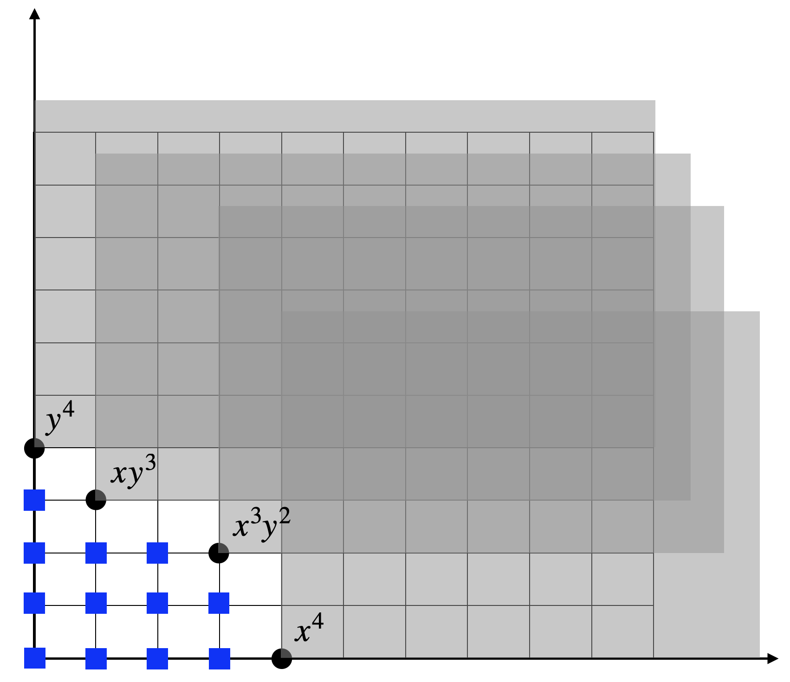

# Sums of Squares Relaxation {#SOS}

## Basic Algebraic Geometry

We first review several basic concepts in algebraic geometry. We refer to standard textbooks for a more comprehensive treatment [@bochnak13book-real], [@cox13book-ideals], [@dummit04book-abstract], [@lang12book-algebra].

### Groups, Rings, Fields

::: {.definitionbox}
::: {.definition #Group name="Group"}
A **group** consists of a set $G$ and a binary operation "$\cdot$" defined on $G$ that satisfies the following conditions:

1. Associative: $(a \cdot b) \cdot c = a \cdot (b \cdot c)$, for all $a,b,c \in G$.

2. Identity: there exists $1 \in G$ such that $1 \cdot a = a \cdot 1 = a$, for all $a \in G$.

3. Inverse: Given $a \in G$, there exists $b \in G$ such that $a \cdot b = b \cdot a = 1$.
:::
:::

For example, the integers $\bbZ$ form a group under addition, but not under multiplication; the set $GL(n,\Real{})$ that contains nonsingular $n \times n$ matrices forms a group under the usual matrix multiplication. Another example is the set of rotation matrices $\SOd := \cbrace{R \in \Real{d \times d} \mid RR\tran = \eye_d, \det(R) = +1}$.

In a group we only have one binary operation ("multiplication"). We will introduce another operation ("addition").

::: {.definitionbox}
::: {.definition #Ring name="Commutative Ring"}
A **commutative ring** (with identity) consists of a set $S$ and two binary operations "$\cdot$" and "$+$" defined on $S$ that satisfy the following conditions 

1. Associative: $(a+b)+c = a + (b+c)$, and $(a \cdot b) \cdot c = a \cdot (b \cdot c)$, for all $a,b,c \in S$.

2. Commutative: $a+b=b+a$ and $a\cdot b = b \cdot a$, for all $a,b \in S$.

3. Distributive: $a \cdot (b+c) = a\cdot b + a \cdot c$ for all $a,b,c \in S$.

4. Identities: there exist $0, 1 \in S$ such that $a + 0 = a \cdot 1 = a$, for all $a \in S$.

5. Additive inverse: given $a \in S$, there exists $b \in S$ such that $a + b = 0$.
:::
:::

A simple example of a ring is the set of integers $\bbZ$ under the usual addition and multiplication.

If we add a requirement for the existence of multiplicative inverse, we obtain a field.

::: {.definitionbox}
::: {.definition #Field name="Field"}
A **field** consists of a set $S$ and two binary operations "$\cdot$" and "$+$" defined on $S$ that satisfy the following conditions 

1. Associative: $(a+b)+c = a + (b+c)$, and $(a \cdot b) \cdot c = a \cdot (b \cdot c)$, for all $a,b,c \in S$.

2. Commutative: $a+b=b+a$ and $a\cdot b = b \cdot a$, for all $a,b \in S$.

3. Distributive: $a \cdot (b+c) = a\cdot b + a \cdot c$ for all $a,b,c \in S$.

4. Identities: there exist $0, 1 \in S$, where $0 \neq 1$, such that $a + 0 = a \cdot 1 = a$, for all $a \in S$.

5. Additive inverse: given $a \in S$, there exists $b \in S$ such that $a + b = 0$.

6. Multiplicative inverse: given $a \in S$ and $a \neq 0$, there exists $c \in S$ such that $a \cdot c = 1$.
:::
:::

Any field is obvious a commutative ring. Some commonly used fields are the rationals $\bbQ$, the reals $\Real{}$, and the complex numbers $\bbC$. Another important field is given by $k(x_1,\dots,x_n)$, the set of rational functions with coefficients in the field $k$, with the natural operations.

### Polynomials, Ideals, and Varieties

We will use $\bbF = \bbR$ or $\bbC$ to denote the field of real or complex numbers from now on. Let $x_1,\dots,x_n$ be indeterminates, we can define a polynomial.

::: {.definitionbox}
::: {.definition #Polynomial name="Polynomial"}
A polynomial $f$ in $x_1,\dots,x_n$ with coefficients in a field $\bbF$ is a finite linear combination of monomials:
$$
f = \sum_{\alpha} c_\alpha x^\alpha = \sum_{\alpha} c_\alpha x_1^{\alpha_1}\cdots x_n^{\alpha_n}, \quad c_\alpha \in \bbF,
$$
where the sum is over a finite number of $n$-tuples (exponents) $\alpha = (\alpha_1,\dots,\alpha_n)$, $\alpha_i \in \bbN$. The set of all polynomials in $x$ with coefficients in $\bbF$ is denoted $\bbF[x]$ or $\bbF[x_1,\dots,x_n]$.
:::
:::

The **degree** of a monomial is the sum of its exponents:
$$
\deg(x^\alpha) = \deg(x_1^{\alpha_1}\cdots x_n^{\alpha_n}) = \sum_{i=1}^n \alpha_i.
$$
The degree of a polynomial is the maximum degree of its monomials:
$$
\deg(f) = \max_{\alpha} \deg(x^\alpha).
$$

It is clear that $\bbF[x]$ is a commutative ring with the $0$ and $1$ identities. 

A **form** is a polynomial where all the monomials have the same degree. It is also called a **homogeneous polynomial**. For example,
$$
f = 2 x_1^2 + x_1 x_2 + x_2^2
$$
is a form of degree $2$. A homogeneous polynomial of degree $d$ satisfies 
$$
f(\lambda x_1,\dots,\lambda x_n) = \lambda^d f(x_1,\dots,x_n).
$$

A polynomial in $n$ variables of degree $d$ has
$$
s(n,d) = \begin{pmatrix} n + d \\ d \end{pmatrix}
$$
coefficients. Let $\bbF[x]_{d}$ be the set of polynomials in $n$ variables of degree $d$, then any $f \in \bbF[x]_d$ can be written as 
$$
f = c\tran [x]_d, \quad c \in \bbF^{s(n,d)}
$$
with $[x]_d$ the **standard monomial basis** in $x$ of degree up to $d$. For example, when $x = (x_1,x_2)$, then 
$$
[x]_2 = \begin{bmatrix} 1 \\ x_1 \\ x_2 \\ x_1^2 \\ x_1 x_2 \\ x_2^2 \end{bmatrix}.
$$

Let $G$ be a set of polynomials, and $\bbF[G]$ denote the set of all polynomials that can be written as 
$$
\sum_{\alpha} c_\alpha g_1^{\alpha_1} \cdots g_k^{\alpha_k}, \quad c_\alpha \in \bbF, g_1,\dots,g_k \in G
$$
with finitely many nonzero coefficients. The polynomials in $G$ are called **generators** and $G$ is called a **generator set** for $\bbF[G]$. Clearly, the set 
$$
G = \{1, x_1, \dots, x_n\}
$$
is a generator set for $\bbF[x]$.

We consider next ideals, which are subrings with an “absorbent” property.

::: {.definitionbox}
::: {.definition #Ideal name="Ideal"}
Let $R$ be a commutative ring. A subset $I \subset R$ is an ideal if it satisfies 

1. $0 \in I$.

2. If $a, b \in I$, then $a + b \in I$.

3. If $a \in I$ and $b \in R$, then $a \cdot b \in I$.
:::
:::

A simple example of an ideal is the set of even integers, considered as a subset of the integer ring $\bbZ$. If the ideal $I$ contains the multiplicative identity "$1$", then $I = R$. For a tuple $h = (h_1,\dots,h_s)$ of polynomials in $\bbF[x]$, $\Ideal[h]:= \Ideal[h_1,\dots,h_m]$ denotes the smallest ideal containing $h$, or equivalently 
$$
\Ideal[h] = h_1 \cdot \bbF[x] + \cdots + h_s \cdot \bbF[x].
$$
The set $\Ideal[h]$ is called the ideal generated by $h$. Every ideal of $\bbF[x]$ is generated by finitely many polynomials, i.e., every ideal is **finitely generated**.

::: {.theorembox}
::: {.theorem #HilbertBasisTheorem name="Hilbert Basis Theorem"}
For every ideal $I \subseteq \bbF[x]$, there exist finitely many polynomials $g_1,\dots,g_m \in I$ such that $I = \Ideal[g_1,\dots,g_m]$.
:::
:::

We define the concept of an **algebraic variety** as the zero set of a set of polynomial equations.

::: {.definitionbox}
::: {.definition #AffineVariety name="Affine Variety"}
Let $f_1,\dots,f_s \in \bbF[x_1,\dots,x_n]$ and $x = (x_1,\dots,x_n)$, and the set $V$ be 
$$
V_{\bbF}(f_1,\dots,f_s) = \cbrace{x \in \bbF^{n}\mid f_i(x) = 0, i=1,\dots,s}.
$$
We call $V_{\bbF}(f_1,\dots,f_s)$ the affine variety defined by $f_1,\dots,f_s$.
:::
:::

Similarly, let $I \subset \bbF[x]$ be an ideal, we denote its zero set as 
$$
V_{\bbF}(I) = \cbrace{x \in \bbF^n \mid f(x) = 0, \forall f \in I}.
$$
Since the ideal is finitely generated, we have 
$$
V_{\bbF}(I) = V_{\bbF}(g_1,\dots,g_m),
$$
where $g_1,\dots,g_m$ are the generators of $I$.

The set of polynomials that vanish in a given variety, i.e., 
$$
I(V)= \cbrace{f \in \bbF[x] \mid f(x) = 0, \forall x \in V},
$$
is an ideal, called the **vanishing ideal** of $V$.

We define the **radical** of an ideal.

::: {.definitionbox}
::: {.definition #Radical name="Radical"}
Let $I \subset \bbF[x]$ be an ideal. The radical of $I$, denoted $\sqrt{I}$, is the set 
$$
\sqrt{I} := \cbrace{f \mid f^k \in I \text{ for some integer }k}.
$$
:::
:::

It is clear that $I \subset \sqrt{I}$, and it can be shown that $\sqrt{I}$ is also a polynomial ideal. 

Given an ideal $I$ and $V_{\bbC}(I)$, it is clear that any $f \in I$ vanishes on $V_{\bbC}(I)$, that is 
$$
I \subseteq I(V_{\bbC}(I)).
$$
However, not all polynomials that vanish on $V_{\bbC}(I)$ belong to $I$.

::: {.theorembox}
::: {.theorem #HilbertNull name="Hilbert's Nullstellensatz"}
Let $I \subseteq \bbC[x]$ be an ideal.

- (Weak Nullstellensatz) If $V_{\bbC}(I) = \emptyset$, then $1 \in I$.

- (Strong Nullstellensatz) For $f \in \bbC[x]$, if $f(u) = 0$ for all $u \in V_{\bbC}(I)$, then $f^k \in I$ for some integer $k \geq 1$, i.e., $I(V_{\bbC}(I)) = \sqrt{I}$.
:::
:::

Let us see an example of Hilbert's Nullstellensatz.

::: {.examplebox}
::: {.example #HilbertNullstellensatz name="Hilbert's Nullstellensatz"}
Consider the ideal 
$$
I=\Ideal[x_1^2 x_2^3, x_1 x_2^4].
$$
The affine variety defined by $I$ is
$$
V = V_{\bbC}(I) = \cbrace{(x_1,x_2) \in \bbC^2 \mid x_1^2 x_2^3 = 0, x_1 x_2^4=0}.
$$
It is easy to see that the variety is the union of the two coordinate axes $x_1=0$ and $x_2 = 0$.

Therefore, the polynomial $x_1x_2$ vanishes on the variety $V$, but $x_1 x_2$ does not belong to the ideal $I$ (because the degree is lower).

We claim that
$$
\sqrt{I} = \Ideal[x_1 x_2].
$$
Indeed, $x_1 x_2 \in \sqrt{I}$ because 
$$
(x_1x_2)^3 = x_1^3 x_2^3 = x_1 \cdot x_1^2 x_3^3 \in I.
$$
Conversely, if $f \in \sqrt{I}$, then $f^k \in I$ for some integer $k$, i.e.,
$$
f^k = x_1^2 x_2^3 p(x) + x_1 x_2^4 q(x) = x_1 x_2 r(x)
$$
which implies $f^k \in \Ideal[x_1 x_2]$. Therefore, all the polynomials that vanish on the variety $V$ can be generated by $x_1 x_2$.

As another example, consider the ideal generated by a single univariate polynomial
$$
I = \Ideal[f], \quad f = \prod_{i=1}^{s} (x - a_i)^{n_i}
$$
with $a_i \neq a_j$ for $i \neq j$ the unique roots of the polynomial $f$. Clearly, the affine variety defined by $I$ is the set of unique roots:
$$
V= V_{\bbC}(I) = \{a_1,\dots,a_s\}.
$$
The vanishing ideal of $V$ is 
$$
\sqrt{I} = \Ideal[(x-a_1)\cdots (x-a_s)].
$$
:::
:::

### Gröbner Bases 

A polynomial ideal can have different "descriptions" in terms of its generators. We will now focus on a particular type of description that is better than the others.

Let's first define a monomial ordering.

::: {.definitionbox}
::: {.definition #MonomialOrdering name="Monomial Ordering"}
A monomial ordering on $\bbC[x]$ is a binary relation $\succ$ on $\bbN^n$, i.e., the exponents of the monomials, that satisfies 

1. The relation $\succ$ is a total ordering, i.e., given any two monomials $x^{\alpha}, x^{\beta}$, we must have either $x^{\alpha} \succ x^{\beta}$, or $x^\beta \succ x^\alpha$, or $x^\alpha = x^\beta$.

2. If $x^\alpha \succ x^\beta$, then $x^\alpha \cdot x^\gamma \succ x^\beta \cdot x^\gamma$ for any monomial $x^\gamma$.

3. The relation $\succ$ is well ordered, i.e., every nonempty set has a smallest element under $\succ$.

:::
:::

There are several monomial orderings of interest in computational algebra.

- **Lexicographic** ("dictionary"). Here $\alpha \lexsucc \beta$ if the left-most nonzero entry of $\alpha - \beta$ is positive. Note that a particular ordering of the variables is assumed.

- **Graded lexicographic**. Sort first by total degree, then Lexicographic, i.e., $\alpha \grlexsucc \beta$ if $\abs{\alpha} > \abs{\beta}$, or $\abs{\alpha} = \abs{\beta}$ and $\alpha \lexsucc \beta$.

- **Graded reverse lexicographic**. Here $\alpha \grevlexsucc \beta$ if $\abs{\alpha} > \abs{\beta}$ or $\abs{\alpha} = \abs{\beta}$ but the right-most nonzero entry of $\alpha - \beta$ is negative. This ordering, although somewhat nonintuitive, has some desirable computational properties.

::: {.examplebox}
::: {.example #MonomialOrdering name="Monomial Ordering"}
Consider the polynomial ring $\bbC[x,y]$ in two variables. With the lexicographic ordering $\lexprec$, we have 
$$
1 \lexprec y \lexprec y^2 \lexprec \cdots \lexprec x \lexprec xy \lexprec xy^2 \lexprec \cdots \lexprec x^2 \lexprec x^2 y \lexprec x^2 y^2 \lexprec \cdots.
$$
For the other two orderings $\grlexprec$ and $\grevlexprec$, which in the case of two variables are the same, we have 
$$
1 \prec y \prec x \prec y^2 \prec xy \prec x^2 \prec y^3 \prec xy^2 \prec x^2 y \prec x^3 \prec \cdots.
$$

As another example, consider the monomials $\alpha = x^3 y^2 z^8$ and $\beta = x^2 y^9 z^2$. If the variables are ordered as $(x,y,z)$, then 
$$
\alpha \lexsucc \beta, \quad \alpha \grlexsucc \beta, \quad \alpha \grevlexprec \beta.
$$
Note that $x \succ y \succ z$ for all three orderings.
:::
:::

We define a monomial ideal.

::: {.definitionbox}
::: {.definition #MonomialIdeal name="Monomial Ideal"}
A monomial ideal is a polynomial ideal that can be generated by monomials.
:::
:::
What are the possible monomials that belong to a given monomial ideal? Since $x^\alpha \in I \Rightarrow x^{\alpha + \beta} \in I$ for any $\beta \geq 0$, we have that these sets are "closed upwards".

A polynomial belongs to a monomial ideal $I$ if and only if its terms are in $I$. 

Similarly, we have that every monomial ideal is finitely generated.

::: {.theorembox}
::: {.theorem #Dickson name="Dickson's Lemma"}
Every monomial ideal is finitely generated.
:::
:::

We next consider a special monomial ideal, associated with every polynomial ideal. From now on, we assume a fixed monomial ordering (e.g., graded reverse lexicographic), and define the notion of an initial ideal.

::: {.definitionbox}
::: {.definition #InitialIdeal name="Initial Ideal"}
Denote by $\initial{f}$ the "largest" (or leading) monomial appearing in the polynomial $f\neq 0$. Consider an ideal $I \subset \bbC[x]$ with a fixed monomial ordering. The initial ideal of $I$, denoted by $\initial{I}$, is the monomial ideal generated by the leading monomials of all the elements in $I$, i.e.,
$$
\initial{I} = \Ideal[\cbrace{\initial{f} \mid f \in I \backslash \{0\}}].
$$
A monomial $x^\alpha$ is called **standard** if it does not belong to the initial ideal $\initial{I}$.
:::
:::

Given an ideal $I = \Ideal[f_1,\dots,f_s]$, we can construct two monomial ideals associated with it:

- The initial ideal $\initial{I}$ as defined in Definition \@ref(def:InitialIdeal).

- The monomial ideal generated by the leading monomials of the generators, i.e., 
$$
\Ideal[\initial{f_1},\dots,\initial{f_s}].
$$

Clearly, we have
$$
\Ideal[\initial{f_1},\dots,\initial{f_s}] \subseteq \initial{I}.
$$

::: {.examplebox}
::: {.example #InitialIdeal name="Initial Ideal and the Ideal of Initials"}
Consider the ideal
$$
I = \Ideal[x^3 -1, x^2 + 1],
$$
we have $1 \in I$ due to 
$$
1 = \frac{1}{2}(x-1)(x^3 - 1) - \frac{1}{2}(x^2 - x - 1)(x^2 +1).
$$
Therefore, $\initial{I} = I = \bbC[x]$. On the other hand, the monomial ideal generated by the leading monomials is 
$$
\Ideal[x^3, x^2],
$$
and clearly does not contain $1$.
:::
:::

We have seen that in general these two monomial ideals are not the same. However, is it possible to find a set of generators for which the two monomial ideals are the same? This is exactly the notion of a Gröbner basis.

::: {.definitionbox}
::: {.definition #GrobnerBasis name="Gröbner Basis"}
Consider the polynomial ring $\bbC[x]$, a fixed monomial ordering, and an ideal $I$. A finite set of polynomials $\cbrace{g_1,\dots,g_s} \subset I$ is a Gröbner basis of $I$ if the initial ideal of $I$ is generated by the leading terms of the $g_i$'s, i.e., 
$$
\initial{I} = \Ideal[\initial{g_1},\dots,\initial{g_s}].
$$
:::
:::

We have the result that every ideal has a Grobner basis.

::: {.theorembox}
::: {.theorem #GrobnerBasis name="Gröbner Basis"}
Every ideal $I$ has a Grobner basis. Further, $I = \Ideal[g_1,\dots,g_s]$.
:::
:::

Theorem \@ref(thm:GrobnerBasis) indeed proves the Hilbert Basis Theorem \@ref(thm:HilbertBasisTheorem). 

Note that the Grobner basis as defined is not unique. It can be fixed to define a so-called **reduced Gröbner Basis**, which is unique when fixing a monomial ordering.

There exist numerical algorithms that can compute the Grobner basis. The most well-known algorithm is called Buchberger's algorithm, developed by Bruno Buchberger around 1965. The algorithm, however, is in general slow because it is double exponential time. Several software packages provide implementations that can compute the Grobner basis, for example Mathematica, Maple, Macaulay2, and Matlab.

::: {.examplebox}
::: {.example #GrobnerBasis name="Grobner Basis"}
Consider the ideal $I = \Ideal[x^2+y^2-2, x^2 - y^2]$. The affine variety of $I$ is finite and only contains four points $(\pm 1, \pm 1)$. It is easy to see that the given generators are not a Grobner basis. 

Computing a Grobner basis (e.g., using the [Matlab `gbasis` function](https://www.mathworks.com/help/symbolic/sym.gbasis.html)) gives us
$$
\cbrace{x^2 - 1, y^2 - 1}.
$$
The standard monomials are $\cbrace{1,x,y,xy}$.
:::
:::

We will see that Grobner basis is a powerful tool with many applications in computational algebra. For a brief introduction to Grobner Basis, see [@sturmfels05notes-grobner].

### Quotient Ring

Given an ideal $I$, we can immediately define a notion of **equivalence classess**, where we identify two elements in the ring if and only if their difference is in the ideal.

For example, in the ring of integers $\bbZ$, the set of even integers is an ideal. We can identify two integers as the same if their difference is even. This effectively divides the ring $\bbZ$ into two equivalence classess, the set of odd and even integers.

We can do the same for the ring of polynomials $\bbC[x]$ given an ideal $I$.

::: {.definitionbox}
::: {.definition #CongruenceIdeal name="Congruence"}
Let $I \subset \bbC[x]$ be an ideal. We are two polynomials $f,g \in \bbC[x]$ is **congruent** modulo $I$, written as 
$$
f \equiv g \quad \text{mod } I,
$$
if $f - g \in I$.
:::
:::

It is easy to see that this is an [equivalence relation](https://en.wikipedia.org/wiki/Equivalence_relation), i.e., it is reflexive, symmetric, and transitive. Therefore, an ideal $I$ partitions $\bbC[x]$ into equivalence classes, where two polynomials are the same if their difference belongs to the ideal. This allows us to define the notion of a quotient ring.

::: {.definitionbox}
::: {.definition #QuotientRing name="Quotient Ring"}
The quotient $\bbC[x]/I$ is the set of equivalence classes for congruence modulo $I$.
:::
:::

The quotient $\bbC[x]/I$ inherits the ring structure of $\bbC[x]$. With the addition and multiplication operations defined between equivalence classes, $\bbC[x]/I$ becomes a ring, known as the quotient ring. Indeed, given a polynomial $p$, the set of all polynomials equivalent to $p$ is denoted as 
$$
[p]:= \cbrace{p + q \mid q \in I}.
$$
We have $[p] = [q]$ if and only if $p - q \in I$. Given two equivalent classes $[p]$ and $[q]$, the addition and multiplication are defined as 
$$
[p] + [q] = [p+q], \quad [p] \cdot [q] = [p q].
$$
One can verify that $(\bbC[x],+,\cdot)$ with $+$ and $\cdot$ defined above forms a ring structure.

The quotient ring $\bbC[x]/I$ is in fact a vector space, and the Grobner basis gives us a way to find a set of basis in the quotient ring! Let $G$ be a Grobner basis of the ideal $I$, and recall from Definition \@ref(def:InitialIdeal) that a monomial is standard if it does not belong to the initial ideal $\initial{I}$. This implies that when the Grobner basis is available, the set of all **standard monomials** can be directly read off from the Grobner basis, as in Example \@ref(exm:GrobnerBasis). Let $S$ be this set of standard monomials, then the basis of the quotient ring is simply 
$$
\cbrace{[s] \mid s\in S}.
$$
Note that the quotient ring needs not be finite-dimensional as the set of standard monomials can be infinite. Given such a basis of the quotient ring, we can associate every polynomial with a **normal form** that is a linear combination of the standard monomials.

::: {.definitionbox}
::: {.definition #NormalForm name="Normal Form"}
Let $G$ be a Grobner basis of the ideal $I \subset \bbC[x]$. Given any $p \in \bbC[x]$, there exists a unique polynomial $\bar{p}$, called the **normal form** of $p$ such that 

- $p$ and $\bar{p}$ are congruent mod $I$, i.e., $p - \bar{p} \in I$.

- Only standard monomials appear in $\bar{p}$.
:::
:::

Note that since $p - \bar{p} \in I$, we have 
$$
p = \sum_{i}^s\lambda_i g_i + \bar{p}, \quad g_i \in G.
$$
Therefore, the normal form $\bar{p}$ can be interpreted as the "reminder" of $p$ divided by the ideal $I$. The unique property of the Grobner basis ensures that the normal form is unique and it is just a $\bbC$-combination of the standard monomials. 

As a consequence, we can check the ideal membership of a given polynomial. Indeed, a polynomial $p$ belongs to the ideal $I$ if and only if its normal form is the zero polynomial. 

See an example of using Grobner basis to compute the normal form in the [Maple software](https://www.maplesoft.com/support/help/maple/view.aspx?path=Groebner%2FNormalForm).


### Zero-dimensional Ideal

In practice, we are often interested in polynomial systems that have only a finite number of solutions, in which case the associated ideal is called zero-dimensional.

::: {.definitionbox}
::: {.definition #ZeroDimensional name="Zero-Dimensional Ideal"}
An ideal $I$ is zero-dimensional if the associated affine variety $V_{\bbC}(I)$ is a finite set.
:::
:::

Note that the variety $V_{\bbC}(I)$ having a finite number of points is stronger than $V_{\bbR}(I)$ have a finite number of points.

The following result characterizes when an ideal is zero-dimensional.

::: {.theorembox}
::: {.theorem #FiniteTheorem name="Finiteness Theorem"}
Let $I \subset \bbC[x]$ be an ideal. Fix a monomial ordering and let $G$ be a Grobner basis of $I$. Then the following statements are equivalent.

1. The ideal $I$ is finite-dimensional (i.e., $V(I)$ is a finite set of points).

2. The quotient ring $\bbC[x]/I$ is a finite-dimensional vector space (i.e., there are a finite number of standard monomials).

3. For each $x_i, i=1,\dots,n$, there exists an integer $m_i \in \bbN$ such that $x_i^{m_i}$ is the leading monomial of some $g \in G$.
:::
:::

Let us work out an example.

::: {.examplebox}
::: {.example #ZeroDIdeal name="Zero-dimensional Ideal"}
Consider the ideal in $\bbC[x,y]$:
$$
I = \Ideal[xy^3-x^2, x^3y^2 - y].
$$
Using the graded lexicographic monomial ordering, we obtain the reduced Grobner basis 
$$
G = \cbrace{x^3 y^2 - y, x^4 - y^2,  xy^3 - x^2, y^4 - xy}.
$$
We can see that $x^4$ is the leading monomial of $x^4 - y^2$, and $y^4$ is the leading monomial of $y^4 - xy$. Therefore, we know $I$ is zero-dimensional. We can also see this by checking the number of standard monomials. The standard monomials are those that do not belong to the initial ideal $\initial{I}$, which in the case of a Grobner basis, is simply 
$$
\initial{I} = \Ideal[x^3 y^2, x^4, xy^3, y^4].
$$
This is a monomial ideal and hence is "closed upwards". The shaded gray areas in Fig. \@ref(fig:ZeroDimensional1) shows all the monomials in the initial ideal, whose boundary forms a "staircase". The standard monomials, shown as blue squares in the figure, are those that are below the staircase:
$$
1,x,x^2,x^3,y,xy,x^2 y, x^3 y, y^2, xy^2, x^2 y^2, y^3.
$$

```{r ZeroDimensional1, out.width='60%', fig.show='hold', fig.cap='Initial ideal and the standard monomials with graded lexicographic monomial ordering.', fig.align='center', echo=FALSE}

```

We can change the monomial ordering and see what happens. Let us use the lexicographic monomial ordering this time. We obtain the reduced Grobner basis
$$
G = \cbrace{x^2-y^6, xy - y^4, y^{11} - y}.
$$
The monomial $x^2$ is the leading monomial of $x^2 - y^6$, and the monomial $y^{11}$ is the leading monomial of $y^11 - y$. Hence, the ideal is verified to be zero-dimensional as well. A different monomial ordering does change the set of standard monomials. Fig. \@ref(fig:ZeroDimensional2) shows the initial ideal and the standard monomials (blue squares) under the staircase:
$$
1,x,y,y^2,y^3,y^4,y^5,y^6,y^7,y^8,y^9,y^{10}.
$$
Though the set of standard monomials has changed, the number of standard monomials remains to be $12$. This makes sense because the dimension of the quotient ring $\bbC[x]/I$ should not change.

```{r ZeroDimensional2, out.width='60%', fig.show='hold', fig.cap='Initial ideal and the standard monomials with lexicographic monomial ordering.', fig.align='center', echo=FALSE}
knitr::include_graphics("images/zero_dimensional_2.png")
```

The code for computing the Grobner basis can be found [here](https://github.com/ComputationalRobotics/Semidefinite-Examples/blob/main/zero_d_ideal.m).
:::
:::

If an ideal $I$ is zero-dimensional, can we find all the points in the affine variety $V(I)$? The next result shows that the number of points in $V(I)$ (counting multiplicity) is precisely the number of standard monomials.

::: {.theorembox}
::: {.theorem #PolySysRoots name="Number of Roots"}
If an ideal $I \subset \bbC[x]$ is zero-dimensional, then the number of standard monomials equals to the cardinality of $V(I)$, counting multiplicities.
:::
:::

Once a set of standard monomials is found, we can also design a numerical procedure to compute the roots of the polynomial system of equations. For each $x_i,\dots,x_n$, define the multiplication mapping
$$
\calM_{x_i}: \bbC[x]/I \rightarrow \bbC[x]/I, \quad [p] \rightarrow [x_i p].
$$
It can be shown that $\calM_{x_i}$ is a linear mapping. Let $M_{x_i}$ be the matrix representation of this linear map using $S$, the set of standard monomials, as the basis of the quotient ring $\bbC[x]/I$. $M_{x_i}$ is called the **companion matrix** or **multiplication matrix** of the ideal $I$ with respect to $x_i$. The companion matrices $M_{x_1},\dots,M_{x_n}$ commute with each other and share common eigenvectors. The affine variety $V_{\bbC}(I)$ can be determined by eigenvalues of the companion matrices. 

::: {.theorembox}
::: {.theorem #StickelbergerTheorem name="Stickelberger's Theorem"}
Let $I \subset \bbC[x]$ be a zero-dimensional ideal and let $M_{x_1},\dots,M_{x_n}$ be the companion matrices, then 
$$
V_{\bbC}(I) = \cbrace{(\lambda_1,\dots,\lambda_n) \mid \exists v \in \bbC^D \backslash \{0 \}, M_{x_i} v = \lambda_i v, i=1,\dots,n },
$$
where $D$ is the dimension of the quotient ring $\bbC[x]/I$.
:::
:::

With Stickelberger's Theorem, one can further show that a zero-dimensional ideal $I$ is radical if and only if the companion matrices $M_{x_1},\dots,M_{x_n}$ are simultaneously diagonalizable, which occurs if and only if the cardinality $|V_{\bbC}(I)| = D$. 

Let us make Stickelberger's Theorem concrete through an example.

::: {.examplebox}
::: {.example #SolvingPolynomialSystem name="Solving Polynomial Equations"}
Consider the ideal $I \subset \bbC[x,y,z]$ 
$$
I = \Ideal[xy-z, yz -x, zx - y].
$$
Choosing lexicographic monomial ordering, we get the Groebner basis 
$$
G = \cbrace{z - yx, y^2 - x^2, yx^2 - y, x^3 - x}.
$$
We can see that this ideal is zero-dimensional (due to $z$, $y^2$, $x^3$ being the leading monomials in $G$). The standard monomials are 
$$
S = \cbrace{1, x, x^2, y, yx}.
$$
We now need to form the matrices $M_x, M_y, M_z$.
This can be done as follows.
$$
\NormalForm\left(
x \cdot \begin{bmatrix}
1 \\
x \\
x^2 \\
y \\
yx 
\end{bmatrix}
\right) = 
\begin{bmatrix}
x \\
x^2 \\
x \\
xy \\
y \end{bmatrix} = 
\underbrace{\begin{bmatrix}
0 & 1 & 0 & 0 & 0 \\
0 & 0 & 1 & 0 & 0 \\
0 & 1 & 0 & 0 & 0 \\
0 & 0 & 0 & 0 & 1 \\
0 & 0 & 0 & 1 & 0 
\end{bmatrix}}_{M_x}
\begin{bmatrix}
1 \\
x \\
x^2 \\
y \\
yx 
\end{bmatrix}
$$
$$
\NormalForm\left(
y \cdot \begin{bmatrix}
1 \\
x \\
x^2 \\
y \\
yx 
\end{bmatrix}
\right) = 
\begin{bmatrix}
y \\
xy \\
y \\
x^2 \\
x \end{bmatrix} = 
\underbrace{\begin{bmatrix}
0 & 0 & 0 & 1 & 0 \\
0 & 0 & 0 & 0 & 1 \\
0 & 0 & 0 & 1 & 0 \\
0 & 0 & 1 & 0 & 0 \\
0 & 1 & 0 & 0 & 0 
\end{bmatrix}}_{M_y}
\begin{bmatrix}
1 \\
x \\
x^2 \\
y \\
yx 
\end{bmatrix}
$$
$$
\NormalForm\left(
z \cdot \begin{bmatrix}
1 \\
x \\
x^2 \\
y \\
yx 
\end{bmatrix}
\right) = 
\begin{bmatrix}
yx \\
y \\
xy \\
x \\
x^2 \end{bmatrix} = 
\underbrace{\begin{bmatrix}
0 & 0 & 0 & 0 & 1 \\
0 & 0 & 0 & 1 & 0 \\
0 & 0 & 0 & 0 & 1 \\
0 & 1 & 0 & 0 & 0 \\
0 & 0 & 1 & 0 & 0 
\end{bmatrix}}_{M_z}
\begin{bmatrix}
1 \\
x \\
x^2 \\
y \\
yx 
\end{bmatrix}
$$
We can then simultaneously diagonalize $M_x,M_y,M_z$ using the following matrix
$$
V = \frac{1}{4}\begin{bmatrix}
4 & 0 & -4 & 0 & 0 \\
0 & 1 & 1 & 1 & 1\\
0 & 1 & 1 & -1 & -1 \\
0 & -1 & 1 & 1 & -1 \\
0 & -1 & 1 & -1 & 1
\end{bmatrix}, \quad 
V\inv = \begin{bmatrix}
1 & 1 & 1 & 1 & 1\\
0 & 1 & 1 & -1 & -1\\
0 & 1 & 1 & 1 & 1\\
0 & 1 & -1 & 1 & -1 \\
0 & 1 & -1 & -1 & 1
\end{bmatrix}.
$$
The result is 
\begin{equation}
\begin{split}
V M_x V\inv &= \diag(0 , 1, 1, -1, -1)\\
V M_y V\inv &= \diag(0 , 1, -1, 1, -1)\\
V M_z V\inv &= \diag(0 , 1, -1, -1, 1)
\end{split}.
\end{equation}
Therefore, the five roots of the polynomial system is 
$$
\begin{pmatrix}
x \\ y \\ z 
\end{pmatrix} =
\lcbrace{
    \begin{pmatrix} 0 \\ 0 \\ 0 \end{pmatrix},
    \begin{pmatrix} 1 \\ 1 \\ 1 \end{pmatrix},
    \begin{pmatrix} 1 \\ -1 \\ -1 \end{pmatrix},
    \begin{pmatrix} -1 \\ 1 \\ -1 \end{pmatrix},
    \begin{pmatrix} -1 \\ -1 \\ 1 \end{pmatrix}
}.
$$
:::
:::

In practice, instead of simultaneously diagonalizing the companion matrices, a Schur decomposition type method is used to compute the roots [@corless97-reordered]. We will see that in the homework.

### Algebraic and Semialgebraic Sets 

An **algebraic set** in $\Real{n}$ is the set of common **real** roots of a set of polynomials. For instance, the unit sphere is an algebraic set because it is real zero set of the polynomial $x_1^2 + \dots + x_n^2 - 1$.

Intersections and unions of finitely many algebraic sets are again algebraic sets. A nonempty algebraic set is said to be **irreducible** if it cannot be written as a union of two distinct proper algebraic subsets; otherwise it is called reducible. Every algebraic set is the union of finitely many irreducible ones. 

More general than algebraic sets are **semialgebraic sets**.

::: {.definitionbox}
::: {.definition #BasisSemialgebraic name="Basic Semialgebraic Set"}
A set $S \subset \Real{n}$ defined as 
$$
S = \cbrace{x \in \Real{n} \mid f_i(x) \triangleright_i 0, i=1,\dots,\ell },
$$
where for each $i$, $\triangleright_i$ is one of $\cbrace{\geq, >, =, \neq}$ and $f_i(x) \in \poly{x}$, is called a basic semialgebraic set.

A basic closed semialgebraic set is a set of the form 
$$
S = \cbrace{x \in \Real{n} \mid f_1\geq 0, \dots f_\ell(x) \geq 0}.
$$
:::
:::

Every basic semialgebraic set can be expressed with polynomial inequalities of the form $f(x) \geq 0$ and a single inequality $g \neq 0$. 

::: {.definitionbox}
::: {.definition #SemialgebraicSet name="Semialgebraic Set"}
A finite union of basic semialgebraic sets in $\Real{n}$ is called a semialgebraic set, and a finite union of basic closed semialgebraic sets is a closed semialgebraic set.
:::
:::

Semialgebraic sets are closed under finite unions, finite intersections, and complementation. The following theorem states that they are also closed under projections.

::: {.theorembox}
::: {.theorem #TarskiSeidenberg name="Tarski-Seidenberg Theorem"}
Let $S \subset \Real{k+n}$ be a semialgebraic set and $\pi : \Real{k+n} \rightarrow \Real{n}$ be the projection map that sends $(y,x) \mapsto x$. Then $\pi(S)$ is a semialgebraic set in $\Real{n}$.
:::
:::

Note that an algebraic set is not closed under projection. For example consider the algebraic set defined by $xy = 1$. The projection of this algebraic set to $x$ is defined by $x \neq 0$, which is not an algebraic set, but a semialgebraic set.

Semialgebraic functions are similarly defined. Let $f: D \rightarrow \Real{}$ be a real-valued function where the domain $D$ is a semialgebraic set. Then $f$ is called a **semialgebraic function** if the graph $\cbrace{(x,y) \mid x \in D, f(x)=y}$ is a semialgebraic set.

## SOS and Nonnegative Polynomials 

### Nonnegative polynomials

Consider polynomials in $n$ variables with real coefficients, i.e., the set $\poly{x}$. A polynomial $p(x_1,\dots,x_n)$ is nonnegative if
$$
p(x_1,\dots,x_n) \geq 0, \quad \forall (x_1,\dots,x_n) \in \Real{n}.
$$

Of couse, a natural question is, given a polynomial $p(x)$, is it possible to efficiently decide whether $p(x)$ is nonnegative?

**Univariate Polynomials**. Let us start the discussion on univariate polynomials, i.e., polynomials in a single variable $x$. A univariate polynomial of degree $d$ can be written as 
\begin{equation}
p(x) = p_d x^d + p_{d-1} x^{d-1} + \cdots + p_1 x + p_0.
(\#eq:univariate-poly)
\end{equation}
Without loss of generality, we can assume $p_d = 1$, in which case the polynomial is said to be **monic**. The univariate polynomial can also be written as 
\begin{equation}
p(x) = p_d \prod_{i=1}^d (x - x_i),
(\#eq:univariate-poly-root)
\end{equation}
with $x_i,i=1,\dots,d$ its complex roots that may have multiplicities. 

How do we decide if $p(x)$ is nonnegative? A simple necessary condition is that $d$ must be even. Otherwise if $d$ is odd, then either pushing $x \rightarrow \infty$ or $x \rightarrow -infinity$ will lead to $p(x)$ negative.

In certain cases it is easy to derive an explict characterization of nonnegativity.

::: {.examplebox}
::: {.example #NonnegativeQuadratic name="Univaraite Quadratic Polynomial"}
Let $p(x) = x^2 + p_1 x + p_0$ be a monic quadratic polynomial. Clearly, $p(x) \geq 0$ if and only if 
$$
\min_{x} p(x) \geq 0.
$$
Since $p(x)$ is convex, its global minimum can be easily computed by setting its gradient to zero, which gives 
$$
x_\star = - \frac{p_1}{2}, \quad p(x_\star) = p_0 - \frac{p_1^2}{4}.
$$
Therefore, $p(x)$ is nonnegative if and only if 
$$
4 p_0 - p_1^2 \geq 0.
$$
:::
:::

For general univariate polynomials, we describe a technique known as the Hermite method for deciding nonnegativity. Consider a monic polynomial as in \@ref(eq:univariate-poly) and \@ref(eq:univariate-poly-root) and define its associated **Hermite matrix** as the following $d \times d$ symmetric Hankel matrix
$$
H_1(p) = \begin{bmatrix}
s_0 & s_1 & \cdots & s_{d-1} \\
s_1 & s_2 & \cdots & s_d \\
\vdots & \vdots & \ddots & \vdots \\
s_{d-1} & s_d & \cdots & s_{2d-2}
\end{bmatrix}, \quad s_k = \sum_{j=1}^d x_j^k,
$$
where recall $x_j,j=1,\dots,d$ are the roots of $p$. The quantities $s_k$ are known as the power sums. The follow lemma states that the power sums can be computed without computing the roots. 

::: {.theorembox}
::: {.lemma #NewtonIdentity name="Newton Identities"}
The power sums $s_k$ satisfy the following recursive equations known as the Newton identities:
$$
s_0 = d, \quad s_k = -1\left(k p_{d-k} + \sum_{i=1}^{k-1} p_{d-i} s_{k-i} \right), k=1,2,\dots.
$$
:::
:::

After forming the Hermite matrix, its rank and signature tells us the number of complex and real roots.

::: {.theorembox}
::: {.theorem #HermiteMatrix name="Hermite Matrix"}
The rank of the Hermite matrix $H_1(p)$ is equal to the number of distinct complex roots. The signature of $H_1(p)$ is equal to the number of distinct real roots.
:::
:::

Recall that given a symmetric matrix $A$, its **inertia**, denoted $\calI(A)$, is the triplet $(n_+, n_0, n_{-})$, where $n_+,n_0, n_-$ are the number of positive, zero, and negative eigenvalues, respectively. The **signature** of $A$ is equal to $n_+ - n_-$.

With the Hermite matrix, we can decide nonnegativity.

::: {.theorembox}
::: {.theorem #NonnegativityHermite name="Nonnegativity from Hermite Matrix"}
Let $p(x)$ be a monic polynomial of degree $2d$. Then the following statements are equivalent. 

1. The polynomial $p(x)$ is strictly positive. 

2. The polynomial $p(x)$ has no real roots. 

3. The inertia of the Hermite matrix is $\calI(H_1(p)) = (k, 2d-k, k)$ for some $1 \leq k \leq d$.
:::
:::

We can use this result on the quadratic example before.

::: {.examplebox}
::: {.example #HermiteQuadratic name="Hermite Matrix of A Quadratic Polynomial"}
Consider the quadratic polynomial $p(x) = x^2 + p_1 x + p_0$. Using the Newton identifies, we have 
$$
s_0 = 2, \quad s_1 = -p_1, \quad s_2 = p_1^2 - 2p_0.
$$
The Hermite matrix is then 
$$
H_1(p) = \begin{bmatrix} 2 & - p_1 \\ -p_1 & p_1^2 - 2 p_0 \end{bmatrix}.
$$
Let $\Delta = \det H_1(p) = p_1^2 - 4p_0$. The inertia of the Hermite matrix is 
$$
\calI(H_1(p)) = \begin{cases}
(0,0,2) & \text{if } \Delta > 0 \\
(0,1,1) & \text{if } \Delta = 0 \\
(1,0,1) & \text{if } \Delta < 0.
\end{cases}
$$
Thus, $p$ is strictly positive if and only if $\Delta < 0$.
:::
:::

