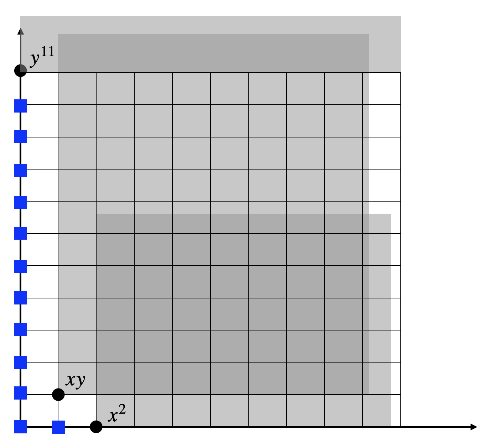

# Sums of Squares Relaxation {#SOS}

## Basic Algebraic Geometry

We first review several basic concepts in algebraic geometry. We refer to standard textbooks for a more comprehensive treatment [@bochnak13book-real], [@cox13book-ideals], [@dummit04book-abstract], [@lang12book-algebra].

### Groups, Rings, Fields

::: {.definitionbox}
::: {.definition #Group name="Group"}
A **group** consists of a set $G$ and a binary operation "$\cdot$" defined on $G$ that satisfies the following conditions:

1. Associative: $(a \cdot b) \cdot c = a \cdot (b \cdot c)$, for all $a,b,c \in G$.

2. Identity: there exists $1 \in G$ such that $1 \cdot a = a \cdot 1 = a$, for all $a \in G$.

3. Inverse: Given $a \in G$, there exists $b \in G$ such that $a \cdot b = b \cdot a = 1$.
:::
:::

For example, the integers $\bbZ$ form a group under addition, but not under multiplication; the set $GL(n,\Real{})$ that contains nonsingular $n \times n$ matrices forms a group under the usual matrix multiplication. Another example is the set of rotation matrices $\SOd := \cbrace{R \in \Real{d \times d} \mid RR\tran = \eye_d, \det(R) = +1}$.

In a group we only have one binary operation ("multiplication"). We will introduce another operation ("addition").

::: {.definitionbox}
::: {.definition #Ring name="Commutative Ring"}
A **commutative ring** (with identity) consists of a set $S$ and two binary operations "$\cdot$" and "$+$" defined on $S$ that satisfy the following conditions 

1. Associative: $(a+b)+c = a + (b+c)$, and $(a \cdot b) \cdot c = a \cdot (b \cdot c)$, for all $a,b,c \in S$.

2. Commutative: $a+b=b+a$ and $a\cdot b = b \cdot a$, for all $a,b \in S$.

3. Distributive: $a \cdot (b+c) = a\cdot b + a \cdot c$ for all $a,b,c \in S$.

4. Identities: there exist $0, 1 \in S$ such that $a + 0 = a \cdot 1 = a$, for all $a \in S$.

5. Additive inverse: given $a \in S$, there exists $b \in S$ such that $a + b = 0$.
:::
:::

A simple example of a ring is the set of integers $\bbZ$ under the usual addition and multiplication.

If we add a requirement for the existence of multiplicative inverse, we obtain a field.

::: {.definitionbox}
::: {.definition #Field name="Field"}
A **field** consists of a set $S$ and two binary operations "$\cdot$" and "$+$" defined on $S$ that satisfy the following conditions 

1. Associative: $(a+b)+c = a + (b+c)$, and $(a \cdot b) \cdot c = a \cdot (b \cdot c)$, for all $a,b,c \in S$.

2. Commutative: $a+b=b+a$ and $a\cdot b = b \cdot a$, for all $a,b \in S$.

3. Distributive: $a \cdot (b+c) = a\cdot b + a \cdot c$ for all $a,b,c \in S$.

4. Identities: there exist $0, 1 \in S$, where $0 \neq 1$, such that $a + 0 = a \cdot 1 = a$, for all $a \in S$.

5. Additive inverse: given $a \in S$, there exists $b \in S$ such that $a + b = 0$.

6. Multiplicative inverse: given $a \in S$ and $a \neq 0$, there exists $c \in S$ such that $a \cdot c = 1$.
:::
:::

Any field is obvious a commutative ring. Some commonly used fields are the rationals $\bbQ$, the reals $\Real{}$, and the complex numbers $\bbC$. Another important field is given by $k(x_1,\dots,x_n)$, the set of rational functions with coefficients in the field $k$, with the natural operations.

### Polynomials, Ideals, and Varieties

We will use $\bbF = \bbR$ or $\bbC$ to denote the field of real or complex numbers from now on. Let $x_1,\dots,x_n$ be indeterminates, we can define a polynomial.

::: {.definitionbox}
::: {.definition #Polynomial name="Polynomial"}
A polynomial $f$ in $x_1,\dots,x_n$ with coefficients in a field $\bbF$ is a finite linear combination of monomials:
$$
f = \sum_{\alpha} c_\alpha x^\alpha = \sum_{\alpha} c_\alpha x_1^{\alpha_1}\cdots x_n^{\alpha_n}, \quad c_\alpha \in \bbF,
$$
where the sum is over a finite number of $n$-tuples (exponents) $\alpha = (\alpha_1,\dots,\alpha_n)$, $\alpha_i \in \bbN$. The set of all polynomials in $x$ with coefficients in $\bbF$ is denoted $\bbF[x]$ or $\bbF[x_1,\dots,x_n]$.
:::
:::

The **degree** of a monomial is the sum of its exponents:
$$
\deg(x^\alpha) = \deg(x_1^{\alpha_1}\cdots x_n^{\alpha_n}) = \sum_{i=1}^n \alpha_i.
$$
The degree of a polynomial is the maximum degree of its monomials:
$$
\deg(f) = \max_{\alpha} \deg(x^\alpha).
$$

It is clear that $\bbF[x]$ is a commutative ring with the $0$ and $1$ identities. 

A **form** is a polynomial where all the monomials have the same degree. It is also called a **homogeneous polynomial**. For example,
$$
f = 2 x_1^2 + x_1 x_2 + x_2^2
$$
is a form of degree $2$. A homogeneous polynomial of degree $d$ satisfies 
$$
f(\lambda x_1,\dots,\lambda x_n) = \lambda^d f(x_1,\dots,x_n).
$$

A polynomial in $n$ variables of degree $d$ has
$$
s(n,d) = \begin{pmatrix} n + d \\ d \end{pmatrix}
$$
coefficients. Let $\bbF[x]_{d}$ be the set of polynomials in $n$ variables of degree $d$, then any $f \in \bbF[x]_d$ can be written as 
$$
f = c\tran [x]_d, \quad c \in \bbF^{s(n,d)}
$$
with $[x]_d$ the **standard monomial basis** in $x$ of degree up to $d$. For example, when $x = (x_1,x_2)$, then 
$$
[x]_2 = \begin{bmatrix} 1 \\ x_1 \\ x_2 \\ x_1^2 \\ x_1 x_2 \\ x_2^2 \end{bmatrix}.
$$

Let $G$ be a set of polynomials, and $\bbF[G]$ denote the set of all polynomials that can be written as 
$$
\sum_{\alpha} c_\alpha g_1^{\alpha_1} \cdots g_k^{\alpha_k}, \quad c_\alpha \in \bbF, g_1,\dots,g_k \in G
$$
with finitely many nonzero coefficients. The polynomials in $G$ are called **generators** and $G$ is called a **generator set** for $\bbF[G]$. Clearly, the set 
$$
G = \{1, x_1, \dots, x_n\}
$$
is a generator set for $\bbF[x]$.

We consider next ideals, which are subrings with an “absorbent” property.

::: {.definitionbox}
::: {.definition #Ideal name="Ideal"}
Let $R$ be a commutative ring. A subset $I \subset R$ is an ideal if it satisfies 

1. $0 \in I$.

2. If $a, b \in I$, then $a + b \in I$.

3. If $a \in I$ and $b \in R$, then $a \cdot b \in I$.
:::
:::

A simple example of an ideal is the set of even integers, considered as a subset of the integer ring $\bbZ$. If the ideal $I$ contains the multiplicative identity "$1$", then $I = R$. For a tuple $h = (h_1,\dots,h_s)$ of polynomials in $\bbF[x]$, $\Ideal[h]:= \Ideal[h_1,\dots,h_m]$ denotes the smallest ideal containing $h$, or equivalently 
$$
\Ideal[h] = h_1 \cdot \bbF[x] + \cdots + h_s \cdot \bbF[x].
$$
The set $\Ideal[h]$ is called the ideal generated by $h$. Every ideal of $\bbF[x]$ is generated by finitely many polynomials, i.e., every ideal is **finitely generated**.

::: {.theorembox}
::: {.theorem #HilbertBasisTheorem name="Hilbert Basis Theorem"}
For every ideal $I \subseteq \bbF[x]$, there exist finitely many polynomials $g_1,\dots,g_m \in I$ such that $I = \Ideal[g_1,\dots,g_m]$.
:::
:::

We define the concept of an **algebraic variety** as the zero set of a set of polynomial equations.

::: {.definitionbox}
::: {.definition #AffineVariety name="Affine Variety"}
Let $f_1,\dots,f_s \in \bbF[x_1,\dots,x_n]$ and $x = (x_1,\dots,x_n)$, and the set $V$ be 
$$
V_{\bbF}(f_1,\dots,f_s) = \cbrace{x \in \bbF^{n}\mid f_i(x) = 0, i=1,\dots,s}.
$$
We call $V_{\bbF}(f_1,\dots,f_s)$ the affine variety defined by $f_1,\dots,f_s$.
:::
:::

Similarly, let $I \subset \bbF[x]$ be an ideal, we denote its zero set as 
$$
V_{\bbF}(I) = \cbrace{x \in \bbF^n \mid f(x) = 0, \forall f \in I}.
$$
Since the ideal is finitely generated, we have 
$$
V_{\bbF}(I) = V_{\bbF}(g_1,\dots,g_m),
$$
where $g_1,\dots,g_m$ are the generators of $I$.

The set of polynomials that vanish in a given variety, i.e., 
$$
I(V)= \cbrace{f \in \bbF[x] \mid f(x) = 0, \forall x \in V},
$$
is an ideal, called the **vanishing ideal** of $V$.

We define the **radical** of an ideal.

::: {.definitionbox}
::: {.definition #Radical name="Radical"}
Let $I \subset \bbF[x]$ be an ideal. The radical of $I$, denoted $\sqrt{I}$, is the set 
$$
\sqrt{I} := \cbrace{f \mid f^k \in I \text{ for some integer }k}.
$$
:::
:::

It is clear that $I \subset \sqrt{I}$, and it can be shown that $\sqrt{I}$ is also a polynomial ideal. 

Given an ideal $I$ and $V_{\bbC}(I)$, it is clear that any $f \in I$ vanishes on $V_{\bbC}(I)$, that is 
$$
I \subseteq I(V_{\bbC}(I)).
$$
However, not all polynomials that vanish on $V_{\bbC}(I)$ belong to $I$.

::: {.theorembox}
::: {.theorem #HilbertNull name="Hilbert's Nullstellensatz"}
Let $I \subseteq \bbC[x]$ be an ideal.

- (Weak Nullstellensatz) If $V_{\bbC}(I) = \emptyset$, then $1 \in I$.

- (Strong Nullstellensatz) For $f \in \bbC[x]$, if $f(u) = 0$ for all $u \in V_{\bbC}(I)$, then $f^k \in I$ for some integer $k \geq 1$, i.e., $I(V_{\bbC}(I)) = \sqrt{I}$.
:::
:::

Let us see an example of Hilbert's Nullstellensatz.

::: {.examplebox}
::: {.example #HilbertNullstellensatz name="Hilbert's Nullstellensatz"}
Consider the ideal 
$$
I=\Ideal[x_1^2 x_2^3, x_1 x_2^4].
$$
The affine variety defined by $I$ is
$$
V = V_{\bbC}(I) = \cbrace{(x_1,x_2) \in \bbC^2 \mid x_1^2 x_2^3 = 0, x_1 x_2^4=0}.
$$
It is easy to see that the variety is the union of the two coordinate axes $x_1=0$ and $x_2 = 0$.

Therefore, the polynomial $x_1x_2$ vanishes on the variety $V$, but $x_1 x_2$ does not belong to the ideal $I$ (because the degree is lower).

We claim that
$$
\sqrt{I} = \Ideal[x_1 x_2].
$$
Indeed, $x_1 x_2 \in \sqrt{I}$ because 
$$
(x_1x_2)^3 = x_1^3 x_2^3 = x_1 \cdot x_1^2 x_3^3 \in I.
$$
Conversely, if $f \in \sqrt{I}$, then $f^k \in I$ for some integer $k$, i.e.,
$$
f^k = x_1^2 x_2^3 p(x) + x_1 x_2^4 q(x) = x_1 x_2 r(x)
$$
which implies $f^k \in \Ideal[x_1 x_2]$. Therefore, all the polynomials that vanish on the variety $V$ can be generated by $x_1 x_2$.

As another example, consider the ideal generated by a single univariate polynomial
$$
I = \Ideal[f], \quad f = \prod_{i=1}^{s} (x - a_i)^{n_i}
$$
with $a_i \neq a_j$ for $i \neq j$ the unique roots of the polynomial $f$. Clearly, the affine variety defined by $I$ is the set of unique roots:
$$
V= V_{\bbC}(I) = \{a_1,\dots,a_s\}.
$$
The vanishing ideal of $V$ is 
$$
\sqrt{I} = \Ideal[(x-a_1)\cdots (x-a_s)].
$$
:::
:::

### Gröbner Bases 

A polynomial ideal can have different "descriptions" in terms of its generators. We will now focus on a particular type of description that is better than the others.

Let's first define a monomial ordering.

::: {.definitionbox}
::: {.definition #MonomialOrdering name="Monomial Ordering"}
A monomial ordering on $\bbC[x]$ is a binary relation $\succ$ on $\bbN^n$, i.e., the exponents of the monomials, that satisfies 

1. The relation $\succ$ is a total ordering, i.e., given any two monomials $x^{\alpha}, x^{\beta}$, we must have either $x^{\alpha} \succ x^{\beta}$, or $x^\beta \succ x^\alpha$, or $x^\alpha = x^\beta$.

2. If $x^\alpha \succ x^\beta$, then $x^\alpha \cdot x^\gamma \succ x^\beta \cdot x^\gamma$ for any monomial $x^\gamma$.

3. The relation $\succ$ is well ordered, i.e., every nonempty set has a smallest element under $\succ$.

:::
:::

There are several monomial orderings of interest in computational algebra.

- **Lexicographic** ("dictionary"). Here $\alpha \lexsucc \beta$ if the left-most nonzero entry of $\alpha - \beta$ is positive. Note that a particular ordering of the variables is assumed.

- **Graded lexicographic**. Sort first by total degree, then Lexicographic, i.e., $\alpha \grlexsucc \beta$ if $\abs{\alpha} > \abs{\beta}$, or $\abs{\alpha} = \abs{\beta}$ and $\alpha \lexsucc \beta$.

- **Graded reverse lexicographic**. Here $\alpha \grevlexsucc \beta$ if $\abs{\alpha} > \abs{\beta}$ or $\abs{\alpha} = \abs{\beta}$ but the right-most nonzero entry of $\alpha - \beta$ is negative. This ordering, although somewhat nonintuitive, has some desirable computational properties.

::: {.examplebox}
::: {.example #MonomialOrdering name="Monomial Ordering"}
Consider the polynomial ring $\bbC[x,y]$ in two variables. With the lexicographic ordering $\lexprec$, we have 
$$
1 \lexprec y \lexprec y^2 \lexprec \cdots \lexprec x \lexprec xy \lexprec xy^2 \lexprec \cdots \lexprec x^2 \lexprec x^2 y \lexprec x^2 y^2 \lexprec \cdots.
$$
For the other two orderings $\grlexprec$ and $\grevlexprec$, which in the case of two variables are the same, we have 
$$
1 \prec y \prec x \prec y^2 \prec xy \prec x^2 \prec y^3 \prec xy^2 \prec x^2 y \prec x^3 \prec \cdots.
$$

As another example, consider the monomials $\alpha = x^3 y^2 z^8$ and $\beta = x^2 y^9 z^2$. If the variables are ordered as $(x,y,z)$, then 
$$
\alpha \lexsucc \beta, \quad \alpha \grlexsucc \beta, \quad \alpha \grevlexprec \beta.
$$
Note that $x \succ y \succ z$ for all three orderings.
:::
:::

We define a monomial ideal.

::: {.definitionbox}
::: {.definition #MonomialIdeal name="Monomial Ideal"}
A monomial ideal is a polynomial ideal that can be generated by monomials.
:::
:::
What are the possible monomials that belong to a given monomial ideal? Since $x^\alpha \in I \Rightarrow x^{\alpha + \beta} \in I$ for any $\beta \geq 0$, we have that these sets are "closed upwards".

A polynomial belongs to a monomial ideal $I$ if and only if its terms are in $I$. 

Similarly, we have that every monomial ideal is finitely generated.

::: {.theorembox}
::: {.theorem #Dickson name="Dickson's Lemma"}
Every monomial ideal is finitely generated.
:::
:::

We next consider a special monomial ideal, associated with every polynomial ideal. From now on, we assume a fixed monomial ordering (e.g., graded reverse lexicographic), and define the notion of an initial ideal.

::: {.definitionbox}
::: {.definition #InitialIdeal name="Initial Ideal"}
Denote by $\initial{f}$ the "largest" (or leading) monomial appearing in the polynomial $f\neq 0$. Consider an ideal $I \subset \bbC[x]$ with a fixed monomial ordering. The initial ideal of $I$, denoted by $\initial{I}$, is the monomial ideal generated by the leading monomials of all the elements in $I$, i.e.,
$$
\initial{I} = \Ideal[\cbrace{\initial{f} \mid f \in I \backslash \{0\}}].
$$
A monomial $x^\alpha$ is called **standard** if it does not belong to the initial ideal $\initial{I}$.
:::
:::

Given an ideal $I = \Ideal[f_1,\dots,f_s]$, we can construct two monomial ideals associated with it:

- The initial ideal $\initial{I}$ as defined in Definition \@ref(def:InitialIdeal).

- The monomial ideal generated by the leading monomials of the generators, i.e., 
$$
\Ideal[\initial{f_1},\dots,\initial{f_s}].
$$

Clearly, we have
$$
\Ideal[\initial{f_1},\dots,\initial{f_s}] \subseteq \initial{I}.
$$

::: {.examplebox}
::: {.example #InitialIdeal name="Initial Ideal and the Ideal of Initials"}
Consider the ideal
$$
I = \Ideal[x^3 -1, x^2 + 1],
$$
we have $1 \in I$ due to 
$$
1 = \frac{1}{2}(x-1)(x^3 - 1) - \frac{1}{2}(x^2 - x - 1)(x^2 +1).
$$
Therefore, $\initial{I} = I = \bbC[x]$. On the other hand, the monomial ideal generated by the leading monomials is 
$$
\Ideal[x^3, x^2],
$$
and clearly does not contain $1$.
:::
:::

We have seen that in general these two monomial ideals are not the same. However, is it possible to find a set of generators for which the two monomial ideals are the same? This is exactly the notion of a Gröbner basis.

::: {.definitionbox}
::: {.definition #GrobnerBasis name="Gröbner Basis"}
Consider the polynomial ring $\bbC[x]$, a fixed monomial ordering, and an ideal $I$. A finite set of polynomials $\cbrace{g_1,\dots,g_s} \subset I$ is a Gröbner basis of $I$ if the initial ideal of $I$ is generated by the leading terms of the $g_i$'s, i.e., 
$$
\initial{I} = \Ideal[\initial{g_1},\dots,\initial{g_s}].
$$
:::
:::

We have the result that every ideal has a Grobner basis.

::: {.theorembox}
::: {.theorem #GrobnerBasis name="Gröbner Basis"}
Every ideal $I$ has a Grobner basis. Further, $I = \Ideal[g_1,\dots,g_s]$.
:::
:::

Theorem \@ref(thm:GrobnerBasis) indeed proves the Hilbert Basis Theorem \@ref(thm:HilbertBasisTheorem). 

Note that the Grobner basis as defined is not unique. It can be fixed to define a so-called **reduced Gröbner Basis**, which is unique when fixing a monomial ordering.

There exist numerical algorithms that can compute the Grobner basis. The most well-known algorithm is called Buchberger's algorithm, developed by Bruno Buchberger around 1965. The algorithm, however, is in general slow because it is double exponential time. Several software packages provide implementations that can compute the Grobner basis, for example Mathematica, Maple, Macaulay2, and Matlab.

::: {.examplebox}
::: {.example #GrobnerBasis name="Grobner Basis"}
Consider the ideal $I = \Ideal[x^2+y^2-2, x^2 - y^2]$. The affine variety of $I$ is finite and only contains four points $(\pm 1, \pm 1)$. It is easy to see that the given generators are not a Grobner basis. 

Computing a Grobner basis (e.g., using the [Matlab `gbasis` function](https://www.mathworks.com/help/symbolic/sym.gbasis.html)) gives us
$$
\cbrace{x^2 - 1, y^2 - 1}.
$$
The standard monomials are $\cbrace{1,x,y,xy}$.
:::
:::

We will see that Grobner basis is a powerful tool with many applications in computational algebra. For a brief introduction to Grobner Basis, see [@sturmfels05notes-grobner].

### Quotient Ring

Given an ideal $I$, we can immediately define a notion of **equivalence classess**, where we identify two elements in the ring if and only if their difference is in the ideal.

For example, in the ring of integers $\bbZ$, the set of even integers is an ideal. We can identify two integers as the same if their difference is even. This effectively divides the ring $\bbZ$ into two equivalence classess, the set of odd and even integers.

We can do the same for the ring of polynomials $\bbC[x]$ given an ideal $I$.

::: {.definitionbox}
::: {.definition #CongruenceIdeal name="Congruence"}
Let $I \subset \bbC[x]$ be an ideal. We are two polynomials $f,g \in \bbC[x]$ is **congruent** modulo $I$, written as 
$$
f \equiv g \quad \text{mod } I,
$$
if $f - g \in I$.
:::
:::

It is easy to see that this is an [equivalence relation](https://en.wikipedia.org/wiki/Equivalence_relation), i.e., it is reflexive, symmetric, and transitive. Therefore, an ideal $I$ partitions $\bbC[x]$ into equivalence classes, where two polynomials are the same if their difference belongs to the ideal. This allows us to define the notion of a quotient ring.

::: {.definitionbox}
::: {.definition #QuotientRing name="Quotient Ring"}
The quotient $\bbC[x]/I$ is the set of equivalence classes for congruence modulo $I$.
:::
:::

The quotient $\bbC[x]/I$ inherits the ring structure of $\bbC[x]$. With the addition and multiplication operations defined between equivalence classes, $\bbC[x]/I$ becomes a ring, known as the quotient ring. Indeed, given a polynomial $p$, the set of all polynomials equivalent to $p$ is denoted as 
$$
[p]:= \cbrace{p + q \mid q \in I}.
$$
We have $[p] = [q]$ if and only if $p - q \in I$. Given two equivalent classes $[p]$ and $[q]$, the addition and multiplication are defined as 
$$
[p] + [q] = [p+q], \quad [p] \cdot [q] = [p q].
$$
One can verify that $(\bbC[x],+,\cdot)$ with $+$ and $\cdot$ defined above forms a ring structure.

The quotient ring $\bbC[x]/I$ is in fact a vector space, and the Grobner basis gives us a way to find a set of basis in the quotient ring! Let $G$ be a Grobner basis of the ideal $I$, and recall from Definition \@ref(def:InitialIdeal) that a monomial is standard if it does not belong to the initial ideal $\initial{I}$. This implies that when the Grobner basis is available, the set of all **standard monomials** can be directly read off from the Grobner basis, as in Example \@ref(exm:GrobnerBasis). Let $S$ be this set of standard monomials, then the basis of the quotient ring is simply 
$$
\cbrace{[s] \mid s\in S}.
$$
Note that the quotient ring needs not be finite-dimensional as the set of standard monomials can be infinite. Given such a basis of the quotient ring, we can associate every polynomial with a **normal form** that is a linear combination of the standard monomials.

::: {.definitionbox}
::: {.definition #NormalForm name="Normal Form"}
Let $G$ be a Grobner basis of the ideal $I \subset \bbC[x]$. Given any $p \in \bbC[x]$, there exists a unique polynomial $\bar{p}$, called the **normal form** of $p$ such that 

- $p$ and $\bar{p}$ are congruent mod $I$, i.e., $p - \bar{p} \in I$.

- Only standard monomials appear in $\bar{p}$.
:::
:::

Note that since $p - \bar{p} \in I$, we have 
$$
p = \sum_{i}^s\lambda_i g_i + \bar{p}, \quad g_i \in G.
$$
Therefore, the normal form $\bar{p}$ can be interpreted as the "reminder" of $p$ divided by the ideal $I$. The unique property of the Grobner basis ensures that the normal form is unique and it is just a $\bbC$-combination of the standard monomials. 

As a consequence, we can check the ideal membership of a given polynomial. Indeed, a polynomial $p$ belongs to the ideal $I$ if and only if its normal form is the zero polynomial. 

See an example of using Grobner basis to compute the normal form in the [Maple software](https://www.maplesoft.com/support/help/maple/view.aspx?path=Groebner%2FNormalForm).


### Zero-dimensional Ideal

In practice, we are often interested in polynomial systems that have only a finite number of solutions, in which case the associated ideal is called zero-dimensional.

::: {.definitionbox}
::: {.definition #ZeroDimensional name="Zero-Dimensional Ideal"}
An ideal $I$ is zero-dimensional if the associated affine variety $V_{\bbC}(I)$ is a finite set.
:::
:::

Note that the variety $V_{\bbC}(I)$ having a finite number of points is stronger than $V_{\bbR}(I)$ have a finite number of points.

The following result characterizes when an ideal is zero-dimensional.

::: {.theorembox}
::: {.theorem #FiniteTheorem name="Finiteness Theorem"}
Let $I \subset \bbC[x]$ be an ideal. Fix a monomial ordering and let $G$ be a Grobner basis of $I$. Then the following statements are equivalent.

1. The ideal $I$ is finite-dimensional (i.e., $V(I)$ is a finite set of points).

2. The quotient ring $\bbC[x]/I$ is a finite-dimensional vector space (i.e., there are a finite number of standard monomials).

3. For each $x_i, i=1,\dots,n$, there exists an integer $m_i \in \bbN$ such that $x_i^{m_i}$ is the leading monomial of some $g \in G$.
:::
:::

Let us work out an example.

::: {.examplebox}
::: {.example #ZeroDIdeal name="Zero-dimensional Ideal"}
Consider the ideal in $\bbC[x,y]$:
$$
I = \Ideal[xy^3-x^2, x^3y^2 - y].
$$
Using the graded lexicographic monomial ordering, we obtain the reduced Grobner basis 
$$
G = \cbrace{x^3 y^2 - y, x^4 - y^2,  xy^3 - x^2, y^4 - xy}.
$$
We can see that $x^4$ is the leading monomial of $x^4 - y^2$, and $y^4$ is the leading monomial of $y^4 - xy$. Therefore, we know $I$ is zero-dimensional. We can also see this by checking the number of standard monomials. The standard monomials are those that do not belong to the initial ideal $\initial{I}$, which in the case of a Grobner basis, is simply 
$$
\initial{I} = \Ideal[x^3 y^2, x^4, xy^3, y^4].
$$
This is a monomial ideal and hence is "closed upwards". The shaded gray areas in Fig. \@ref(fig:ZeroDimensional1) shows all the monomials in the initial ideal, whose boundary forms a "staircase". The standard monomials, shown as blue squares in the figure, are those that are below the staircase:
$$
1,x,x^2,x^3,y,xy,x^2 y, x^3 y, y^2, xy^2, x^2 y^2, y^3.
$$

```{r ZeroDimensional1, out.width='60%', fig.show='hold', fig.cap='Initial ideal and the standard monomials with graded lexicographic monomial ordering.', fig.align='center', echo=FALSE}
knitr::include_graphics("images/zero_dimensional_1.png")
```

We can change the monomial ordering and see what happens. Let us use the lexicographic monomial ordering this time. We obtain the reduced Grobner basis
$$
G = \cbrace{x^2-y^6, xy - y^4, y^{11} - y}.
$$
The monomial $x^2$ is the leading monomial of $x^2 - y^6$, and the monomial $y^{11}$ is the leading monomial of $y^11 - y$. Hence, the ideal is verified to be zero-dimensional as well. A different monomial ordering does change the set of standard monomials. Fig. \@ref(fig:ZeroDimensional2) shows the initial ideal and the standard monomials (blue squares) under the staircase:
$$
1,x,y,y^2,y^3,y^4,y^5,y^6,y^7,y^8,y^9,y^{10}.
$$
Though the set of standard monomials has changed, the number of standard monomials remains to be $12$. This makes sense because the dimension of the quotient ring $\bbC[x]/I$ should not change.

```{r ZeroDimensional2, out.width='60%', fig.show='hold', fig.cap='Initial ideal and the standard monomials with lexicographic monomial ordering.', fig.align='center', echo=FALSE}

```

The code for computing the Grobner basis can be found [here](https://github.com/ComputationalRobotics/Semidefinite-Examples/blob/main/zero_d_ideal.m).
:::
:::

If an ideal $I$ is zero-dimensional, can we find all the points in the affine variety $V(I)$? The next result shows that the number of points in $V(I)$ (counting multiplicity) is precisely the number of standard monomials.

::: {.theorembox}
::: {.theorem #PolySysRoots name="Number of Roots"}
If an ideal $I \subset \bbC[x]$ is zero-dimensional, then the number of standard monomials equals to the cardinality of $V(I)$, counting multiplicities.
:::
:::

Once a set of standard monomials is found, we can also design a numerical procedure to compute the roots of the polynomial system of equations. For each $x_i,\dots,x_n$, define the multiplication mapping
$$
\calM_{x_i}: \bbC[x]/I \rightarrow \bbC[x]/I, \quad [p] \rightarrow [x_i p].
$$
It can be shown that $\calM_{x_i}$ is a linear mapping. Let $M_{x_i}$ be the matrix representation of this linear map using $S$, the set of standard monomials, as the basis of the quotient ring $\bbC[x]/I$. $M_{x_i}$ is called the **companion matrix** or **multiplication matrix** of the ideal $I$ with respect to $x_i$. The companion matrices $M_{x_1},\dots,M_{x_n}$ commute with each other and share common eigenvectors. The affine variety $V_{\bbC}(I)$ can be determined by eigenvalues of the companion matrices. 

::: {.theorembox}
::: {.theorem #StickelbergerTheorem name="Stickelberger's Theorem"}
Let $I \subset \bbC[x]$ be a zero-dimensional ideal and let $M_{x_1},\dots,M_{x_n}$ be the companion matrices, then 
$$
V_{\bbC}(I) = \cbrace{(\lambda_1,\dots,\lambda_n) \mid \exists v \in \bbC^D \backslash \{0 \}, M_{x_i} v = \lambda_i v, i=1,\dots,n },
$$
where $D$ is the dimension of the quotient ring $\bbC[x]/I$.
:::
:::

With Stickelberger's Theorem, one can further show that a zero-dimensional ideal $I$ is radical if and only if the companion matrices $M_{x_1},\dots,M_{x_n}$ are simultaneously diagonalizable, which occurs if and only if the cardinality $|V_{\bbC}(I)| = D$. 

Let us make Stickelberger's Theorem concrete through an example.

::: {.examplebox}
::: {.example #SolvingPolynomialSystem name="Solving Polynomial Equations"}
Consider the ideal $I \subset \bbC[x,y,z]$ 
$$
I = \Ideal[xy-z, yz -x, zx - y].
$$
Choosing lexicographic monomial ordering, we get the Groebner basis 
$$
G = \cbrace{z - yx, y^2 - x^2, yx^2 - y, x^3 - x}.
$$
We can see that this ideal is zero-dimensional (due to $z$, $y^2$, $x^3$ being the leading monomials in $G$). The standard monomials are 
$$
S = \cbrace{1, x, x^2, y, yx}.
$$
We now need to form the matrices $M_x, M_y, M_z$.
This can be done as follows.
$$
\NormalForm\left(
x \cdot \begin{bmatrix}
1 \\
x \\
x^2 \\
y \\
yx 
\end{bmatrix}
\right) = 
\begin{bmatrix}
x \\
x^2 \\
x \\
xy \\
y \end{bmatrix} = 
\underbrace{\begin{bmatrix}
0 & 1 & 0 & 0 & 0 \\
0 & 0 & 1 & 0 & 0 \\
0 & 1 & 0 & 0 & 0 \\
0 & 0 & 0 & 0 & 1 \\
0 & 0 & 0 & 1 & 0 
\end{bmatrix}}_{M_x}
\begin{bmatrix}
1 \\
x \\
x^2 \\
y \\
yx 
\end{bmatrix}
$$
$$
\NormalForm\left(
y \cdot \begin{bmatrix}
1 \\
x \\
x^2 \\
y \\
yx 
\end{bmatrix}
\right) = 
\begin{bmatrix}
y \\
xy \\
y \\
x^2 \\
x \end{bmatrix} = 
\underbrace{\begin{bmatrix}
0 & 0 & 0 & 1 & 0 \\
0 & 0 & 0 & 0 & 1 \\
0 & 0 & 0 & 1 & 0 \\
0 & 0 & 1 & 0 & 0 \\
0 & 1 & 0 & 0 & 0 
\end{bmatrix}}_{M_y}
\begin{bmatrix}
1 \\
x \\
x^2 \\
y \\
yx 
\end{bmatrix}
$$
$$
\NormalForm\left(
z \cdot \begin{bmatrix}
1 \\
x \\
x^2 \\
y \\
yx 
\end{bmatrix}
\right) = 
\begin{bmatrix}
yx \\
y \\
xy \\
x \\
x^2 \end{bmatrix} = 
\underbrace{\begin{bmatrix}
0 & 0 & 0 & 0 & 1 \\
0 & 0 & 0 & 1 & 0 \\
0 & 0 & 0 & 0 & 1 \\
0 & 1 & 0 & 0 & 0 \\
0 & 0 & 1 & 0 & 0 
\end{bmatrix}}_{M_z}
\begin{bmatrix}
1 \\
x \\
x^2 \\
y \\
yx 
\end{bmatrix}
$$
We can then simultaneously diagonalize $M_x,M_y,M_z$ using the following matrix
$$
V = \frac{1}{4}\begin{bmatrix}
4 & 0 & -4 & 0 & 0 \\
0 & 1 & 1 & 1 & 1\\
0 & 1 & 1 & -1 & -1 \\
0 & -1 & 1 & 1 & -1 \\
0 & -1 & 1 & -1 & 1
\end{bmatrix}, \quad 
V\inv = \begin{bmatrix}
1 & 1 & 1 & 1 & 1\\
0 & 1 & 1 & -1 & -1\\
0 & 1 & 1 & 1 & 1\\
0 & 1 & -1 & 1 & -1 \\
0 & 1 & -1 & -1 & 1
\end{bmatrix}.
$$
The result is 
\begin{equation}
\begin{split}
V M_x V\inv &= \diag(0 , 1, 1, -1, -1)\\
V M_y V\inv &= \diag(0 , 1, -1, 1, -1)\\
V M_z V\inv &= \diag(0 , 1, -1, -1, 1)
\end{split}.
\end{equation}
Therefore, the five roots of the polynomial system is 
$$
\begin{pmatrix}
x \\ y \\ z 
\end{pmatrix} =
\lcbrace{
    \begin{pmatrix} 0 \\ 0 \\ 0 \end{pmatrix},
    \begin{pmatrix} 1 \\ 1 \\ 1 \end{pmatrix},
    \begin{pmatrix} 1 \\ -1 \\ -1 \end{pmatrix},
    \begin{pmatrix} -1 \\ 1 \\ -1 \end{pmatrix},
    \begin{pmatrix} -1 \\ -1 \\ 1 \end{pmatrix}
}.
$$
:::
:::

In practice, instead of simultaneously diagonalizing the companion matrices, a Schur decomposition type method is used to compute the roots [@corless97-reordered]. We will see that in the homework.

### Algebraic and Semialgebraic Sets 

An **algebraic set** in $\Real{n}$ is the set of common **real** roots of a set of polynomials. For instance, the unit sphere is an algebraic set because it is real zero set of the polynomial $x_1^2 + \dots + x_n^2 - 1$.

Intersections and unions of finitely many algebraic sets are again algebraic sets. A nonempty algebraic set is said to be **irreducible** if it cannot be written as a union of two distinct proper algebraic subsets; otherwise it is called reducible. Every algebraic set is the union of finitely many irreducible ones. 

More general than algebraic sets are **semialgebraic sets**.

::: {.definitionbox}
::: {.definition #BasisSemialgebraic name="Basic Semialgebraic Set"}
A set $S \subset \Real{n}$ defined as 
$$
S = \cbrace{x \in \Real{n} \mid f_i(x) \triangleright_i 0, i=1,\dots,\ell },
$$
where for each $i$, $\triangleright_i$ is one of $\cbrace{\geq, >, =, \neq}$ and $f_i(x) \in \poly{x}$, is called a basic semialgebraic set.

A basic closed semialgebraic set is a set of the form 
$$
S = \cbrace{x \in \Real{n} \mid f_1\geq 0, \dots f_\ell(x) \geq 0}.
$$
:::
:::

Every basic semialgebraic set can be expressed with polynomial inequalities of the form $f(x) \geq 0$ and a single inequality $g \neq 0$. 

::: {.definitionbox}
::: {.definition #SemialgebraicSet name="Semialgebraic Set"}
A finite union of basic semialgebraic sets in $\Real{n}$ is called a semialgebraic set, and a finite union of basic closed semialgebraic sets is a closed semialgebraic set.
:::
:::

Semialgebraic sets are closed under finite unions, finite intersections, and complementation. The following theorem states that they are also closed under projections.

::: {.theorembox}
::: {.theorem #TarskiSeidenberg name="Tarski-Seidenberg Theorem"}
Let $S \subset \Real{k+n}$ be a semialgebraic set and $\pi : \Real{k+n} \rightarrow \Real{n}$ be the projection map that sends $(y,x) \mapsto x$. Then $\pi(S)$ is a semialgebraic set in $\Real{n}$.
:::
:::

Note that an algebraic set is not closed under projection. For example consider the algebraic set defined by $xy = 1$. The projection of this algebraic set to $x$ is defined by $x \neq 0$, which is not an algebraic set, but a semialgebraic set.

Semialgebraic functions are similarly defined. Let $f: D \rightarrow \Real{}$ be a real-valued function where the domain $D$ is a semialgebraic set. Then $f$ is called a **semialgebraic function** if the graph $\cbrace{(x,y) \mid x \in D, f(x)=y}$ is a semialgebraic set.

## SOS and Nonnegative Polynomials 

### Nonnegative polynomials

Consider polynomials in $n$ variables with real coefficients, i.e., the set $\poly{x}$. A polynomial $p(x_1,\dots,x_n)$ is nonnegative if
$$
p(x_1,\dots,x_n) \geq 0, \quad \forall (x_1,\dots,x_n) \in \Real{n}.
$$

Of couse, a natural question is, given a polynomial $p(x)$, is it possible to efficiently decide whether $p(x)$ is nonnegative?

**Univariate Polynomials**. Let us start the discussion on univariate polynomials, i.e., polynomials in a single variable $x$. A univariate polynomial of degree $d$ can be written as 
\begin{equation}
p(x) = p_d x^d + p_{d-1} x^{d-1} + \cdots + p_1 x + p_0.
(\#eq:univariate-poly)
\end{equation}
Without loss of generality, we can assume $p_d = 1$, in which case the polynomial is said to be **monic**. The univariate polynomial can also be written as 
\begin{equation}
p(x) = p_d \prod_{i=1}^d (x - x_i),
(\#eq:univariate-poly-root)
\end{equation}
with $x_i,i=1,\dots,d$ its complex roots that may have multiplicities. 

How do we decide if $p(x)$ is nonnegative? A simple necessary condition is that $d$ must be even. Otherwise if $d$ is odd, then either pushing $x \rightarrow \infty$ or $x \rightarrow -infinity$ will lead to $p(x)$ negative.

In certain cases it is easy to derive an explict characterization of nonnegativity.

::: {.examplebox}
::: {.example #NonnegativeQuadratic name="Univaraite Quadratic Polynomial"}
Let $p(x) = x^2 + p_1 x + p_0$ be a monic quadratic polynomial. Clearly, $p(x) \geq 0$ if and only if 
$$
\min_{x} p(x) \geq 0.
$$
Since $p(x)$ is convex, its global minimum can be easily computed by setting its gradient to zero, which gives 
$$
x_\star = - \frac{p_1}{2}, \quad p(x_\star) = p_0 - \frac{p_1^2}{4}.
$$
Therefore, $p(x)$ is nonnegative if and only if 
$$
4 p_0 - p_1^2 \geq 0.
$$
:::
:::

For general univariate polynomials, we describe a technique known as the Hermite method for deciding nonnegativity. Consider a monic polynomial as in \@ref(eq:univariate-poly) and \@ref(eq:univariate-poly-root) and define its associated **Hermite matrix** as the following $d \times d$ symmetric Hankel matrix
$$
H_1(p) = \begin{bmatrix}
s_0 & s_1 & \cdots & s_{d-1} \\
s_1 & s_2 & \cdots & s_d \\
\vdots & \vdots & \ddots & \vdots \\
s_{d-1} & s_d & \cdots & s_{2d-2}
\end{bmatrix}, \quad s_k = \sum_{j=1}^d x_j^k,
$$
where recall $x_j,j=1,\dots,d$ are the roots of $p$. The quantities $s_k$ are known as the power sums. The follow lemma states that the power sums can be computed without computing the roots. 

::: {.theorembox}
::: {.lemma #NewtonIdentity name="Newton Identities"}
The power sums $s_k$ satisfy the following recursive equations known as the Newton identities:
$$
s_0 = d, \quad s_k = -1\left(k p_{d-k} + \sum_{i=1}^{k-1} p_{d-i} s_{k-i} \right), k=1,2,\dots.
$$
:::
:::

After forming the Hermite matrix, its rank and signature tells us the number of complex and real roots.

::: {.theorembox}
::: {.theorem #HermiteMatrix name="Hermite Matrix"}
The rank of the Hermite matrix $H_1(p)$ is equal to the number of distinct complex roots. The signature of $H_1(p)$ is equal to the number of distinct real roots.
:::
:::

Recall that given a symmetric matrix $A$, its **inertia**, denoted $\calI(A)$, is the triplet $(n_+, n_0, n_{-})$, where $n_+,n_0, n_-$ are the number of positive, zero, and negative eigenvalues, respectively. The **signature** of $A$ is equal to $n_+ - n_-$.

With the Hermite matrix, we can decide nonnegativity.

::: {.theorembox}
::: {.theorem #NonnegativityHermite name="Nonnegativity from Hermite Matrix"}
Let $p(x)$ be a monic polynomial of degree $2d$. Then the following statements are equivalent. 

1. The polynomial $p(x)$ is strictly positive. 

2. The polynomial $p(x)$ has no real roots. 

3. The inertia of the Hermite matrix is $\calI(H_1(p)) = (k, 2d-k, k)$ for some $1 \leq k \leq d$.
:::
:::

We can use this result on the quadratic example before.

::: {.examplebox}
::: {.example #HermiteQuadratic name="Hermite Matrix of A Quadratic Polynomial"}
Consider the quadratic polynomial $p(x) = x^2 + p_1 x + p_0$. Using the Newton identifies, we have 
$$
s_0 = 2, \quad s_1 = -p_1, \quad s_2 = p_1^2 - 2p_0.
$$
The Hermite matrix is then 
$$
H_1(p) = \begin{bmatrix} 2 & - p_1 \\ -p_1 & p_1^2 - 2 p_0 \end{bmatrix}.
$$
Let $\Delta = \det H_1(p) = p_1^2 - 4p_0$. The inertia of the Hermite matrix is 
$$
\calI(H_1(p)) = \begin{cases}
(0,0,2) & \text{if } \Delta > 0 \\
(0,1,1) & \text{if } \Delta = 0 \\
(1,0,1) & \text{if } \Delta < 0.
\end{cases}
$$
Thus, $p$ is strictly positive if and only if $\Delta < 0$.
:::
:::

**Multivariate Polynomials**. Let us denote by $P_{n,2d}$ the set of nonnegative polynomials in $n$ variables with degree up to $2d$, i.e., 
$$
P_{n,2d} = \cbrace{f \in \poly{x}_{2d} \mid f(x) \geq 0, \forall x \in \Real{n}}.
$$
There are 
$$
s(n,2d) = \begin{pmatrix} n + 2d \\ 2d \end{pmatrix}
$$
coefficients for $f \in P_{n,2d}$. Notice that the constraint $f(x) \geq 0$ when fixing $x$ is an affine constraint in the coefficients of $p$. Therefore, $P_{n,2d}$ is in fact a convex set. Further, it is a proper cone.

::: {.theorembox}
::: {.theorem #ConeNonnegative name="Cone of Nonnegative Polynomials"}
The set of nonnegative polynomials $P_{n,2d}$ is a proper cone (i.e., closed, convex, pointed, and solid) in $\poly{x}_{2d} \sim \Real{s(n,2d)}$.
:::
:::

Let us see an example of quadratic polynomials.

::: {.examplebox}
::: {.example #ConeNonnegativeQuadratic name="Cone of Nonnegative Quadratic Polynomials"}
Consider the cone $P_{n,2}$, nonnegative polynomials in $n$ variables of degree up to $2$. Such polynomials can be written as 
$$
p(x) = x\tran A x + 2 b\tran x + c,
$$
for some $A \in \sym{n}$, $b \in \Real{n}$, $c \in \Real{}$. Observe that we can write 
$$
p(x) = \begin{bmatrix} x \\ 1 \end{bmatrix}\tran \begin{bmatrix} A & b \\ b\tran & c \end{bmatrix} \begin{bmatrix} x \\ 1 \end{bmatrix},
$$
therefore $p(x) \geq 0$ if and only if 
$$
\begin{bmatrix} A & b \\ b\tran & c \end{bmatrix} \succeq 0.
$$
Thus, in this case the set $P_{n,2}$ is isomorphic to the positive semidefinite cone $\psd{n+1}$.
:::
:::

One may wonder is it the case that $P_{n,2d}$, being a convex cone, will always have nice descriptions as in the previous example?

Unfortunately the answer is no. In general the geometry of $P_{n,2d}$ is extremely complicated. In Example \@ref(exm:ConeNonnegativeQuadratic) we showed $P_{n,2}$ is isomorphic to $\psd{n+1}$ and hence it is **basic semialgebraic** (recall that the PSD cone can be described by a finite number of polynomial constraints). However, in general $P_{n,2d}$ is semialgebraic but not basic semialgebraic.

::: {.examplebox}
::: {.example #DegreeFourNonnegative name="Semialgebraic Set of Nonnegative Polynomials"}
Consider the quartic univariate polynomial
$$
p(x) = x^4 + 2ax^2 + b, \quad a,b \in \Real{}.
$$
We are interested in finding conditions on $a,b$ such that $p(x) \geq 0$ for any $x \in \Real{}$.

A formal analysis can be done via the discriminant of $p(x)$. But here we will leverage a powerful tool known as **quantifier elimination**, using cylindrical algebraic decomposition, to directly give us the answer. For example, we can use the quantifier elimination function in the Maple software.

Fig. \@ref(fig:QuantifierEliminationQuartic) shows my query to Maple. The quantifier elimination algorithm produces me a set of conditions on $a,b$ such that $p(x) \geq 0$.

```{r QuantifierEliminationQuartic, out.width='60%', fig.show='hold', fig.cap='Quantifier elimination in Maple.', fig.align='center', echo=FALSE}
knitr::include_graphics("images/quantifier_elimination_quartic.png")
```

Plotting the conditions we get the blue region in Fig. \@ref(fig:NonnegativeQuartic). As we can see, the set of $(a,b)$ such that $p(x)$ is nonnegative is indeed a convex set, but it is not a basic semialgebraic set in the sense that it cannot be written as the feasible set of a finite number of polynomial constraints. However, it is a semialgebraic set that can be described by the union of several basic semialgebraic sets. 

```{r NonnegativeQuartic, out.width='60%', fig.show='hold', fig.cap='Set of coefficients such that the polynomial is nonnegative.', fig.align='center', echo=FALSE}
knitr::include_graphics("images/nonnegative_quartic.png")
```

Another issue with the convex set shown in Fig. \@ref(fig:NonnegativeQuartic) is that there exists a zero-dimensional face (a vertex) that is not exposed, which is the point $(0,0)$. A non-exposed face is a known obstruction for a convex set to be the feasible set of a semidefinite program [@ramana95jgo-some].

:::
:::

This shows the difficulty of working with nonnegative polynomials. 

From the computational complexity perspective, the difficulty of working with nonnegative polynomials is seen by the fact that deciding polynomial nonnegativity for $2d \geq 4$ is known to be NP-hard in the worst case.

However, we do know very well a special class of nonnegative polynomials, the nonnegative polynomials that can be written as a sum of squares. 

### Sums-of-Squares Polynomials 

A multivariate polynomial $p(x)$ is a **sum of squares** (SOS) if it can be written as the sum of squares of some other polynomials.

::: {.definitionbox}
::: {.definition #SumOfSquares name="Sum of Squares Polynomial"}
A polynomial $p(x) \in \poly{x}_{2d}$ is a sum of squares if there exist $q_1,\dots,q_m \in \poly{x}_d$ such that 
$$
p(x) = \sum_{k=1}^m q_k^2(x).
$$
:::
:::

We will use $\Sigma_{n,2d}$ to denote the set of SOS polynomials in $n$ variables of degree up to $2d$. Clearly, we have 
$$
\Sigma_{n,2d} \subseteq P_{n,2d},
$$
because any SOS polynomial is necessarily nonnegative. 

Similar to $P_{n,2d}$, the set of SOS polynomials is also a convex proper cone.

::: {.theorembox}
::: {.theorem #ConeSOSPolynomial name="Cone of SOS Polynomials"}
The set of SOS polynomials $\Sigma_{n,2d}$ is a proper cone (i.e., closed, convex, pointed, and solid) in $\poly{x}_{2d}$.
:::
:::

One of the central questions in convex algebraic geometry is to understand the relationships between $P_{n,2d}$ and $\Sigma_{n,2d}$. 

The first question is when is nonnegativity equal to sum of squares? David Hilbert showed that equality between $\Sigma_{n,2d}$ and $P_{n,2d}$ happens only in the following three cases:

- Univariate polynomials, $n=1$

- Quadratic polynomials, $2d=2$

- Bivariate quartics, $n=2, 2d=4$.

For all other cases, there always exist nonnegative polynomials that are not SOS.  One of the most famous examples is the **Motzkin's polynomial** written as
$$
M(x,y) = x^4 y^2 + x^2 y^4 + 1 - 3 x^2 y^2.
$$
One can show that this polynomial is nonnegative but not SOS. Other examples of nonnegative but not SOS polynomials can be found in [@reznick00cm-some].

Let us show that univariate nonnegative polynomials can always be written as a sum of squares. 

::: {.theorembox}
::: {.theorem #UnivaraiteNonSOS name="Univaraite Nonnegative Polynomials are SOS"}
A univariate polynomial is nonnegative if and only if it is a sum of squares.
:::
:::
::: {.proofbox}
::: {.proof}
Since $p(x)$ is univariate, we can factorize it as 
\begin{equation}
p(x) = p_n \prod_j (x - r_j)^{n_j} \prod_{k} (x - a_k + i b_k)^{m_k} (x - a_k - i b_k)^{m_k},
(\#eq:proof-univariate-non-sos-factorization)
\end{equation}
where $r_j$'s are the real roots and $a_k \pm i b_k$'s are the complex roots. Because $p(x)$ is nonnegative, then $p_n > 0$ and the multiplicities of the real roots must be even, i.e., $n_j = 2 s_j$.

Also note that 
$$
(x - a + ib)(x - a - ib) = (x-a)^2 + b^2.
$$
Consequently we can write \@ref(eq:proof-univariate-non-sos-factorization) as 
$$
p(x) = p_n \prod_j (x - r_j)^{2 s_j} \prod_k ((x-a_k)^2 + b_k^2)^{m_k}.
$$
Since products of sums of squares are still sums of squares and all the factors in the above expression are SOS, it follows that $p(x)$ is SOS.

Furthermore, the two-squares identify
$$
(\alpha^2 + \beta^2)(\gamma^2 + \delta^2) = (\alpha \gamma - \beta \delta)^2 + (\alpha \delta + \beta \delta)^2
$$
allows us to combine very partial product as a sum of only two squares:
$$
p(x) = q_1^2(x) + q_2^2(x).
$$
Therefore, it suffices to write every nonnegative univariate polynomial as the sum of only two squares.
:::
:::

In the next section, we focus on how to numerically compute SOS decompositions.

## Compute SOS Decompositions 

Given a polynomial $p(x)$, how do we decide if $p(x)$ is SOS? We knew that deciding if $p(x)$ is nonnegative is generally NP-hard. The nice thing about SOS polynomials is that the decision problem is tractable and it is a convex semidefinite program.

### Univaraite Polynomials

Consider a univariate polynomial $p(x)$ of degree $2d$
$$
p(x) = p_{2d} x^{2d} + p_{2d-1} x^{2d-1} + \cdots + p_1 x + p_0.
$$
Assume $p(x)$ is SOS and can be written as 
\begin{equation}
p(x) = q_1^2(x) + \dots + q_m^2(x).
(\#eq:univariate-sos)
\end{equation}
Note that the degree of the polynomials $q_k$ must be at most $d$ since the leading term of $q_k^2(x)$ must have positive coefficients and there cannot be any cancellation in the highest power of $x$. Then, we can write 
\begin{equation}
\begin{bmatrix} q_1(x) \\ q_2(x) \\ \vdots \\ q_m(x) \end{bmatrix} = V \begin{bmatrix} 1 \\ x \\ \vdots \\ x^d \end{bmatrix} = V [x]_d,
(\#eq:univariate-q-V)
\end{equation}
where recall $[x]_d$ is the vector of monomials in $x$ of degree up to $d$. Plugging \@ref(eq:univariate-q-V) into \@ref(eq:univariate-sos), we get 
\begin{equation}
p(x) = \sum_{k=1}^m q_k^2 (x) = (V [x]_d)\tran (V [x]_d) = [x]_d\tran V\tran V [x]_d = [x]_d\tran Q [x]_d.
(\#eq:univariate-sos-gram-Q)
\end{equation}

This suggests the following characterization of univariate SOS polynomials. 

::: {.theorembox}
::: {.lemma #UnivaraiteSOS name="Characterization of Univaraite SOS Polynomials"}
A univariate polynomial $p(x) \in \poly{x}_{2d}$ is SOS if and only if there exists a symmetric matrix $Q \in \sym{d+1}$ that satisfies
$$
p(x) = [x]_d\tran Q [x]_d, \quad Q \succeq 0.
$$
:::
:::

The matrix $Q$ is typically called the **Gram matrix** of the SOS representation. Lemma \@ref(lem:UnivaraiteSOS) can be easily verified: one direction is clear from \@ref(eq:univariate-sos-gram-Q) and the other direction can be shown by factorizing a positive semidefinite matrix $Q = V\tran V$.

Although it may not be immediately clear, but the nice property of Lemma \@ref(lem:UnivaraiteSOS) is that it says deciding if a univariate polynomial is SOS (and finding its SOS decomposition) is in fact a convex semidefinite program!

To see this, note that the constraint $Q \succeq 0$ is a convex PSD constraint and the constraint $p(x) = [x]_d\tran Q [x]_d$ leads to a finite number of affine constraints on the entries of $Q$ by "matching coefficients". In particular, let us index the rows and columns of $Q$ from $0$ to $d$, and expand 
$$
[x]_d\tran Q [x]_d = \sum_{k=0}^{2d} \left( \sum_{i+j=k} Q_{ij} \right) x^k.
$$
It now becomes clear that $p(x) = [x]_d\tran Q [x]_d$ simply askes 
$$
\sum_{i+j=k} Q_{ij} = p_k, \quad k = 0, \dots, 2d.
$$

It is easier to work this out via an example.

::: {.examplebox}
::: {.example #SOSDecompositionUnivariate name="SOS Decomposition of Univaraite Polynomials"}
Consider the univariate polynomial
$$
p(x) = x^4 + 4 x^3 + 6 x^2 + 4 x + 5.
$$
To decide if this polynomial is SOS, we write the polynomial equality constraint 
\begin{equation}
\begin{split}
p(x) & = \begin{bmatrix} 1 \\ x \\ x^2 \end{bmatrix}\tran \begin{bmatrix} Q_{00} & Q_{01} & Q_{02} \\
Q_{01} & Q_{11} & Q_{12} \\
Q_{02} & Q_{12} & Q_{22} 
\end{bmatrix}  \begin{bmatrix} 1 \\ x \\ x^2 \end{bmatrix} \\
& = Q_{22} x^4 + 2 Q_{12} x^3 + (Q_{11} + 2 Q_{02}) x^2 + 2 Q_{01} x + Q_{00}.
\end{split}
\end{equation}
Matching coefficients, we get the constraints 
\begin{equation}
\begin{split}
x^4: & \quad Q_{22} = 1\\
x^3: & \quad 2 Q_{12} = 4\\
x^2: & \quad Q_{11} + 2 Q_{02} = 6\\
x: & \quad 2Q_{01} = 4\\
1: & \quad Q_{00} = 5
\end{split}
\end{equation}
We need to find a $Q \succeq 0$ that satisfies the above constraints, which is clearly a convex SDP. In this case, the SDP is feasible and we can find a solution 
$$
Q = \begin{bmatrix} 5 & 2 & 0 \\ 2 & 6 & 2 \\ 0 & 2 & 1 \end{bmatrix}.
$$
Factorizing $Q=V\tran V$ with 
$$
V = \begin{bmatrix} 0 & 2 & 1 \\ \sqrt{2} & \sqrt{2} & 0 \\ \sqrt{3} & 0 & 0 \end{bmatrix},
$$
we obtain the SOS decomposition
$$
p(x) = (x^2 + 2x)^2 + 2 (1+x)^2 + 3,
$$
:::
:::

### Multivariate Polynomials 

Deciding if a multivariate polynomial is SOS is almost identical to what we have shown for univariate polynomials. Consider a multivariate polynomial $p(x)$ in $n$ variables of degree $2d$:
$$
p(x) = \sum_{\alpha} p_{\alpha} x^{\alpha}, \quad \alpha \in \calF_{n,2d} := \cbrace{(\alpha_1,\dots,\alpha_n) \in \bbN^n \mid \alpha_1 + \cdots + \alpha_n \leq 2d}.
$$
Let
\begin{equation}
[x]_d := \begin{bmatrix} 1 \\ x_1 \\ \vdots \\ x_n \\ x_1^2 \\ x_1 x_2 \\ \vdots \\ x_n^d \end{bmatrix} = [x^\alpha]_{\alpha \in \calF_{n,d}}
(\#eq:SOS-standard-basis)
\end{equation}
be the standard basis of monomials with degree up to $d$. Then in parallel to Lemma \@ref(lem:UnivaraiteSOS), we have that $p(x)$ is SOS if and only if there exists a positive semidefinite Gram matrix.

::: {.theorembox}
::: {.lemma #MultivariateSOS name="Characterization of Multivariate SOS Polynomials"}
A multivariate polynomial $p(x) \in \poly{x}_{2d}$ is SOS if and only if there exists a symmetric matrix $Q \in \sym{s(n,d)}$ that satisfies
$$
p(x) = [x]_d\tran Q [x]_d, \quad Q \succeq 0.
$$
:::
:::

Let us index the monomials in the basis \@ref(eq:SOS-standard-basis), as well as the rows and columns of $Q$, using their exponents. Then by matching coefficients of the polynomial equation $p(x) = [x]_d\tran Q [x]_d$, Lemma \@ref(lem:MultivariateSOS) is equivalent to finding $Q \in \sym{s(n,d)}$ that satisfies 
\begin{equation}
p_\alpha = \sum_{\beta + \gamma = \alpha} Q_{\beta\gamma}, \forall \alpha \in \calF_{n,2d}, \quad Q \succeq 0.
(\#eq:multivariate-SOS-SDP-formulation)
\end{equation}
That is, for every $\alpha \in \calF_{n,2d}$, we search for all possible pairs of $\beta,\gamma \in \calF_{n,d}$ such that $\beta + \gamma = \alpha$, the sum of $Q_{\beta \gamma}$ should be equal to $p_{\alpha}$ by the virtue of matching coefficients. **Note that \@ref(eq:multivariate-SOS-SDP-formulation) boils down to solving an SDP with matrix size $s(n,d) \times s(n,d)$ and $s(n,2d)$ affine constraints.** Therefore, it grows quickly with $n$ and $d$.

Let us work out a simple example.

::: {.examplebox}
::: {.example #SOSDecompositionMultivariate name="SOS Decomposition of a Multivariate Polynomial"}
We want to check if the following polynomial in two variables is SOS:
$$
p(x) = 2 x_1^4 + 5 x_2^4 - x_1^2 x_2^2 + 2 x_1^3 x_2 + 2 x_1 + 2.
$$
Since $\deg(p) = 4$, we pick the standard monomial basis of degree up to $2$
$$
[x]_2 = \begin{bmatrix} 1 \\ x_1 \\ x_2 \\ x_1^2 \\ x_1 x_2 \\ x_2^2 \end{bmatrix},
$$
and write down the polynomial equality constraint
$$
p(x) = [x]_2\tran Q [x]_2 = 
[x]_2\tran \begin{bmatrix}
Q_{00,00} & Q_{00,10} & Q_{00,01} & Q_{00,20} & Q_{00,11} & Q_{00,02} \\
* & Q_{10,10} & Q_{10,01} & Q_{10,20} & Q_{10,11} & Q_{10,02} \\
* & * & Q_{01,01} & Q_{01,20} & Q_{01,11} & Q_{01,02} \\
* & * & * & Q_{20,20} & Q_{20,11} & Q_{20,02} \\
* & * & * & * & Q_{11,11} & Q_{11,02} \\
* & * & * & * & * & Q_{02,02}
\end{bmatrix}
[x]_2
$$
By matching coefficients, we obtain 
$$
s(n,2d) = s(2,4) = \begin{pmatrix} 2 + 4 \\ 4 \end{pmatrix} = 15
$$
affine constraints on the entries of $Q$, which has size $6 \times 6$.

Solving the SDP, we obtain a solution 
$$
Q = \frac{1}{3} \begin{bmatrix} 6 & 3 & 0 & -2 & 0 & -2 \\
3 & 4 & 0 & 0 & 0 & 0 \\
0 & 0 & 4 & 0 & 0 & 0 \\
-2 & 0 & 0 & 6 & 3 & -4 \\
0 & 0 & 0 & 3 & 5 & 0 \\
-2 & 0 & 0 & -4 & 0 & 15
\end{bmatrix}.
$$
:::
:::

**Choice of Basis**. It is worth noting that so far, when computing SOS decompositions, we have been using the standard monomial basis $[x]_d$. This is the most popular choice in practice, but it is not necessarily the only choice. See Chapter 3.1.5 of [@blekherman12book-semidefinite] for other basis choices.

## SOS Programming

We have seen that finding SOS decompositions of given polynomials can be written as semidefinite programs. It is clear to see that we can do more than just finding SOS decompositions -- we can also formulate optimization problems subject to SOS constraints, known as SOS programming.

::: {.definitionbox}
::: {.definition #SOSProgram name="SOS Program"}
An SOS optimization problem or SOS program is a convex optimization problem of the form 
\begin{equation}
\begin{split}
\max_y & \quad b_1 y_1 + \cdots + b_m y_m \\
\subject & \quad p_i(x;y) \text{ is SOS in } \poly{x}, \quad i=1,\dots,k.
\end{split}
(\#eq:SOS-program)
\end{equation}
where $b = (b_1,\dots,b_m) \in \Real{m}$ is a given constant vector, $y= (y_1,\dots,y_m)$ is the unknown variable to be optimized, and 
$$
p_i(x;y) = a_{i0}(x) + y_1 a_{i1}(x) + \cdots + y_m a_{im}(x), \quad i=1,\dots,k,
$$
are polynomials in $x$ with coefficientss affine in $y$, with $a_{ij}(x),i=1,\dots,k, j=0,\dots,m$ given polynomials.
:::
:::

For readers seeing SOS programs for the first time, it is critical to realize that **the variable $x$ in an SOS program \@ref(eq:SOS-program) is "dummy"**, in the sense that it is only used to formulate the problem, but not really being optimized. The variable $y \in \Real{m}$ is the optimization variable.

To see this point more clearly, we will show that the SOS program \@ref(eq:SOS-program) can be reformulated as a convex semidefinite program (or in general a conic optimization problem). Let 
$$
d_i = \ceil{\deg(p_i)/2}, \quad i=1,\dots,k,
$$
where importantly, the degree of $p_i$ is taken w. r. t. $x$ (but not $y$). Then we can clearly see that the constraint "$p_i(x;y)$ is SOS in $\poly{x}$" is equivalent to 
\begin{equation}
p_i(x;y) = [x]_{d_i}\tran Q_i [x]_{d_i}, \quad Q_i \in \psd{s(n,d_i)}, \quad i=1,\dots,k,
(\#eq:SOS-program-expand)
\end{equation}
where recall $[x]_{d_i}$ is the standard monomial basis in $x$ of degree up to $d_i$. By matching coefficients in equation \@ref(eq:SOS-program-expand), we obtain a set of affine constraints in $y$ and $Q_i$, while the variable $x$ is simply removed! Therefore, the SOS program \@ref(eq:SOS-program) is equivalent to a conic optimization in the variable 
$$
(y,Q_1,\dots,Q_k) \in \Real{m} \times \psd{s(n,d_1)} \times \cdots \times \psd{s(n,d_k)}.
$$
The number of affine constraints is 
$$
s(n,2d_1) + \cdots + s(n,2d_k).
$$

Let us make this observation concrete using a simple example.

::: {.examplebox}
::: {.example #SOSProgram name="SOS Programming"}
Consider the following SOS program
\begin{equation}
\begin{split} 
\max_y & \quad y_1 + y_2 \\
\subject & \quad x^4 + y_1 x + (2+y_2) \text{ is SOS}\\
& \quad (y_1 - y_2 + 1) x^2 + y_2 x + 1 \text{ is SOS}
\end{split}
(\#eq:SOS-program-example)
\end{equation}
The first SOS constraint is equivalent to 
$$
x^4 + y_1 x + (2 + y_2) = [x]_2\tran Q_1 [x]_2 = \begin{bmatrix} 1 \\ x \\ x^2 \end{bmatrix}\tran
\underbrace{\begin{bmatrix}
Q_{1,00} & Q_{1,01} & Q_{1,02} \\
Q_{1,01} & Q_{1,11} & Q_{1,12} \\
Q_{1,02} & Q_{1,12} & Q_{1,22}
\end{bmatrix}}_{Q_1}
\begin{bmatrix} 1 \\ x \\ x^2 \end{bmatrix}.
$$
Matching coefficients, we obtain 
\begin{equation}
\begin{split}
x^4: & \quad 1 = Q_{1,22} \\
x^3: & \quad 0 = 2 Q_{1,12} \\
x^2: & \quad 0 = Q_{1,11} + 2 Q_{1,02} \\
x: & \quad y_1 = 2 Q_{1,01} \\
1: & \quad 2 + y_2 = Q_{1,00}
\end{split}
(\#eq:SOS-program-constraint-1)
\end{equation}
The second SOS constraint is equivalent to 
$$
(y_1 - y_2 + 1)x^2 + y_2 x + 1 = [x]_1\tran Q_2 [x]_1 = \begin{bmatrix} 1 \\ x \end{bmatrix}\tran 
\underbrace{\begin{bmatrix} Q_{2,00} & Q_{2,01} \\
Q_{2,01} & Q_{2,11} \end{bmatrix}}_{Q_2}
\begin{bmatrix} 1 \\ x \end{bmatrix}.
$$
Matching coefficients, we obtain 
\begin{equation}
\begin{split}
x^2: & \quad y_1 - y_2 + 1 = Q_{2,11} \\
x: & \quad y_2 = 2 Q_{2,01} \\
1: & \quad 1 = Q_{2,00}
\end{split}
(\#eq:SOS-program-constraint-2)
\end{equation}
Therefore, we obtain a conic optimization in
$$
(y_1,y_2,Q_1,Q_2)
$$
subject to the affine constraints in \@ref(eq:SOS-program-constraint-1) and \@ref(eq:SOS-program-constraint-2), plus $Q_1 \succeq 0, Q_2 \succeq 0$.

For this simple example, it is tractable to collect the linear constraints by hand. When the SOS program grows larger, we can use existing software packages to perform the conversion for us.

In the next, we show how to use the software package SOSTOOLS [@prajna02cdc-sostools] to implement SOS programming in Matlab. 

I first create the dummy polynomial variable $x$ and the decision variable $y$.
```matlab 
dim_y = 2;
dim_x = 1;
x = mpvar('x',1); % dummy x 
prog = sosprogram(x);
y_name = {}; % decision variable y
for i = 1:dim_y
    y_name{i} = sprintf('y_%d',i);
end
y = dpvar(y_name);
y = y(:);
prog = sosdecvar(prog,y);
```

I then define the two polynomials in the SOS constraints, two SOS polynomials, and enforce them to the equal.

```matlab
% two polynomials
p1 = x^4 + y(1)*x + (2 + y(2));
p2 = (y(1)-y(2)+1)*x^2 + y(2)*x + 1;
% two SOS polynomials
[prog, sig1] = sossosvar(prog,monomials(x,0:2));
[prog, sig2] = sossosvar(prog,monomials(x,0:1));
% matching coefficients
prog = soseq(prog,p1-sig1);
prog = soseq(prog,p2-sig2);
```

Finally, I set the objective function, choose a solver, and solve the SOS program.
```matlab 
% objective
prog = sossetobj(prog,-(y(1)+y(2)));
% choose solver
options.solver = 'mosek';
prog = sossolve(prog,options);
```

After solving the SOS program, I extract the optimal solution 
```matlab 
% get solution
ystar = double(sosgetsol(prog,y));
```
which produces 
$$
y_{\star} = (6.6189, 3.8716).
$$

How do I get the solutions to $Q_1$ and $Q_2$? If I go to the field `prog.solinfo.x`, I see a vector of dimension $15$, which is $2 + 3^2 + 2^2$. Therefore, I can extract $Q_{1\star}$ and $Q_{2\star}$ with 
```matlab
Q1star = reshape(prog.solinfo.x(2+1:2+9),3,3);
Q2star = reshape(prog.solinfo.x(2+9+1:end),2,2);
```
which produces 
$$
Q_{1\star} = \begin{bmatrix} 5.8716 & 3.3095 & -1.3990 \\
3.3095 & 2.7980 & 0 \\-1.3990 & 0 & 1 \end{bmatrix}, \quad 
Q_{2\star} = \begin{bmatrix} 1 & 1.9358 \\ 1.9358 & 3.7473 \end{bmatrix}.
$$

The implementation can be found [here](https://github.com/ComputationalRobotics/Semidefinite-Examples/blob/main/sos_program_example_sostools.m).

The implementation in SOSTOOLS is a bit unsatisfying because (i) one needs to separately define $x$ and $y$, (ii) the extraction of $Q_1$ and $Q_2$ is not very intuitive. The following implementation shows how to solve the same SOS program using YALMIP [@lofberg04icra-yalmip].

```matlab 
% define all variables
x = sdpvar(1);
y = sdpvar(2,1);
Q1 = sdpvar(3,3);
Q2 = sdpvar(2,2);
% define polynomials
p1 = x^4 + y(1)*x + (2 + y(2));
p2 = (y(1)-y(2)+1)*x^2 + y(2)*x + 1;
% SOS polynomials
sig1 = monolist(x,2)' * Q1 * monolist(x,2);
sig2 = monolist(x,1)' * Q2 * monolist(x,1);
% define all constraints
F = [Q1>=0, Q2>=0,...
    coefficients(p1-sig1,x)==0,...
    coefficients(p2-sig2,x)==0];
% objective
obj = -(y(1)+y(2));
% solve
options = sdpsettings('solver','mosek');
optimize(F,obj,options);
% extract solution
ystar = value(y);
Q1star = value(Q1);
Q2star = value(Q2);
```

We get the same solution as using SOSTOOLS. The implementation in YALMIP can be found [here](https://github.com/ComputationalRobotics/Semidefinite-Examples/blob/main/sos_program_example_yalmip.m).

:::
:::

## Positivstellensatz

We have seen that in the univariate case, a polynomial is nonnegative if and only if it is SOS; while in the multivariate case, being SOS is a sufficient but not necessary condition for nonnegativity in general (e.g., think of the Motzkin's polynomial). Those characterizations are stated with respect to $\Real{n}$. What if we are interested in nonnegativity over only a subset of $\Real{n}$? 

### Univaraite Intervals

The first result we present here is w.r.t. univariate intervals. 

::: {.theorembox}
::: {.theorem #SOSUnivariateInterval name="Nonnegativity Over Univaraite Intervals"}
A univariate polynomial $p(x)$ is nonnegative on $[0,\infty]$ if and only if it can be written as 
\begin{equation}
p(x) = s(x) + x \cdot t(x)
(\#eq:SOS-univariate-interval-1)
\end{equation}
where $s(x)$ and $t(x)$ are both SOS polynomials. If $\deg(p) = 2d$, then we have $\deg(s) \leq 2d$ and $\deg(t) \leq 2d -2$, while if $\deg(p) = 2d+1$, then $\deg(s) \leq 2d, \deg(t) \leq 2d$.

Similarly, a univariate polynomial $p(x)$ is nonnegative on the interval $[a,b]$ with $a < b$ if and only if it can be written as 
\begin{equation}
\begin{cases}
p(x) = s(x) + (x-a)(b-x) \cdot t(x) & \text{if } \deg(p) = 2d, \\
p(x) = (x-a)\cdot s(x) + (b-x) \cdot t(x) & \text{if } \deg(p) = 2d + 1
\end{cases}
(\#eq:SOS-univariate-interval-2)
\end{equation}
where both $s(x),t(x)$ are SOS polynomials. In the first case, $\deg(s) \leq 2d$, $\deg(t) \leq 2d -2$. In the second case, $\deg(s) \leq 2d, \deg(t) \leq 2d$.
:::
:::

A simple example of the above theorem is that the polynomial $p(x)=x^3$ is nonnegative on the interval $[0,\infty]$ (but not on $\Real{}$) because we can write $p(x) = x \cdot x^2$ where $x^2$ is SOS.

It should be noted that the "if" direction is clear, i.e., when $p(x)$ can be written as in \@ref(eq:SOS-univariate-interval-1) and \@ref(eq:SOS-univariate-interval-2), it certifies nonnegativity because the polynomials $x, x-a, b-x, (x-a)(b-x)$ are all nonnegative on the respective intervals. The "only if" direction is nontrivial and it states that it is sufficient to consider the decompositions in \@ref(eq:SOS-univariate-interval-1) and \@ref(eq:SOS-univariate-interval-2) with bounded degrees on $s(x)$ and $t(x)$. It should also be noted that finding $s(x)$ and $t(x)$ can be done using SOS programming as introduced above.   

### Affine Variety

Consider now the case where we are interested in deciding if a polynomial $p(x)$ is nonnegative on the set defined by a finite number of polynomial equalities
$$
I = \Ideal[h_1,\dots,h_\ell], \quad V(I) = V_{\bbR}(I) = \cbrace{x \in \Real{n} \mid h_i(x) = 0, i=1,\dots,\ell}.
$$
This is an algebraic set. Clearly, if we can decompose $p(x)$ as 
$$
p(x) = \sigma_0(x) + \sum_{i=1}^{\ell} \lambda_i(x) h_i(x),
$$
with $\sigma_0(x)$ SOS and $\lambda_i(x)$ arbitrary polynomials, then it verifies nonnegativity on $V(I)$. To see this, for any $x \in V(I)$, we have $h_i(x) = 0,i=1,\dots,\ell$ and hence
$$
p(x) = \sigma_0(x) + \sum_{i=1}^{\ell} \lambda_i(x) \cdot h_i(x) = \sigma_0(x) \geq 0.
$$
The following result states that it is also a necessary condition under additional assumptions. 

::: {.theorembox}
::: {.theorem #SOSonVaritty name="SOS on Affine Variety"}
Let $I$ be a radical ideal. Then $p(x)$ is nonnegative on $V(I)$ if and only if 
\begin{equation}
p(x) = \sigma_0(x) + \sum_{i=1}^{\ell} \lambda_i(x) h_i(x)
(\#eq:SOS-variety-decomposition)
\end{equation}
for $\sigma_0(x)$ that is SOS and $\lambda_1(x),\dots,\lambda_{\ell}(x)$ that are arbitrary polynomials.
:::
:::

Note that the assumption that $I$ is radical is necessary when $p(x)$ is nonnegative but not strictly positive. For example, the polynomial $p(x)=x$ is nonnegative on the variety defined by the non-radical ideal $\Ideal[x^2]$, but no decomposition of the form $x = \sigma_0(x) + \lambda(x) x^2$ can possibly exist.

It is also worth noting that, in stark contrast with the Positivstellensatz conditions we stated so far, the degrees of $\sigma_0(x)$ and $\lambda_i(x)$ are not bounded in the decomposition \@ref(eq:SOS-variety-decomposition)! Therefore, one may need to search for nonnegativity certifcates with infinite degrees. To make the decomposition tractable, it is often done in practice to limit the degrees of $\sigma_0(x)$ and $\lambda_i(x)$ to bound the computational complexity.

It is clear that finding a decomposition of the form \@ref(eq:SOS-variety-decomposition) with bounded degrees on $\sigma_0(x)$ and $\lambda_i(x)$ is an instance of SOS programming.

When a Grobner basis of the ideal $I$ is available, we can leverage the structure of the problem to formulate a more efficient type of SOS program.

Define the quotient ring $\poly{x}/I$, a different perspective to look at \@ref(eq:SOS-variety-decomposition) is that 
$$
p(x) \text{ is SOS on } \poly{x}/I.
$$
With this perspective, we can formulate an SOS program not with the standard monomial basis, but instead with the **standard monomials**. Let us see an example.

::: {.examplebox}
::: {.example #SOSonQuotientRing name="SOS on Quotient Ring"}
Consider the problem of deciding if the polynomial
$$
p(x,y) = 10 - x^2 - y
$$
is nonnegative on the affine variety $V(I)$ with
$$
I = \Ideal[x^2 + y^2 - 1].
$$
Clearly, $V(I)$ is the unit circle. Since the ideal is generated by a single polynomial, we know that $h(x,y):= x^2 + y^2 - 1$ is already a Grobner basis. With the graded lexicographic monomial ordering and $x \prec y$, the corresponding set of standard monomials is 
$$
S = \cbrace{1,x,y,x^2, xy, x^3, x^2 y, \dots}.
$$
We pick a partial basis of the quotient ring, $\cbrace{1,x,y}$. Then we write 
\begin{equation}
\begin{split}
10 - x^2 - y = &  \begin{bmatrix} 1 \\ x \\ y \end{bmatrix}\tran  \begin{bmatrix} Q_{11} & Q_{12} & Q_{13} \\ Q_{12} & Q_{22} & Q_{23} \\ Q_{13} & Q_{23} & Q_{33} \end{bmatrix} \begin{bmatrix} 1 \\ x \\ y \end{bmatrix} \\
= & Q_{11} + 2 Q_{12}x + 2 Q_{13} y + Q_{22} x^2 + 2 Q_{23} xy + Q_{33} y^2 \\
\equiv & (Q_{11} + Q_{33}) + (Q_{22} - Q_{33}) x^2 + 2 Q_{12} x + 2 Q_{13} y + 2 Q_{23} xy \quad \text{mod }I 
\end{split}
\end{equation}
where in the last equation we used the normal form of $y^2$ to write everything using the standard monomials. We can then do the same procedure of matching coefficients and solving the SDP, which gives us a solution 
$$
Q = \begin{bmatrix} 9 & 0 & -\frac{1}{2} \\
0 & 0 & 0 \\
- \frac{1}{2} & 0 & 1 
\end{bmatrix}.
$$
Finding a factorization of $Q$ gives us 
$$
10 - x^2 - y \equiv \left( 3 - \frac{y}{6} \right)^2 + 
\frac{35}{36} y^2 \quad \text{mod }I,
$$
and shows that it is SOS on the quotient ring.

What if we do not want to use the Grobner basis and standard monomials? We can directly search for the certificate of the form \@ref(eq:SOS-variety-decomposition) using SOSTOOLS, as shown below 
```matlab 
x = mpvar('x',2,1); % dummy x 
p = 10 - x(1)^2 - x(2);
h = x(1)^2 + x(2)^2 - 1;
prog = sosprogram(x);
kappa = 1; % bound of degree
[prog, sig0] = sossosvar(prog,monomials(x,0:kappa));
[prog, lam] = sospolyvar(prog,monomials(x,0:(2*kappa-2)));
prog = soseq(prog,p-sig0-lam*h);
options.solver = 'mosek';
prog = sossolve(prog,options);
```
Note that the variable `kappa` is used to bound the degree of SOS polynomials. Solving the above SOS program, I get a solution 
$$
\sigma_0 = 2.8808 x^2 + 3.8808 y ^2 - y + 6.1192, \quad \lambda = -3.8808.
$$
It is easy to verify that $p = \sigma_0 + \lambda h$.

Note that the decomposition in \@ref(eq:SOS-variety-decomposition) needs not be unique. If we increase $\kappa$ to be $2$, we get the solution 
\begin{equation}
\begin{split}
\sigma_0 = 2.3716 x^4 + 4.8085 x^2 y^2 + 2.4369 y^4 - 0.14344 x^2 y \\ - 0.14344 y^3 + 1.3059 x^2 + 2.2406 y^2 - 0.85656 y + 5.3225,
\end{split}
\end{equation}
$$
\lambda = -2.3716 x^2 - 2.4369 y^2 + 0.14344 y - 4.6775.
$$
You can play with the code [here](https://github.com/ComputationalRobotics/Semidefinite-Examples/blob/main/sos_quotient_ring.m).
:::
:::

### Basic Semialgebraic Sets 

We are ready to bring SOS nonnegativity certifcates to full generality. In optimization, usually we are faced with a constraint set defined by finitely many polynomial equalities and inequalities:
\begin{equation}
S = \cbrace{x \in \Real{n} \mid h_i(x)=0, i=1,\dots,\ell_h, g_i(x) \geq 0, i = 1,\dots,\ell_g},
(\#eq:basic-semialgebraic-set)
\end{equation}
where $h_i$ and $g_i$ are polynomials in $x$. $S$ is a basic closed semialgebraic set. Often times we are interested in minimizing another polynomial $p(x)$ over $S$. Before talking about this optimization problem, let us discuss how we can certify nonnegativity of $p(x)$ over $S$, because minimizing $p(x)$ can be equivalently written as certifying nonnegativity.

#### Quadratic Module and Preorder

Given a set of polynomials $h_1,\dots,h_{\ell_h}$, we have seen that the ideal generated by them is
$$
I=\Ideal[h_1,\dots,h_{\ell_h}] = \lcbrace{\sum_{i=1}^{\ell_h} \lambda_i(x) h_i(x) \lmid \lambda_i(x) \in \poly{x},i=1,\dots,\ell_h }.
$$
Every polynomial in the ideal vanishes on $V_{\bbR}(I)$, i.e., the algebraic set defined by $I$. 

What is the corresponding notion of an ideal when we have inequalities $g_1,\dots,g_{\ell_g}$? That is to say, we can try to generate many other polynomials that are also nonnegative on the basic semialgebraic set defined by the inequalities.

::: {.definitionbox}
::: {.definition #QuadraticModule name="Quadratic Module"}
Given a set of multivariate polynomials $\cbrace{g_1(x),\dots,g_{\ell_g}(x)}$, the quadratic module generated by them is the set 
$$
\qmodule[g_1,\dots,g_{\ell_g}] = \lcbrace{ \sigma_0(x) + \sigma_1(x)g_1(x) + \cdots + \sigma_{\ell_g}(x) g_{\ell_g}(x) \mid \sigma_0,\dots,\sigma_{\ell_g} \text{ are SOS} }.
$$

The $2d$-th order truncated quadratic module is 
\begin{equation}
\begin{split}
\qmodule[g_1,\dots,g_{\ell_g}]_{2d} = \\
\lcbrace{ \sigma_0(x) + \sum_{i=1}^{\ell_g} \sigma_i(x)g_i(x) \mid \sigma_0,\dots,\sigma_{\ell_g} \text{ are SOS}, \deg(\sigma_0) \leq 2d, \deg(\sigma_i g_i) \leq 2d,i=1,\dots,\ell_g}.
\end{split}
\end{equation}

:::
:::

For any polynomial $g$ in the quadratic module, and any $x$ such that $g_i(x) \geq 0,i=1,\dots,\ell_g$, we have $g(x) \geq 0$ due to the fact that $\sigma_i(x)$ are SOS polynomials. 

This is not the only way to generate valid inequality constraints given the existing inequalities $\cbrace{g_1(x),\dots,g_{\ell_g}(x)}$. More general than the quadratic module is the notion of a preorder.

::: {.definitionbox}
::: {.definition #Preorder name="Preorder"}
Given a set of multivariate polynomials $\cbrace{g_1(x),\dots,g_{\ell_g}(x)}$, the preorder generated by them is the set 
\begin{equation}
\begin{split}
\preorder[g_1,\dots,g_{\ell_g}] = \{ \sigma_0(x) + \sum_{i} \sigma_i(x) g_i(x) +  \sum_{i,j} \sigma_{ij}(x) g_i(x) g_j(x) \\
 + \sum_{i,j,k} \sigma_{ijk}(x) g_i(x) g_j(x) g_k(x) + \cdots \mid \sigma_0(x),\sigma_i(x),\sigma_{ij}(x),\sigma_{ijk}(x)\dots \text{ are SOS} \}
\end{split}
\end{equation}
:::
:::

Comparing the preorder with the quadratic module, we see that when forming the preorder, it is allowed to take arbitrary products of the given polynomials. For this reason, it is clear to observe that
$$
\qmodule[g_1,\dots,g_{\ell_g}] \subset \preorder[g_1,\dots,g_{\ell_g}].
$$
Moreover, for any $g \in \preorder[g_1,\dots,g_{\ell_g}]$, and any $x$ such that $g_i \geq 0, i=1,\dots,\ell_g$, we have that $g(x) \geq 0$ must also hold. 

Now the question is, consider the set
$$
S_{\geq 0} := \cbrace{x \in \Real{n} \mid g_i(x) \geq 0, i=1,\dots,\ell_g},
$$
do the quadratic module and the preorder generate **all possible** polynomials that are nonnegative on the set $S_{\geq 0}$? The answer is no, as shown by the following exercise.

::: {.exercisebox}
::: {.exercise}
- Let $S = \cbrace{x \in \Real{} \mid x^3 \geq 0}$. Show that the polynomial $x$ is nonnegative on $S$ but it is not in $\preorder[x^3]$ (and thus is also not in $\qmodule[x^3]$).

- Let $S = \cbrace{x \in \Real{}\mid x\geq 0, y\geq 0}$. Show that the polynomial $xy$ is nonnegative on the feasible set but is not in $\qmodule[x,y]$ (but it is in $\preorder[x,y]$).
:::
:::

#### The Positivstellensatz

With the introduction of the quadratic module and the preorder, we can state one of the cornerstone results in real algebraic geometry, the Positivstellensatz, due to [@stengle74ma-nullstellensatz] and presented in the following form due to [@bochnak13book-real].

::: {.theorembox}
::: {.theorem #Positivstellensatz name="Positivstellensatz"}
Consider the set $S$ in \@ref(eq:basic-semialgebraic-set) that is defined by polynomial equalities and inequalities. The set $S$ is empty (i.e., the polynomial equalities and inequalities have no solutions in $\Real{n}$) if and only if 
$$
\exists H(x), G(x) \in \poly{x} \quad \subject \quad \begin{cases}
H(x) + G(x) = -1 \\
H(x) \in \Ideal[h_1,\dots,h_{\ell_h}] \\
G(x) \in \preorder[g_1,\dots,g_{\ell_g}]
\end{cases}.
$$
:::
:::

Let us parse the Positivstellensatz result a bit.

- The if direction should be clear. If $S$ is nonempty, then pick $x \in S$, we have
$$
H(x) = 0, \quad G(x) \geq 0
$$
for any $H(x)$ in the ideal and $G(x)$ in the preorder. However, $H(x) + G(x) = -1$ exists for some $H$ and $G$, creating a contradiction. The only if direction is not easy to prove but it states that as long as $S$ is empty, there exists $H(x)$ and $G(x)$ that will serve as **certificates of infeasibility**.

- The Positivstellensatz holds **without any assumptions** on the defining polynomials $h_1,\dots,h_{\ell_h}$ and $g_1,\dots,g_{\ell_g}$. They need not be convex.

- There is no guarantee that the degrees of the polynomials $H(x)$ and $G(x)$ are bounded. However, once we bound the degrees of $H(x)$ and $G(x)$ (more precisely bound the degrees of the polynomial and SOS multipliers in the ideal and the preorder), then seaching for such certificates is a **convex optimization** problem! In particular, they are SOS programs that we have seen before.

Let us see an example.

::: {.examplebox}
::: {.example #Positivstellensatz name="Positivstellensatz"}
Consider the following polynomial system:
\begin{equation}
\begin{split}
h_1 & := x_1^2 + x_2^2 -1 = 0 \\
g_1 & := 3x_2 - x_1^3 -2 \geq 0 \\
g_2 & := x_1 - 8 x_2^3 \geq 0
\end{split}
\end{equation}

We will use the Positivstellensatz to prove that this system has no real solutions. To do so, according to the Positivstellensatz, the system is infeasible if and only if 
$$
\underbrace{\lambda_1(x) h_1(x)}_{\Ideal[h_1]} + \underbrace{\sigma_0(x) + \sigma_1(x) g_1(x) + \sigma_2(x) g_2(x) + \sigma_{12}(x) g_1(x) g_2(x)}_{\preorder[g_1,g_2]} = -1.
$$
where $\lambda_1$ is an arbitrary polynomial and $\sigma_0,\sigma_1,\sigma_2,\sigma_{12}$ are SOS polynomials.

We will use SOS programming to find such certificates. In particular, we will search for certifcates with bounded degree $2\kappa$, where $\kappa \in \bbN$ is the degree of choice. Solving the SOS program with $\kappa=4$, we found an infeasibility certifcate. The code can be found [here](https://github.com/ComputationalRobotics/Semidefinite-Examples/blob/main/example_infeasibility.m).
:::
:::

We can use the Positivstellensatz to induce a positivity certificate. Given the set $S$ defined in \@ref(eq:basic-semialgebraic-set), and another polynomial $p(x)$, how can we certify that $p(x)$ is **strictly positive** on $S$? This is equivalent to showing that the following polynomial system has no real solutions:
\begin{equation}
\begin{cases}
h_i(x) = 0, i=1,\dots,\ell_h \\
g_i(x) \geq 0, i=1,\dots, \ell_g \\
p(x) \leq 0 \Leftrightarrow -p(x) \geq 0
\end{cases}.
(\#eq:Positivstellensatz-positivity)
\end{equation}
By the Positivstellensatz, the polynomial system in \@ref(eq:Positivstellensatz-positivity) has no real solutions if and only if
$$
\underbrace{\sum_{i}^{\ell_h} \lambda_i h_i}_{\Ideal[h_1,\dots,h_{\ell_h}]} + \underbrace{\sigma_0 + \sigma_{p} (-p) + \sum_{i=1}^{\ell_g} \sigma_i g_i + \sum_{i,j} \sigma_{ij} g_i g_j + \sum_{i,p} \sigma_{ip} g_i (-p) + \cdots}_{\preorder[-p,g_1,\dots,g_{\ell_g}]} = -1
$$
Rearranging terms we get 
$$
p\underbrace{\left( \sigma_p + \sum_{i,p} \sigma_{ip} g_i  + \cdots \right)}_{\preorder[g_1,\dots,g_{\ell_g}]} = 1 + \underbrace{\sum_{i=1}^{\ell_h}}_{\Ideal[h_1,\dots,h_{\ell_h}]} + \underbrace{\sigma_0 + \sum_{i=1}^{\ell_g} \sigma_i g_i + \sum_{i,j} \sigma_{ij} g_i g_j + \cdots}_{\preorder[g_1,\dots,g_{\ell_g}]}.
$$
Consequently, we have the following corollary.

::: {.theorembox}
::: {.corollary #Positivstellensatz name="Positivstellensatz"}
Consider the set $S$ defined in \@ref(eq:basic-semialgebraic-set). A polynomial $p(x)$ is strictly positive on $S$ if and only if there exist $G_1(x),G_2(x),H(x) \in \poly{x}$ such that 
$$
p(x) = \frac{1 + H(x) + G_1(x)}{G_2(x)}, \quad H(x) \in \Ideal[h_1,\dots,h_{\ell_h}], G_1(x),G_2(x) \in \preorder[g_1,\dots,g_{\ell_g}].
$$
:::
:::

#### Schmudgen's and Putinar's Positivity Certificates

The positivity certifcate in Corollay \@ref(cor:Positivstellensatz) holds without any assumptions on the set $S$. However, when the set $S$ is compact, the positivity certifcate can be simplified. 

The first simplification is due to Schmudgen [@Schmudgen91ma-moment].

::: {.theorembox}
::: {.theorem #Schmudgen name="Schmudgen's Positivstellensatz"}
Let $S$ defined in \@ref(eq:basic-semialgebraic-set) be compact. A polynomial $p(x)$ is strictly positive on $S$ if and only if 
$$
p(x) \in \Ideal[h_1,\dots,h_{\ell_h}] + \preorder[g_1,\dots,g_{\ell_g}].
$$
:::
:::

The second simplification, due to Putinar [@putinar93-positive] adds a further assumption that the set $S$ is compact with a certifcate.

::: {.definitionbox}
::: {.definition #Archimedean name="Archimedean"}
The set $S$ is said to be Archimedean if there exists $N \in \bbN$ such that 
$$
N - \sum_{i=1}^n x_i^2 \in \Ideal[h_1,\dots,h_{\ell_h}] + \qmodule[g_1,\dots,g_{\ell_g}].
$$
:::
:::

In practice, if we know the set $S$ is compact, then we might as well just add a constraint $g:=N - \sum_{i=1}^{n} x_i^2$ to the set $S$ to make the Archimedean condition trivially satisfied. Under the Archimedean condition, we have the simpler Positivstellensatz.

::: {.theorembox}
::: {.theorem #Putinar name="Putinar's Positivstellensatz"}
Let $S$ defined in \@ref(eq:basic-semialgebraic-set) be Archimedean. A polynomial $p(x)$ is strictly positive on $S$ if and only if 
$$
p(x) \in \Ideal[h_1,\dots,h_{\ell_h}] + \qmodule[g_1,\dots,g_{\ell_g}].
$$
:::
:::

It is important to recognize that searching for positivity certifcates in the form of Schmudgen or Putinar with **bounded degrees** is a convex optimization problem.

## Applications 

The Positivstellensatz results stated above are extremely powerful tools and they have a broad set of applications due to their connections with semidefinite programming. 

### Polynomial Optimization {#SOS:POP}

Consider the polynomial optimization problem (POP)
\begin{equation}
\begin{split}
p^\star = \min_{x \in \Real{n}} & \quad p(x) \\
\subject & \quad h_i(x) = 0, i=1,\dots,\ell_h \\
& \quad g_i(x) \geq 0, i=1,\dots,\ell_g
\end{split}
(\#eq:pop)
\end{equation}
We denote the feasible set of \@ref(eq:pop) as $S$ and we assume $S$ is nonempty. The POP is a very general modelling language and in general it is NP-hard to solve it to global optimality. To connect it with the QCQP formulation we introduced before, we clearly see that POP subsumes QCQP.

We will show that the Positivstellensatz provides a way to use convex optimization to approximately solve POP to global optimality. To see this, note that the original POP formulation \@ref(eq:pop) is equivalent to 
\begin{equation}
\max \quad \gamma \quad \subject \quad p(x) - \gamma \text{ is nonnegative on } S. 
(\#eq:pop-gamma-nonnegative)
\end{equation}
Since it is challenging to handle the nonnegativity constraint, we can relax it using the Positivstellensatz results before. For example, assuming the set $S$ is Archimedean, we can invoke Putinar's Positivstellensatz and equivalently write \@ref(eq:pop-gamma-nonnegative) as 
\begin{equation}
\max \quad \gamma \quad \subject \quad p(x) - \gamma \in \Ideal[h_1,\dots,h_{\ell_h}] + \qmodule[g_1,\dots,g_{\ell_g}]. 
(\#eq:pop-gamma-nonnegative-Putinar)
\end{equation}
To make \@ref(eq:pop-gamma-nonnegative-Putinar) computationally tractable, we can bound the degree of the terms and formulate the following optimization problem 
\begin{equation}
\max \quad \gamma \quad \subject \quad p(x) - \gamma \in \Ideal[h_1,\dots,h_{\ell_h}]_{2\kappa} + \qmodule[g_1,\dots,g_{\ell_g}]_{2\kappa},
(\#eq:pop-gamma-nonnegative-Putinar-truncated)
\end{equation}
where the subscript $2\kappa$ indicates the ideal and the quadratic module are truncated at degree $2\kappa$. Problem \@ref(eq:pop-gamma-nonnegative-Putinar-truncated) can be explicitly written as 
\begin{equation}
\begin{split}
\gamma^\star_{\kappa}=\max & \quad \gamma\\
\subject & \quad p(x) - \gamma = \sum_{i}^{\ell_h} \lambda_i(x) h_i(x) + \sum_{i=0}^{\ell_g} \sigma_i(x) g_i(x) \\
& \quad \deg(\lambda_i(x) h_i(x)) \leq 2\kappa, i=1,\dots,\ell_h \\
& \quad \deg(\sigma_i(x) g_i(x)) \leq 2\kappa, i=1,\dots,\ell_g \\
& \quad \lambda_i(x) \in \poly{x}, i=1,\dots,\ell_h, \quad \sigma_i(x) \in \Sigma[x], i=1,\dots,\ell_g.
\end{split}
(\#eq:pop-gamma-nonnegative-Putinar-bound)
\end{equation}
where I have added $g_0:=1$ as a dummy constraint, $\Sigma[x]$ denotes the set of SOS polynomials, and $\kappa$ is called the **relaxation order**. We have
$$
\gamma^\star_{\kappa} \leq p^\star.
$$

**Problem \@ref(eq:pop-gamma-nonnegative-Putinar-bound) is convex!** In fact, it is an instance of an SOS program. Note, again, **the decision variable of \@ref(eq:pop-gamma-nonnegative-Putinar-bound) is not $x$!** The decision variable is $\gamma$, the coefficients of $\lambda_i$, and the coefficients (Gram matrix) of $\sigma_i$.

Let us use a simple example to illustrate this.

::: {.examplebox}
::: {.example #SOSRelaxation name="SOS Relaxation of Polynomial Optimization"}
Consider the optimization problem 
$$
\min_{x_1,x_2} \quad 4 x_1^3 + 6 x_2  \quad \subject \quad x_1^2 = x_2^2 = 1, x_1 \geq 0.
$$
This is a POP we can solve by hand. The optimal solution is 
$$
x_\star = (1,-1),
$$
with the optimal value $p^\star = -2$.
The feasible set is Archimedean. Therefore, we can solve \@ref(eq:pop-gamma-nonnegative-Putinar-bound) to obtain a lower bound to $p^\star$. 

Solving \@ref(eq:pop-gamma-nonnegative-Putinar-bound) at $\kappa=2$, we obtain $\gamma_{2}^\star = -2$, which is actually the true global optimum!

Make sure you check out the [code](https://github.com/ComputationalRobotics/Semidefinite-Examples/blob/main/example_pop.m).
:::
:::


### Lyapunov Certificates

In Chapter \@ref(LyapunovLinearSystem) we have seen the application of SDP in certifying stability of linear systems via the notion of a Lyapunov function. With sums of squares, we can generalize Lyapunov certifcates to nonlinear systems, in particular systems whose dynamics can be written as polynomials. You can find more information in this webpage.


